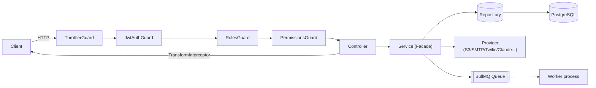
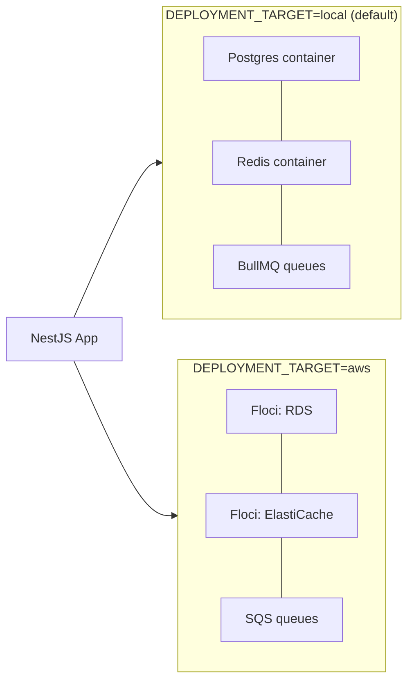

# NestJS Enterprise Boilerplate

[](https://nodejs.org)
[](https://nestjs.com)
[](https://www.typescriptlang.org)
[](https://pnpm.io)
[](./CHANGELOG.md)
[](./LICENSE)

A **production-grade** NestJS 11 application template designed for **humans and AI agents**.
Pre-configured with authentication, common enterprise modules, AI integration, a full
observability stack, and background workers — plus a real test suite, a clean security scan, and
pre-commit gates, so it's ready to build on rather than clean up first.

> [!TIP]
> **New to this repo?** See [`CHANGELOG.md`](./CHANGELOG.md) for what changed between v1.0.0 and
> v2.0.0. Want to strip modules you don't need (RBAC, AI/RAG, social OAuth, SMS, etc.)? See
> [`docs/MODULE_REMOVAL_GUIDE.md`](./docs/MODULE_REMOVAL_GUIDE.md).

---

## Table of contents

- [Prerequisites](#prerequisites)
- [Quick Start](#quick-start)
- [Architecture](#architecture)
- [Scripts](#scripts)
- [Testing](#testing)
- [Security](#security)
- [Auth System](#auth-system)
- [Webhooks](#webhooks)
- [Data Export](#data-export)
- [Real-time Communication](#real-time-communication)
- [Audit Logging](#audit-logging)
- [AI Integration](#ai-integration)
- [Monitoring & Observability](#monitoring--observability)
- [AWS-Emulated Local Stack (Floci)](#aws-emulated-local-stack-floci)
- [Configuration](#configuration)
- [Dependency override exceptions](#dependency-override-exceptions)
- [Customizing this boilerplate](#customizing-this-boilerplate)
- [Troubleshooting](#troubleshooting)
- [AI-Agent Debugging Flow](#ai-agent-debugging-flow)
- [Docs-First Development Policy](#docs-first-development-policy)
- [Resources](#resources)

---

## Prerequisites

- **Node.js**: `>=20.0.0`
- **pnpm**: `>=8.0.0`
- **Docker Engine**: Docker Desktop / Podman / Rancher Desktop / OrbStack
- **Gitleaks** and **Trivy** — required for the pre-commit hook (`brew install gitleaks trivy`,
  or see [gitleaks](https://github.com/gitleaks/gitleaks#installing) /
  [trivy](https://aquasecurity.github.io/trivy/latest/getting-started/installation/) for other
  platforms)

```bash
docker ps  # Verify Docker is running
```

---

## Quick Start

```bash
pnpm install               # Install dependencies (also sets up git hooks via husky)
pnpm run setup             # Copy .env.example → .env (one-time)
pnpm local:up              # Start everything (Docker + DB migrate + dev server)
```

### Step-by-step startup

```bash
pnpm generate:prometheus   # Generate Prometheus config
pnpm db:dev:up             # Start Docker containers (Postgres, Redis, monitoring)
sleep 5                    # Wait for DB availability
pnpm db:migrate            # Apply Drizzle SQL migrations
pnpm start:dev             # Start API + Worker in dev mode
```

### Accessible Endpoints

| Service | URL |
|---------|-----|
| App | http://localhost:3000 |
| Swagger API Docs (v1) | http://localhost:3000/api/v1 |
| Swagger API Docs (v2) | http://localhost:3000/api/v2 |
| Health Check | http://localhost:3000/health |
| Health UI | http://localhost:3000/health/health-ui |
| Dev Tools | http://localhost:3000/dev-tools |
| Bull Board (Queues) | http://localhost:3000/admin/queues |
| Prometheus | http://localhost:9090 |
| Grafana | http://localhost:3001 (admin/admin) |
| Jaeger | http://localhost:16686 |
| Loki | http://localhost:3100 |

---

## Architecture

### Tech Stack

- **NestJS 11** with strict TypeScript
- **Drizzle ORM** (SQL-first workflow) + PostgreSQL
- **Redis** (caching + BullMQ job queues)
- **OpenTelemetry + Jaeger** (distributed tracing)
- **Prometheus + Grafana** (metrics & dashboards)
- **Winston + Loki** (structured logging)
- **Jest + ts-jest** (unit testing — 847 tests across every service/controller/guard/provider)

### Design Patterns

- **Repository Pattern** — All DB access isolated in repository classes
- **Strategy/Provider Pattern** — Swappable implementations (S3/Cloudinary, SMTP/SES, Twilio/SNS, Claude/OpenAI, BullMQ/SQS queue transport)
- **Facade Pattern** — Services orchestrate repositories + providers
- **Factory Pattern** — Provider selection via environment config (`STORAGE_PROVIDER`, `EMAIL_PROVIDER`, `DEPLOYMENT_TARGET`, ...)

### Request lifecycle



### Directory Layout

```
src/
├── auth/               # JWT + OAuth + API Keys + MFA + RBAC
├── users/              # User management with roles
├── media/              # File uploads (S3/Cloudinary)
├── email/              # Templated emails (SMTP/SES)
├── sms/                # SMS + OTP (Twilio/SNS)
├── notifications/      # Multi-channel notifications (FCM push via Firebase Installation IDs/in-app)
├── webhooks/           # Outbound webhooks with HMAC signatures
├── ai/                 # AI service layer + RAG + Agents
│   ├── providers/      #   Claude & OpenAI providers
│   ├── rag/            #   pgvector RAG pipeline
│   └── agents/         #   Agent framework with tools
├── gateway/            # WebSocket gateway (Socket.IO)
├── api/                # Infrastructure APIs
│   ├── health/         #   Health checks (DB, Redis, memory)
│   ├── metrics/        #   Prometheus metrics
│   ├── tracing/        #   OpenTelemetry tracing
│   └── dev-tools/      #   Developer tools dashboard
├── background/         # BullMQ queues & workers
├── common/             # Shared utilities, guards, filters, decorators
│   ├── audit/          #   Application-level audit logging
│   └── export/         #   CSV/PDF/Excel data export
├── config/             # Environment configuration
├── db/                 # Drizzle ORM + centralized repositories
│   ├── drizzle/        #   Schema, migrations, migrate runner
│   ├── repositories/   #   ALL repositories (auth/, users/, media/, etc.)
│   └── seeds/          #   Raw SQL seed files
├── redis/              # Redis client & health
├── otel/               # OpenTelemetry setup
├── logger/             # Winston logging
├── interceptors/       # Global interceptors
├── middlewares/         # Express middlewares
├── app.module.ts       # Main application module
├── main.ts             # API entry point (secrets hydration gate, see bootstrap.ts)
├── bootstrap.ts        # API bootstrap logic (Swagger, middleware, listen)
├── worker.main.ts      # Worker entry point (secrets hydration gate, see worker-bootstrap.ts)
├── worker-bootstrap.ts # Worker bootstrap logic
└── worker.module.ts    # Worker module
```

`infra/floci/` (repo root) holds Terraform for the [AWS-emulated local stack](#aws-emulated-local-stack-floci) —
provisioned against [Floci](https://floci.io) only, never the default/staging/production stack.

Every domain module also has co-located `*.spec.ts` test files (Jest), and most contain a `dto/`
folder for `@nestjs/swagger`-decorated request/response classes — see
[Testing](#testing) and the Module Structure Convention below.

### Module Structure Convention

Every domain module follows this pattern:

```
src/<module>/                         # Business logic module
├── <module>.module.ts
├── <module>.controller.ts
├── <module>.controller.spec.ts
├── <module>.service.ts               # Business logic (Facade)
├── <module>.service.spec.ts
├── providers/                        # Swappable implementations
│   ├── <abstract>.provider.ts
│   └── <impl>.provider.ts
├── dto/                               # class-validator + class-transformer + @ApiProperty DTOs
├── interfaces/                        # Plain domain interfaces (not request/response DTOs)
└── guards/ or decorators/

src/db/repositories/<module>/         # Data access (centralized)
├── <module>.repository.ts            # Drizzle queries ONLY
└── <module>.repository.spec.ts
```

> [!IMPORTANT]
> Repositories live under `src/db/repositories/`, **not** inside domain modules. The global
> `DBModule` exports all repositories, so any module can inject any repository without
> cross-module coupling.

See `docs/conventions/` for detailed patterns.

---

## Scripts

### Development

```bash
pnpm start:dev          # Start API + Worker (watch mode)
pnpm start:prod         # Production mode
pnpm build              # Compile API + Worker
pnpm type-check         # TypeScript strict mode check
```

### Database (Drizzle + PostgreSQL)

```bash
pnpm db:migrate              # Apply SQL migrations
pnpm db:seed                 # Run raw SQL seed files (roles, admin user)
pnpm db:introspect           # Generate Drizzle schema from DB
pnpm db:generate             # migrate + introspect (combined)
pnpm db:create-migration <n> # Create new empty SQL migration
pnpm db:studio               # Open Drizzle Studio
```

### Code Quality & Security

```bash
pnpm lint               # ESLint fix
pnpm lint:check         # ESLint check only
pnpm format             # Prettier format
pnpm security:gitleaks  # Secret scan (staged changes)
pnpm security:trivy     # Dependency vulnerability + Dockerfile misconfig scan
pnpm security:scan      # Both of the above
pnpm pre-commit         # security:scan + type-check + lint:check + build (runs automatically on commit)
```

### Testing

```bash
pnpm test                       # Jest unit tests (847 tests)
pnpm test:e2e                   # Playwright E2E tests
pnpm test:coverage              # Coverage report
pnpm test:playwright:unit       # Playwright unit
pnpm test:playwright:functional # Playwright functional
pnpm test:playwright:e2e        # Playwright E2E
pnpm test:playwright:ui         # Interactive Playwright UI
pnpm test:artillery:quick       # Quick load test
pnpm test:artillery:stress      # Stress test
```

### Docker & Infra

```bash
pnpm db:dev:up           # Start all Docker containers
pnpm db:dev:rm           # Stop & remove containers
pnpm generate:prometheus # Generate Prometheus config
docker build -t app .    # Build production Docker image (non-root user + HEALTHCHECK)
```

See [AWS-Emulated Local Stack (Floci)](#aws-emulated-local-stack-floci) for the
`db:aws:up`/`infra:floci:up`/`local:aws:up` equivalents.

### Client SDK Generation

Generates a typed TypeScript client from the running app's OpenAPI spec (`/api/v1-json` — the
full API surface; see [Directory Layout](#directory-layout) for why `v1`, not `v2`). Two
generator flavors are available as separate scripts — pick one per project, both write to the
gitignored `client_sdk/` directory:

```bash
pnpm run generate:sdk:axios   # typescript-axios — consumed as source (no build step), @ts-nocheck'd
pnpm run generate:sdk:fetch   # typescript-fetch — built to client_sdk/dist via its own tsc
```

Both require the API running locally first (`pnpm start:dev`). Config lives in
`sdk-config.{axios,fetch}.json` (openapi-generator options) and `sdk-tsconfig.{axios,fetch}.json`
(the tsconfig copied into the generated output) — edit `npmName` to your actual package scope
before publishing. `scripts/postprocess-sdk.ts` (axios) strips the generator's per-file banner and
adds `@ts-nocheck`; `scripts/postprocess-sdk-fetch.ts` (fetch) patches a known
`typescript-fetch` generator template bug (a referenced-but-never-defined `objectToJSON` helper,
triggered by the media upload endpoint's object-typed `metadata` form field).

---

## Testing

The full test suite lives next to the source it covers (`<file>.spec.ts`), runs under
Jest + `ts-jest`, and currently totals **847 tests across ~105 spec files** — every service,
controller, guard, provider, repository, interceptor, middleware, and background processor has
coverage.

```bash
pnpm test               # run the whole suite
pnpm test:coverage      # with coverage report
pnpm exec jest --config jest.config.ts src/auth   # run a subset by path
```

<details>
<summary><strong>Conventions used throughout the suite</strong> (click to expand)</summary>

- `Test.createTestingModule({...})` from `@nestjs/testing`, with every injected dependency
  (repositories, `ConfigService`, external SDK clients) provided as a `jest.fn()`-based mock —
  no real DB/network/SMTP/S3/Firebase/AI-provider calls happen in unit tests.
- Drizzle repository tests mock `DBService.db`'s query-builder chain (`select().from().where()`,
  etc.) with a small reusable "thenable chain" helper rather than hitting a real database.
- Any test that mutates global state (e.g. `global.fetch`) saves and restores the original value
  in `afterAll` to avoid leaking into other test files run in the same Jest worker.
- `eslint.config.js` has a scoped override for `**/*.spec.ts` disabling rules that only produce
  noise against Jest mocks (`unbound-method`, `no-unsafe-*`, `explicit-function-return-type`) —
  application code keeps the full strict ruleset.

</details>

---

## Security

This repo is scanned clean by both tools below, and both run automatically before every commit
(see [`.husky/pre-commit`](./.husky/pre-commit)):

- **[Gitleaks](https://github.com/gitleaks/gitleaks)** — secret scanning (`pnpm security:gitleaks`,
  scoped to staged changes on commit via `gitleaks protect --staged`).
- **[Trivy](https://aquasecurity.github.io/trivy/)** — dependency vulnerability scanning
  (`pnpm security:trivy`), covering the `pnpm-lock.yaml` dependency tree and the `Dockerfile`
  (non-root user, `HEALTHCHECK` present). `node_modules`/`dist`/`coverage` are excluded from the
  misconfig/secret scan (third-party vendored code isn't ours to fix).

> [!WARNING]
> If either check fails a commit, fix the underlying issue rather than skipping the hook — see
> [Dependency override exceptions](#dependency-override-exceptions) for the one sanctioned way
> to temporarily suppress a finding that has no upstream fix yet.

The production `Dockerfile` runs as a non-root `USER node` (with `--chown` on every layer) and
ships a `HEALTHCHECK` against `/health`.

---

## Auth System

Full enterprise authentication:

- **JWT** — Access + refresh tokens with rotation
- **OAuth** — Google, GitHub (Apple stub ready)
- **API Keys** — Prefix-based lookup with hash validation
- **MFA** — TOTP with QR code + backup codes
- **RBAC** — Roles (OR logic) + Permissions (AND logic)

> [!TIP]
> Don't need one of these? See [`docs/MODULE_REMOVAL_GUIDE.md`](./docs/MODULE_REMOVAL_GUIDE.md)
> for exact removal steps (RBAC, social OAuth, etc.).

### Guards (applied globally in order)

1. `ThrottlerGuard` — Rate limiting
2. `JwtAuthGuard` — JWT validation (skip with `@Public()`)
3. `RolesGuard` — Role check (use `@Roles('admin')`)
4. `PermissionsGuard` — Permission check (use `@Permissions('users:read')`)

### Default Roles

| Role | Permissions |
|------|------------|
| admin | All permissions |
| moderator | users:read/write, media:read/write, ai:read/write, notifications:read/write, webhooks:read/write |
| user | users:read, media:read, ai:read, notifications:read, webhooks:read |

---

## Webhooks

Outbound webhook system with HMAC-SHA256 signed payloads:

- **CRUD** — Create, list, update, delete webhook subscriptions
- **Event-based dispatch** — Subscribe webhooks to specific events
- **Reliable delivery** — BullMQ queue with 5 retries and exponential backoff
- **Signature verification** — HMAC-SHA256 signatures (`X-Webhook-Signature` header)
- **Delivery tracking** — Full delivery history with response status and retry info
- **Test events** — Send test payloads to verify endpoints

---

## Data Export

Reusable export service (`ExportModule`) for any domain module:

- **CSV** — RFC 4180 compliant, configurable delimiters, UTF-8 BOM for Excel
- **PDF** — Table-based reports with headers, pagination, page numbers (pdfkit)
- **Excel** — Styled worksheets with auto-width columns, filters (exceljs)

---

## Real-time Communication

WebSocket gateway via Socket.IO:

- Room-based user targeting for notifications and events
- Auto join/leave on connect/disconnect
- Extensible event handlers

---

## Audit Logging

Application-level audit logging with decorator support:

- `@AuditLog('action', 'SEVERITY')` decorator on controller methods
- Automatic capture of user, IP, user-agent, request details
- Stored in `audit_logs` table for compliance and traceability

---

## AI Integration

### Service Layer
Provider-agnostic AI interface supporting Claude and OpenAI:
- Chat completions with streaming
- Embeddings generation
- Structured output (JSON mode)
- Token counting and cost tracking

### RAG Pipeline (pgvector)
- Document ingestion with multiple chunking strategies (fixed, recursive, paragraph)
- Embedding generation via AI providers
- Semantic similarity search with metadata filtering
- Hybrid retrieval (vector + keyword)

### Agent Framework
- Multi-turn conversations with tool calling loop
- Built-in tools: RAG search, database queries (read-only), external API calls
- Conversation memory (sliding window + summarization)
- Configurable max turns and model selection

---

## Monitoring & Observability

| Tool | Port | Purpose |
|------|------|---------|
| Prometheus | 9090 | Metrics aggregation |
| Grafana | 3001 | Dashboards & visualization |
| Jaeger | 16686 | Distributed tracing |
| Loki | 3100 | Log aggregation |
| Node Exporter | 9100 | System metrics |

### Application Endpoints

- `GET /health` — JSON health status (VERSION_NEUTRAL — no version prefix)
- `GET /health/health-ui` — HTML health dashboard
- `GET /metrics` — Prometheus metrics
- `GET /tracing/status` — OpenTelemetry status

### Alert Rules (Prometheus)

- High error rate (>5% for 5 min)
- High P99 latency (>2s for 5 min)
- High concurrent requests (>500 for 2 min)
- Disk almost full (<15%)

---

## AWS-Emulated Local Stack (Floci)

A **second, parallel local dev stack** that exercises AWS-shaped infrastructure instead of the
default self-hosted one — useful when your project targets AWS in production and you want
integration bugs (queue semantics, IAM, connection strings) to surface locally instead of in
staging. It's toggled by a single env var and runs **side by side** with the default stack; neither
changes the other's behavior.



[Floci](https://floci.io) is an open-source, MIT-licensed drop-in [LocalStack](https://localstack.cloud)-compatible
AWS emulator. Unlike a pure API-response stub, it orchestrates **real** Postgres/MySQL behind its
RDS emulation and **real** Redis/Valkey behind its ElastiCache emulation — so Drizzle/`pg` and
`ioredis` code paths need **zero changes**, only a different connection endpoint.

| Concern | `local` | `aws` | Code changes |
|---|---|---|---|
| Postgres | `postgres-db` container | Floci-emulated RDS (real Postgres underneath) | None — same client, different `DATABASE_URL` |
| Redis/cache | `redis` container | Floci-emulated ElastiCache (real Redis underneath) | None — same client, different host/port |
| Media/Email/SMS | Cloudinary/SMTP/Twilio, or S3/SES/SNS against real AWS | S3/SES/SNS against Floci | One optional `endpoint` override per provider (`getAwsEndpointOverride()`) |
| Queues | BullMQ + Redis | SQS (one-by-one polling consumer) | `QueuePublisherProvider` abstraction (see below) |
| Secrets | `.env` file | AWS Secrets Manager (one JSON blob) | Boot-time hydration gate — see below |
| Metrics / Logs / Tracing | Prometheus/Grafana/Loki/Jaeger | **Unchanged** — same stack, same config | None |

> [!NOTE]
> Metrics, logs, and tracing are intentionally **out of scope** — no CloudWatch integration is
> built. Both modes run the exact same Prometheus/Grafana/Loki/Jaeger stack.

### Running it

```bash
pnpm run db:aws:up          # Start docker-compose.floci.yml (Floci + monitoring stack)
pnpm run infra:floci:up     # terraform init && apply against Floci (RDS/ElastiCache/SQS/S3/Secrets Manager)
DEPLOYMENT_TARGET=aws pnpm run start:dev   # Boot API + Worker against the Floci-provisioned stack
# or, all at once:
pnpm run local:aws:up
```

`pnpm run db:aws:rm` tears the Floci stack down; `pnpm run infra:floci:down` runs `terraform destroy`.

### How each piece works

- **Secrets** (`src/config/secrets-bootstrap.ts`) — a dynamic `import()` gate in `main.ts`/
  `worker.main.ts` fetches one JSON secret (`nestjs-app/{env}` by default) from Secrets Manager and
  copies every key into `process.env` **before** `AppModule`/`WorkerModule` are ever `require()`'d.
  This matters because `app.module.ts` constructs a `new ConfigService()` at module-evaluation
  time — an async `ConfigModule.forRootAsync` can't hydrate config before that line runs under
  CommonJS's synchronous `require()` semantics, so the dynamic-import gate is the smallest change
  that makes hydration happen first. Everything downstream (Joi validation, provider factories)
  is unaware anything changed.
- **Queues** (`src/background/providers/`) — `QueuePublisherProvider` (abstract) is implemented by
  `BullMqQueuePublisher` (local) and `SqsQueuePublisher` (aws), selected by
  `QueueTransportModule`'s factory based on `DEPLOYMENT_TARGET`. On the consumer side,
  `SqsQueueConsumerBase` is a long-polling `ReceiveMessageCommand` loop that mirrors each BullMQ
  `@Processor`'s `switch (job.name) { ... }` dispatch. Business-logic classes
  (`*-queue.service.ts`) are 100% transport-agnostic and needed zero changes.
- **Dead-letter visibility** — failed jobs rely on SQS's native visibility-timeout-based redrive to
  a `-dlq` queue (configured per-queue in Terraform); consumers additionally call
  `DeadLetterQueueService` for parity with the local stack's Bull Board DLQ view. See the
  **SQS Queues** panel at `/dev-tools/queues` (aws mode) for live queue/DLQ depth — Bull Board has
  no SQS equivalent.
- **Terraform** (`infra/floci/`) — provisions against Floci only (never the default/staging/
  production stack): `aws_db_instance`, `aws_elasticache_replication_group`, one `aws_sqs_queue` + matching
  `-dlq` queue per background queue, `aws_s3_bucket`, `aws_secretsmanager_secret`, and an
  `aws_iam_role`/`aws_iam_policy`. Copy `infra/floci/terraform.tfvars.example` to
  `terraform.tfvars` and fill in real values (JWT secret, OAuth credentials, etc.) before applying
  — see that file for the exact key list.

> [!WARNING]
> **Known limitation**: Floci's RDS emulation spawns a vanilla `postgres:17-alpine` container, not
> the `pgvector/pgvector:pg17` image the default stack uses — so the RAG module's
> `CREATE EXTENSION vector` migration fails against it. Verified during development: real TCP
> connectivity (`localhost:<Floci-assigned RDS port>`), SQS publish/consume, and DLQ redrive all
> work correctly; only the pgvector-specific migration needs a workaround (skip it if you don't
> need RAG in `aws` mode, or point Terraform's `aws_db_instance` at a custom-image RDS emulation if
> Floci adds that capability).

---

## Configuration

See `.env.example` for all environment variables. Key sections:

- **Common** — PORT, NODE_ENV, CORS
- **Database** — PostgreSQL connection
- **Redis** — Cache and queue backend
- **Auth** — JWT secrets, OAuth credentials, MFA encryption
- **Media** — S3/Cloudinary credentials
- **Email** — SMTP/SES configuration
- **SMS** — Twilio/SNS credentials
- **Notifications** — FCM credentials. Devices register a **Firebase Installation ID (FID)**, not
  an FCM registration token — `firebase-admin`'s token-based `MulticastMessage` API is deprecated
  in favor of `FidMulticastMessage`/`fids` (see `CHANGELOG.md` v2.0.0).
- **Webhooks** — Configured per-user via API
- **AI** — Anthropic/OpenAI API keys
- **Observability** — Prometheus, Grafana, Jaeger, Loki settings
- **Deployment target** — `DEPLOYMENT_TARGET` (`local` | `aws`), `FLOCI_ENDPOINT`/`FLOCI_PORT`,
  `SECRETS_MANAGER_SECRET_ID`, `<QUEUE>_QUEUE_URL` — see
  [AWS-Emulated Local Stack (Floci)](#aws-emulated-local-stack-floci)

---

## Dependency override exceptions

Vulnerability scans (Trivy) should show **zero** dependency findings. When a CVE is fixed
upstream, always bump the affected package (or its direct parent) in `package.json` directly —
do not reach for `overrides` first.

`overrides` (declared in both `pnpm-workspace.yaml` and `package.json`'s `pnpm.overrides` field,
for compatibility across pnpm 8/9/10) should only contain entries where **no upstream fix
exists yet**:

| Override | CVE | Why an override was needed | Remove when |
|---|---|---|---|
| `uuid: ^11.1.1` | CVE-2026-41907 (out-of-bounds write) | Pulled in at the vulnerable `uuid@8.x`/`9.x` by `exceljs@4.4.0` and by `firebase-admin@14.2.0` → `@google-cloud/storage@7.21.0` → `google-auth-library@9.x` → `gaxios@6.x`. Both are the latest published versions of their packages and neither has moved to a `uuid`-free or patched dependency chain yet. | `exceljs` releases a version that bumps its `uuid` dependency past `9.0.1`/`8.3.2`, **or** `@google-cloud/storage`/`google-auth-library` moves to `gaxios@7.x` (which dropped the `uuid` dependency entirely) — check with `pnpm why uuid` after bumping those packages, then delete the override once it's no longer needed to keep resolution otherwise ungoverned. |

Re-run `pnpm security:trivy` after any dependency bump to confirm whether an override entry above
is still required.

---

## Customizing this boilerplate

Every module in this boilerplate is optional except Auth, Users, and the infrastructure APIs
(Health/Metrics/Tracing). If your project doesn't need RBAC, AI/RAG, social OAuth, SMS, media
uploads, webhooks, audit logging, notifications, the WebSocket gateway, or data export, see
[`docs/MODULE_REMOVAL_GUIDE.md`](./docs/MODULE_REMOVAL_GUIDE.md) — it lists, per module, exactly
which files to delete, which imports/registrations to remove, which database tables to drop, and
which environment variables become unnecessary.

Not targeting AWS in production? The entire
[AWS-Emulated Local Stack (Floci)](#aws-emulated-local-stack-floci) is additive and safe to delete:
`docker-compose.floci.yml`, `infra/floci/`, `src/config/secrets-bootstrap.ts`, the
`src/background/providers/sqs-*` files, `*-sqs.consumer.ts` files, and the `aws`-mode branches
(`isAws` conditionals) in the queue modules and `aws-endpoint.util.ts` usages — the `local`-mode
branch of every conditional is the boilerplate's actual default behavior.

---

## Troubleshooting

```bash
# Docker not running
docker ps  # If fails, start Docker Engine

# DB connection issues
pnpm db:dev:rm && pnpm db:dev:up

# Port in use
lsof -i :3000 && kill -9 <PID>

# Dependency issues
pnpm clean:all && pnpm install

# Verify health
curl http://localhost:3000/health

# Check tracing
curl http://localhost:3000/tracing/status
```

> [!NOTE]
> **Editor shows TypeScript errors/warnings that `pnpm type-check` doesn't reproduce** (e.g.
> `"Cannot find name 'describe'"`, or tsconfig deprecation warnings mentioning a TS version newer
> than `package.json`'s pinned 5.9.2)? Your editor is likely using a different TypeScript than
> this project's. In VS Code: `Cmd/Ctrl+Shift+P` → **"TypeScript: Select TypeScript Version"** →
> **"Use Workspace Version"**. Also try a fresh `pnpm install` if `node_modules` is missing or
> stale.

---

## AI-Agent Debugging Flow

This project is designed to be **AI-agent friendly**. Agents should follow this sequence:

1. `docker ps` — Verify Docker engine
2. `pnpm db:dev:up` — Start containers
3. `pnpm db:migrate` — Apply migrations
4. `pnpm start:dev` — Start application
5. `curl http://localhost:3000/health` — Verify health
6. Check observability stack (Prometheus, Grafana, Jaeger)

See `CLAUDE.md` for comprehensive AI development instructions.
See `docs/conventions/` for module creation patterns.

## Docs-First Development Policy

For behavior-changing work, this repository enforces **document first, code second**.

1. Update docs in `docs/` (or `README.md`) to define the flow and acceptance criteria.
2. Implement code only after the flow is documented.
3. Include tests and verification output.

Templates and policy:

- `docs/templates/feature-rfc.md`
- `AGENTS.md`
- `CONTRIBUTING.md`

---

## Resources

- [NestJS Docs](https://docs.nestjs.com/)
- [Drizzle ORM Docs](https://orm.drizzle.team/)
- [OpenTelemetry](https://opentelemetry.io/docs/)
- [Playwright](https://playwright.dev/)
- [Artillery](https://artillery.io/)
- [`CHANGELOG.md`](./CHANGELOG.md) — version history
- [`docs/MODULE_REMOVAL_GUIDE.md`](./docs/MODULE_REMOVAL_GUIDE.md) — stripping optional modules

---

## Project Status

| | |
|---|---|
| Version | `2.1.0` — see [`CHANGELOG.md`](./CHANGELOG.md) for what changed since `1.0.0` |
| Tests | 847 passing, 0 failing (105 spec files) |
| Statement coverage | 72.92% |
| Branch coverage | 71% |
| Function coverage | 78.02% |
| Line coverage | 73.05% |
| Security scans | Gitleaks + Trivy — 0 findings (enforced on every commit, see [Security](#security)) |

Regenerate coverage locally with `pnpm test:coverage` (HTML report at `coverage/lcov-report/index.html`).
