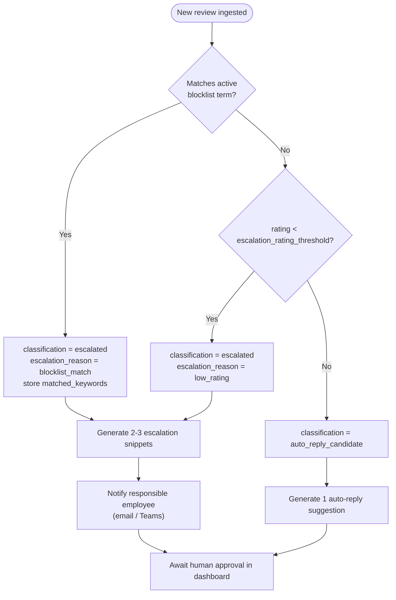
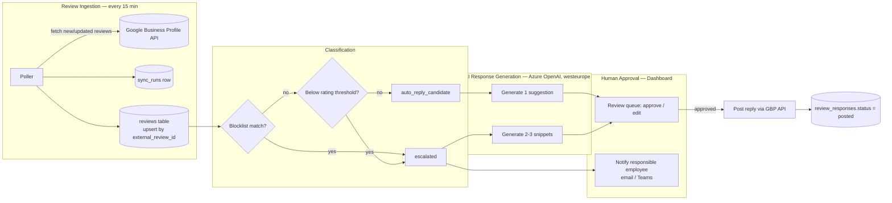
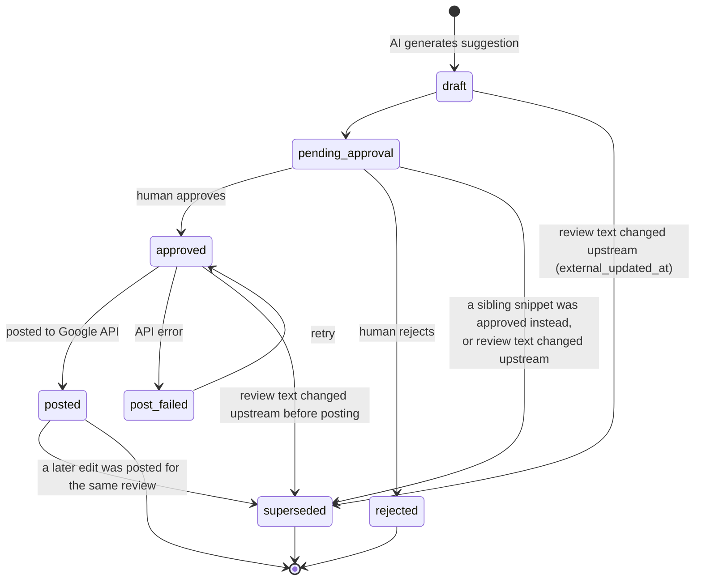
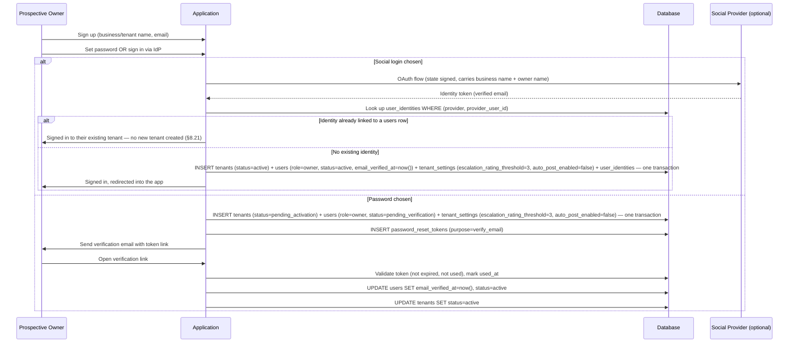
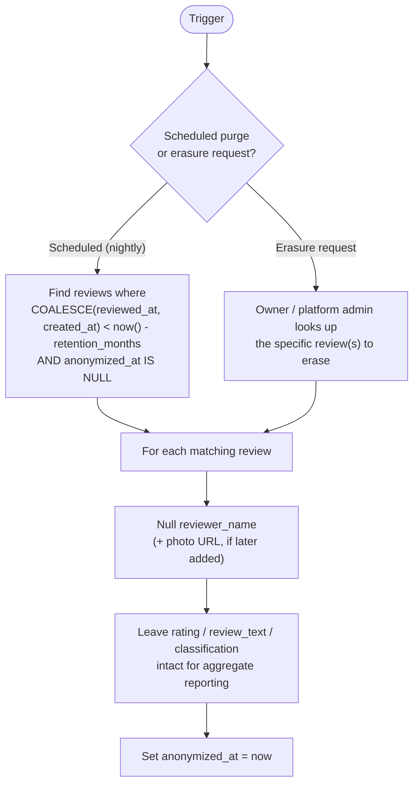
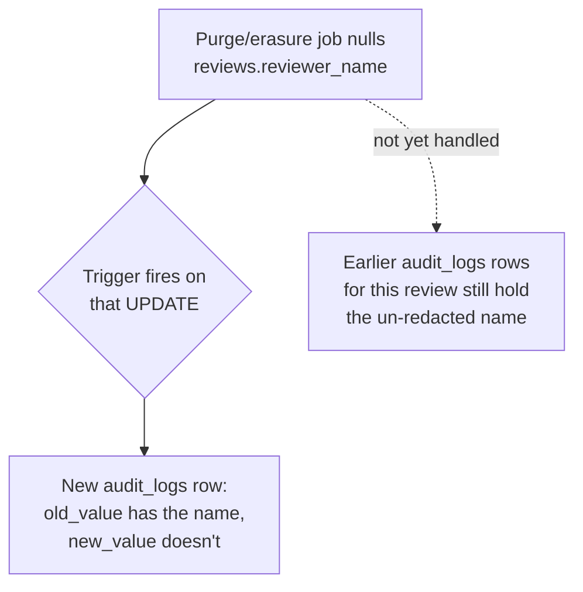
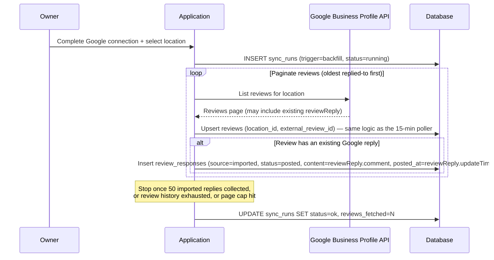

# Google Business Profile Review Management — MVP Plan

## Context

The goal is to automate handling of Google Business Profile reviews for a single tenant/location: ingest new reviews on a poll, classify them by star rating and a keyword blocklist, draft AI replies (Azure OpenAI, GDPR-scoped to `westeurope`), require human approval before anything posts back to Google, and escalate risky reviews to a responsible employee via email/Teams. A web dashboard is the human interface for approving, editing, and posting replies, and for configuring thresholds/blocklist/recipients.

This is a **design document**. Decisions made along the way:
- **Single rating threshold** (not dual positive/negative) — matches the stated requirement exactly, no ambiguous gap.
- **Native Postgres ENUM types** for status/role/type-style fields.
- **Multi-method auth**: everyone — super admin, owner, and member — can use password *or* social/OAuth login (side by side). What distinguishes a member isn't the auth method, it's that they can only ever be *created* via an owner's invite, never self-registered.
- **Roles**: one platform-wide super admin (outside the tenant model), plus per-tenant `owner` (full access incl. settings) and `member` (review workflow only).

---

## 1. Entity-Relationship Diagram

```mermaid
erDiagram
    TENANTS ||--o{ USERS : has
    TENANTS ||--o{ REVIEW_PROVIDER_CONNECTIONS : has
    TENANTS ||--o{ LOCATIONS : has
    TENANTS ||--o{ REVIEWS : has
    TENANTS ||--|| TENANT_SETTINGS : configures
    TENANTS ||--o{ BLOCKLIST_TERMS : has
    TENANTS ||--o{ NOTIFICATION_RECIPIENTS : has
    TENANTS ||--o{ NOTIFICATIONS : has
    TENANTS ||--o{ SYNC_RUNS : has
    TENANTS ||--o{ TENANT_IDENTITY_PROVIDERS : "trusts (SSO directory binding)"

    USERS ||--o{ USER_IDENTITIES : "linked social logins"
    USERS ||--o{ PASSWORD_RESET_TOKENS : requests
    USERS ||--o{ REVIEW_PROVIDER_CONNECTIONS : "connected by"
    USERS ||--o{ REVIEW_RESPONSES : "created by"
    USERS ||--o{ REVIEW_RESPONSES : "approved by"
    USERS ||--o{ NOTIFICATION_RECIPIENTS : "is recipient"
    USERS ||--o{ NOTIFICATIONS : receives
    USERS ||--o{ USER_LOCATIONS : "scoped to"
    USERS |o--o{ USERS : "invites (owner -> member)"
    LOCATIONS ||--o{ USER_LOCATIONS : "visible to"

    REVIEW_PROVIDER_CONNECTIONS ||--o{ LOCATIONS : provides

    LOCATIONS ||--o{ REVIEWS : receives
    LOCATIONS ||--o{ SYNC_RUNS : "polled in"

    REVIEWS ||--o{ REVIEW_RESPONSES : has
    REVIEWS ||--o{ NOTIFICATIONS : triggers

    PLATFORM_ADMINS ||--o{ PLATFORM_ADMIN_IDENTITIES : "linked social logins"
    PLATFORM_ADMINS ||--o{ PLATFORM_ADMIN_INVITES : requests
    PLATFORM_ADMINS ||--o{ PLATFORM_ADMINS : invites
    PLATFORM_ADMINS |o--o{ TENANTS : "creates (support cases only)"

    TENANTS {
        id uuid PK
        name string
        created_by_platform_admin_id uuid FK "null for the normal self-registration path"
        status enum "pending_activation, active, suspended"
    }
    TENANT_IDENTITY_PROVIDERS {
        id uuid PK
        tenant_id uuid FK
        provider enum "entra_id, google_workspace, ..."
        provider_tenant_id string "the directory/org ID for that provider"
        is_active boolean
    }
    USERS {
        id uuid PK
        tenant_id uuid FK
        name string
        email string
        password_hash string "nullable"
        email_verified_at datetime
        invited_by_user_id uuid FK "nullable; set only for a member invited by an owner (§4.3b)"
        role enum "owner, member"
        status enum "pending_verification, invited, active, disabled"
        anonymized_at datetime "set on staff GDPR erasure — see §6.2; row is never deleted"
    }
    USER_IDENTITIES {
        id uuid PK
        user_id uuid FK
        provider enum "entra_id, google, ..."
        provider_user_id string
        email string
    }
    PASSWORD_RESET_TOKENS {
        id uuid PK
        user_id uuid FK
        token_hash string
        purpose enum "verify_email, invite, reset"
        expires_at datetime
        used_at datetime
    }
    PLATFORM_ADMINS {
        id uuid PK
        email string
        password_hash string "nullable"
        invited_by_platform_admin_id uuid FK "null for the first, seeded admin"
        status enum "invited, active, disabled"
    }
    PLATFORM_ADMIN_INVITES {
        id uuid PK
        platform_admin_id uuid FK
        token_hash string
        purpose enum "invite, reset"
        expires_at datetime
        used_at datetime
    }
    PLATFORM_ADMIN_IDENTITIES {
        id uuid PK
        platform_admin_id uuid FK
        provider enum
        provider_user_id string
    }
    REVIEW_PROVIDER_CONNECTIONS {
        id uuid PK
        tenant_id uuid FK
        connected_by_user_id uuid FK
        provider enum "google, ... (any review-source provider)"
        provider_account_id string
        credential_reference string
        token_expires_at datetime
        status enum "active, needs_reauth"
    }
    LOCATIONS {
        id uuid PK
        tenant_id uuid FK
        provider_connection_id uuid FK
        provider enum "denormalized from review_provider_connections.provider"
        external_location_id string
        name string
        address string
        status enum "active, inactive"
        last_synced_at datetime
        last_sync_status enum "ok, error"
        last_sync_error string "why the most recent poll attempt failed, if it did"
        onboarding_backfill_completed_at datetime "gates live polling/classification"
    }
    USER_LOCATIONS {
        id uuid PK
        user_id uuid FK
        location_id uuid FK
    }
    REVIEWS {
        id uuid PK
        tenant_id uuid FK
        location_id uuid FK
        external_review_id string
        external_reviewer_id string "nullable, best-effort erasure key"
        rating int
        review_text string
        reviewer_name string
        reviewed_at datetime "when posted on Google"
        external_updated_at datetime "drives edit detection on re-poll"
        sentiment enum
        classification enum "auto_reply_candidate, escalated (implemented migration adds pending_classification as the pre-classification default — see §2)"
        escalation_reason enum "low_rating, blocklist_match"
        matched_keywords jsonb
        status enum "new, in_review, responded, dismissed"
        anonymized_at datetime "set once PII purged"
        removed_upstream_at datetime "set when the poller detects the reviewer deleted their review upstream"
    }
    REVIEW_RESPONSES {
        id uuid PK
        tenant_id uuid FK
        review_id uuid FK
        generation_group_id uuid
        response_type enum "auto_reply_suggestion, escalation_snippet"
        content string
        source enum "ai_generated, human_edited, human_manual, imported"
        status enum "draft, pending_approval, approved, rejected, posted, post_failed, superseded"
        created_by_user_id uuid FK
        approved_by_user_id uuid FK
        posted_at datetime
        error_message string
        generation_metadata jsonb
    }
    TENANT_SETTINGS {
        id uuid PK
        tenant_id uuid FK
        escalation_rating_threshold int
        auto_post_enabled boolean
        review_data_retention_months int "nullable, null = platform default"
    }
    BLOCKLIST_TERMS {
        id uuid PK
        tenant_id uuid FK
        term string
        is_active boolean
    }
    NOTIFICATION_RECIPIENTS {
        id uuid PK
        tenant_id uuid FK
        user_id uuid FK
        notification_type enum
        channel enum "email, teams, both"
        is_active boolean
    }
    NOTIFICATIONS {
        id uuid PK
        tenant_id uuid FK
        review_id uuid FK
        recipient_user_id uuid FK
        generation_group_id uuid "which snippet batch was included"
        type enum
        channel enum "email, teams"
        status enum
        sent_at datetime
        read_at datetime
    }
    SYNC_RUNS {
        id uuid PK
        tenant_id uuid FK
        location_id uuid FK
        trigger enum "scheduled, backfill"
        started_at datetime
        completed_at datetime
        status enum "running, ok, error"
        reviews_fetched int
        error_message string
    }
```



---

## 2. Schema Review — Issues & Recommended Changes

The original table list and shape are sound (clean tenant scoping, sensible separation of connections/locations/reviews/responses/notifications). The changes below are additive/corrective, organized by table.

### `tenants`, `users`, `user_identities` — multi-method auth + onboarding

Two genuinely different join flows, not one:
- **Tenant creation is self-service.** A prospective business owner signs up directly — no platform admin involved. Signing up creates the `tenants` row *and* the owner's `users` row (`role = owner`) together, in one action.
- **Member accounts are invite-only, and it's the owner who invites them** — not the platform admin. The platform admin has no role in either flow under normal operation; it exists for platform-level administration (support access, disabling a tenant, cross-tenant visibility), not for provisioning tenants or users. See the **New table: `platform_admins`** note below.

Auth is multi-method for every role — password *or* any linked social/OAuth provider (Entra ID, Google, etc.), both available side by side, not either/or. This applies equally to super admin, owner, and member: an invited member completing their invite can set a password or sign in via a social provider matching the invited email, exactly like the owner's self-signup flow (§4.3a). **What's actually invite-gated is account creation, not the auth method** — a member's `users` row only ever comes into existence via an owner's invite; there's no self-registration or directory-wide auto-provisioning path for members, regardless of which auth method they end up using to activate it.

This is why `tenant_identity_providers` (the org-wide directory-trust table) stays unused even with member SSO in the picture: a member's social login only has to prove they control the *specific invited email* — the same bar the owner's login already clears — not that the login came from a specific verified corporate directory. If a requirement later shows up for "anyone in Acme Corp's Entra directory can sign in without an individual invite," that's the point `tenant_identity_providers` would actually earn its place; it doesn't yet.

- `user_identities` stays scoped to OAuth/social providers only (`entra_id`, `google`, …) — unchanged in shape, just no longer the *only* auth path. This is a **per-user** identity link (which specific person maps to which specific IdP account) — it does not carry the tenant-level directory-trust concept below.
- **Add `password_hash` (string, nullable) and `email_verified_at` (datetime, nullable) to `users`.** Nullable because a user might only ever use social login (owner/super admin case) and never set a password.
- **New table `tenant_identity_providers`** (replaces an earlier flat `tenants.entra_tenant_id` column) — the *tenant-level* directory-trust config: which external directory (Entra ID, and later Google Workspace/Okta/etc.) this app-tenant accepts SSO logins from. This is a separate concern from `user_identities`: it has to be checkable *before* any user has ever logged in (otherwise the first successful Entra login would implicitly claim the directory for the tenant — a trust-on-first-use gap), and it generalizes to future providers without adding a new column to `tenants` for each one. Shape mirrors `user_identities` one level up — see ER diagram above. Add a unique constraint on `(provider, provider_tenant_id)` so the same external directory can't be bound to two different app-tenants by mistake.
- **New table `password_reset_tokens`** — covers three flows that are all the same underlying mechanic (prove email ownership via a one-time emailed link, then act): the owner's self-signup email verification (`purpose = verify_email`), an invited member setting their first password (`purpose = invite`), and forgot-password reset (`purpose = reset`). See ER diagram above for shape.
- **Add `users.invited_by_user_id`** (nullable, self-referential FK, `ON DELETE SET NULL`) — this was a real gap: `platform_admins.invited_by_platform_admin_id` already tracks inviter lineage one level up (§2's platform admin notes), but `users` had no equivalent, so a `password_reset_tokens` row (`purpose = invite`) tells you *that* someone was invited and *who* they are, never *by whom* — the token only stores its own hash and the invitee's `user_id`, not the inviter's. `password_reset_tokens` is the wrong table to carry this (it's a short-lived, deleted-on-use token, not a durable audit trail); the FK belongs on the row it's actually a fact about, `users` itself, same reasoning as `review_responses.approved_by_user_id`. NULL for a self-registered owner (§4.3a) and for a platform-admin-provisioned owner (§4.3d — that owner's inviter is a `platform_admins` row, which this FK can't point to); set only when an owner invites a member (§4.3b), the one case where the inviter genuinely is another `users` row.
- **`users.role` enum = `owner`, `member`** (tenant-scoped only):
  - `owner` — full tenant access: Settings page (thresholds, blocklist, Google connection, inviting/removing users) *and* participates in review approval. Created via self-signup, one per new tenant (more can be promoted later, out of scope for MVP).
  - `member` — review workflow only (queue, approve/edit/post, escalation view); no Settings access. Created only via an invite the *owner* sends, never self-registered and never platform-admin-created.
  - This also drives the "responsible employee" notification target (typically owners, but `notification_recipients` already lets any user be added regardless of role).
- **`users.status` enum = `pending_verification`, `invited`, `active`, `disabled`.** `pending_verification` is the owner's post-signup, pre-email-verification state (they can still explore the product, just not connect Google or invite anyone until verified); `invited` is member-specific, waiting on the invite link.
- `user_identities.email` is the IdP claim (source of truth at login, when used); `users.email` is the primary record. Add unique constraint: `user_identities (provider, provider_user_id)`.
- Add unique constraint: `users (tenant_id, email)` — needed for the invite-match lookup to be unambiguous. **Deliberately scoped per-tenant, not global**: the same email legitimately owning more than one tenant (an agency running several client businesses, say) is a supported case, not an error — signup must not reject an email just because it already owns an *active* tenant elsewhere. See §8.18 for what that means for concurrent duplicate signups.
- **`tenants.status` enum = `pending_activation`, `active`, `suspended`.** This was easy to miss: with self-registration, a `tenants` row now comes into existence *before* it has any active owner — during the window between signup and email verification (§4.3a), or between a support-assisted invite being sent and accepted (§4.3d). `active`/`suspended` alone doesn't have anywhere to put that window. `pending_activation` is set at tenant creation in both flows and flips to `active` the moment the owner's `users.status` becomes `active` — the tenant tracks whether it has a working owner, not the other way around. `suspended` stays the platform-admin-triggered disable action, unrelated to this transition. A tenant stuck in `pending_activation` because the owner never finished signup is an abandoned-signup cleanup question (purge or re-prompt after some window) — a fast-follow, not required for MVP.

See the **User Onboarding sequence diagrams** (§4.3) for both flows in full.

### New table: `platform_admins`
The SaaS-level super admin is **not** a tenant-scoped user, and — since tenant creation is now self-service — it's no longer in the tenant/owner provisioning path either. Its purpose is narrower: platform-level administration (support access into a tenant, disabling/suspending a tenant, cross-tenant visibility/metrics). Modeling it separately keeps `users.tenant_id` always `NOT NULL` and every tenant-scoped query safely assumable as single-tenant, rather than needing to defensively handle a nullable-tenant "super user" row mixed into the same table. Same dual auth model as owners (password + social), via a mirrored `platform_admin_identities` table — not worth a shared polymorphic table at this scale.
- **`tenants.created_by_platform_admin_id` (nullable FK)** stays, but reframed: it's `NULL` for the normal self-registration path, and only gets set on the rare support-driven exception where a platform admin manually provisions a tenant on a business's behalf (e.g. an assisted/sales-led onboarding). Don't design the primary flow around it. See **§4.3d** for the full flow — the platform admin creates the tenant and invites the owner in one step, same invite-then-activate mechanic as a member invite, just one level up.
- **There is exactly one platform admin to start, and no public signup path creates one.** The first `platform_admins` row is seeded at deployment time (a one-off migration/CLI step run by whoever operates the platform), never through the application's UI — allowing platform-admin signup as a normal web flow would be a privilege-escalation hole, not a feature. Additional platform admins, if ever needed, are **invite-only**, mirroring the owner→member mechanic one level up: an existing platform admin invites another by email.
- **New table `platform_admin_invites`** — the platform-admin-scoped mirror of `password_reset_tokens`, for exactly the same reason `tenant_identity_providers` mirrors `user_identities`: keep the two account hierarchies (tenant users vs. platform admins) structurally independent rather than threading one shared polymorphic table through both. Same `purpose` values (`invite`, `reset`), same one-time-token-then-consume mechanic.
- **Add `platform_admins.invited_by_platform_admin_id`** (nullable, self-referential FK) — `NULL` only for the seeded first admin; every subsequently invited one records who invited them, same audit reasoning as `review_responses.approved_by_user_id`.
- Extend `platform_admins.status` to `invited`, `active`, `disabled` (was just `active`/`disabled`) to support the pending-invite state.

See **§4.3c** for the platform admin invite flow.

### `user_locations` (restored from your original design — don't drop it)
Worth calling out explicitly: your original table list included `user_locations`, scoping which locations a given user can see/act on. It's redundant *in practice* for MVP (one tenant, one location — every user in the tenant trivially sees the only location), but it should stay in the schema now rather than being added back later, since "one location for MVP" implies multi-location is coming and every review/notification query that scopes by location will already need to join through it. Add unique constraint `(user_id, location_id)`.

### `review_provider_connections` (renamed from `google_connections` — generalized to any review-source provider, not just Google; see the table's own comment in `0003_review_provider_locations.sql`)
- Add `token_expires_at` (datetime) — Google OAuth refresh tokens/access tokens need expiry tracking to know when re-auth is needed.
- Add `scopes` (string) if useful for debugging, optional for MVP.
- Clarify `status` enum includes a `needs_reauth` value (not just active/inactive) — this is the actual failure mode you'll hit in production when a token is revoked.
- Add unique constraint: `(tenant_id, provider_account_id)`.

### `locations`
- Add unique constraint: `(provider_connection_id, external_location_id)` — required for idempotent upsert.
- Add sync observability fields: `last_synced_at`, `last_sync_status` (enum: `ok`/`error`), `last_sync_error` (string, nullable). The 15-minute poller **will** fail sometimes (expired token, rate limit, API schema change) and you need a place to see that without digging through logs.
- Keep the original `status` (`active`/`inactive`) as a separate field from `last_sync_status` — they answer different questions. `status` is whether this location is still a valid, connected place to poll at all (business closed, connection removed by the owner); `last_sync_status` is whether the *most recent poll attempt* succeeded. A location can be `status = active` with `last_sync_status = error` (still valid, just failed last time), or `status = inactive` regardless of how the last poll went (stop polling, ignore sync health entirely).
- **Add `onboarding_backfill_completed_at` (datetime, nullable)** — the regular poller and classification pipeline must not run for a location until the one-time historical backfill (§7) has finished; see **§8 Concurrency & Race Conditions** for why this ordering isn't automatic otherwise.

### `reviews`
- **Add unique constraint `(location_id, external_review_id)`** — this is the upsert key for every poll cycle; without it you'll get duplicate rows on re-poll.
- **`classification` and `status` are two separate, independent fields — don't let `status` re-derive response-level states.** An earlier pass of this plan had `reviews.status` include values like `approved`/`posted`, which really describe a *response's* state, not the review's. A review can have several `review_responses` (2–3 escalation snippets, retries after edits); mirroring their granular states onto `reviews.status` creates a second place that state lives and can drift out of sync (e.g. `reviews.status = approved` while zero responses are actually approved yet). Keep them cleanly separated:
  - `classification` — the *routing* decision: `auto_reply_candidate`, `escalated`, `pending_classification`.
  - `status` — the review's own queue-level lifecycle only: `new`, `in_review` (has a draft/pending response), `responded` (a response has been posted), `dismissed`.
  - The dashboard's status badge is a *computed* combination of `classification` + `status` + the latest `review_responses` row for that review (e.g. "Escalated · Pending Approval"), not read off a single column.
- **Add `matched_keywords` (jsonb array, nullable)** — when `escalation_reason = blocklist_match`, you need to know *which* term(s) matched, both for UI display ("escalated because it contains 'lawsuit'") and for tuning the blocklist later. An enum alone can't carry this.
- Consider `classification_overridden_by_user_id` / `classification_overridden_at` (nullable) if manual reclassification is allowed — flag as a possible fast-follow if not needed in MVP.
- `rating` should store the raw integer (1–5); GBP's API returns a `STAR_RATING` string enum — map it on ingestion, don't store the raw string.
- Reviewer PII: `reviewer_name` plus `review_text` are personal data under GDPR. See the dedicated **§6 GDPR Data Retention & Erasure** for the `external_reviewer_id`/`anonymized_at` fields and the purge flow — this is designed now, not deferred.
- Consider a fast-follow `removed_upstream_at` (nullable) — a reviewer can delete their Google review after you've ingested it; the poller should detect the disappearance and mark it rather than leaving a stale row with no signal. Not required for MVP but cheap to add now.
- Keep `reviewed_at` (when the reviewer originally posted on Google) and `external_updated_at` (Google's own last-modified timestamp for the review). Both were in your original design — `external_updated_at` in particular is what the poller diffs against on every 15-minute cycle to detect whether an already-ingested review was edited and needs re-classification, so it's load-bearing, not just metadata.

### `review_responses`
- **Add `generation_group_id` (UUID, nullable)** — when 2–3 escalation snippets are generated together in one AI call, they need a shared identifier so the UI can group them and a "regenerate all" action works.
- **Add `approved_by_user_id` and `approved_at`** (nullable) — distinct from `created_by_user_id`. AI creates the draft; a human approves it. Collapsing these into one field loses the approval audit trail.
- **Add `error_message` (string, nullable)** and ensure `status` includes a `post_failed` value — posting to the Google API can fail (rate limit, auth expiry, content policy rejection) and that needs to surface in the UI with a retry path.
- **Add `generation_metadata` (jsonb, nullable)** — store model name/version, prompt version, region (`westeurope`), token counts. Cheap to add now, valuable for debugging and as a GDPR/compliance record.
- **Drop `google_response_id`.** The Google Business Profile API doesn't actually issue an ID for a reply — a reply is a `reviewReply {comment, updateTime}` sub-field on the *review* resource itself (`PUT .../reviews/{reviewId}/reply`), not a standalone entity with its own identifier. Posting a reply always means "set/overwrite the one reply this review has"; there's nothing to reference by ID. Use `posted_at` (already present) instead.
- **This also means only one reply can ever exist per review on Google's side.** Enforce that invariant at the DB level with a partial unique index: `UNIQUE (review_id) WHERE status IN ('approved', 'posted')` — covering `approved` too, not just `posted`, is what actually closes the race: if it only covered `posted`, two staff members could each approve a different sibling snippet at nearly the same moment (both reads happen before either write lands) and both proceed to call Google's API; widening the constraint means the *second* approve attempt fails immediately at the DB level, before any API call is made. See **§8 Concurrency & Race Conditions** for the full walkthrough. Two follow-on cases both need a terminal **`superseded`** status value:
  - When one of 2–3 sibling escalation snippets (same `generation_group_id`) gets posted, the other sibling(s) still sitting in `pending_approval` become `superseded` rather than lingering as live drafts for a review that already has a reply.
  - If a reply is edited and re-posted later, the previous `posted` row flips to `superseded` (Google's PUT overwrites the old reply, it doesn't add a new one) and the new row becomes the `posted` one.
- Clarify `response_type` enum: `auto_reply_suggestion` vs `escalation_snippet`.
- Clarify `status` enum: `draft` → `pending_approval` → `approved`/`rejected`/`superseded` → `posted`/`post_failed`, with `posted` → `superseded` on a later edit. See the updated **state diagram** in §4.2.
- Clarify `source` enum needs an `imported` value — the "last 50 responses" few-shot requirement means you must backfill the client's pre-existing Google replies (posted before this system existed) into this table. See **§7 Historical Response Backfill** for the job design and its own idempotency constraint on this table.

### `tenant_settings`
- Replace `positive_rating_threshold` + `negative_rating_threshold` with a single **`escalation_rating_threshold`** (integer): `rating < threshold` → escalate, `rating >= threshold` → auto-reply candidate.
- `auto_post_enabled` stays as-is (MVP always false via app logic).

### `blocklist_terms`
- Add unique constraint (case-insensitive) on `(tenant_id, lower(term))` to prevent duplicate entries.
- Consider a `match_type` enum (`exact`, `contains`, `regex`) as a possible fast-follow, not required for MVP.

### `notification_recipients` / `notifications`
- **Add `channel` (enum: `email`, `teams`, `both`) to `notification_recipients`.** As originally specified, nothing records *where* a given recipient wants to be notified — `notifications.channel` only logs which channel a specific already-sent notification went out on, it's not a preference. Without a preference field on the recipient config, the system has no way to decide email vs. Teams vs. both when composing a new notification.
- Confirm `notification_type`/`type` enums share the same domain (currently just `escalation` — no digest/summary notification type is planned).
- Add a unique constraint on `(review_id, recipient_user_id, type, generation_group_id)` in `notifications` to prevent duplicate escalation notifications *within one escalation event*, without permanently blocking a review from ever being re-notified if it escalates again later — see §8.13.
- Treat `notifications.read_at` as best-effort only, not something to gate logic on — email open-tracking is unreliable (Apple Mail Privacy Protection, Gmail image proxying routinely fire it without a real open). Fine for Teams (real read receipts via the Bot Framework), just don't rely on it uniformly across both channels.
- **Add `notifications.generation_group_id` (nullable)** — the requirement is "include suggested reply snippets in notification," but `notifications` currently only links to `review_id`. If the dashboard later re-derives "what snippets were included" by joining `reviews → review_responses` live, that view can silently drift from what was actually emailed/Teams-messaged if a snippet gets regenerated or edited afterward — the sent message itself is frozen, the DB's record of it shouldn't be a moving join. Recording the specific `generation_group_id` that was live at send time pins the notification to the exact snippet set that went out.

### New table: `sync_runs`
Needed for operability of the 15-minute poller — without it, diagnosing "why didn't review X show up" or "why did the poller stop" requires log spelunking. See ER diagram above for shape.

---

## 3. Classification Rule



Sentiment (optional, nice-to-have) is computed and stored but does not drive routing in MVP — it's informational only, shown as an indicator in the escalation view.

---

## 4. Key Flows

### 4.1 End-to-end system flow



### 4.2 `review_responses` state machine

Only one `posted` (or `approved`, about to be posted) row can exist per review at a time (Google's reply API overwrites, it doesn't version). That constraint drives most `superseded` transitions below: sibling escalation snippets get superseded the moment one of them is approved, and a `posted` row itself gets superseded if a later edit is posted for the same review. The third trigger — `external_updated_at` changing upstream — is a separate gap: if the reviewer edits their review text after a draft was generated but before it's posted, the pending draft is now answering content that no longer exists. Any non-terminal response (`draft`, `pending_approval`, or `approved` but not yet `posted`) gets superseded and reclassification/regeneration re-triggered when that happens — see **§8**.



### 4.3 User onboarding — two separate flows

**4.3a Tenant self-registration (owner) — no inviter, platform admin not involved**



The two branches deliberately diverge on `status`, not just on which tables get an extra row: social login's identity provider has already verified the email, so there is nothing left for a `verify_email` token to prove — the tenant and its owner go straight to `active`. Earlier drafts of this diagram inserted `users` at `pending_verification` and queued a verification email unconditionally, before branching on login method; that was a drafting error, not an intended requirement — nothing elsewhere in this document (§8.10, the `overview.md` auth flows list, or the `users.status` note above) ever wanted SSO signups to sit in `pending_verification`.

**The "same email can own multiple tenants" design (§2, §8.18) only actually holds for the password path.** `user_identities` is unique on `(provider, provider_user_id)` with no `tenant_id` in that index at all (§2) — one Microsoft/Google account can only ever back exactly one `users` row across the whole system, in any tenant, not one per tenant. This is the same constraint the login flow already relies on (`user_identities` lookup has to resolve to a single unambiguous user, or which tenant would a login even sign into?). So the SSO signup branch has to check for an existing identity *first*: if this Microsoft/Google account already backs a `users` row somewhere, the right behavior isn't a duplicate-key error, it's just signing them into the account they already have — most people clicking "sign up with Microsoft" a second time are simply confused about whether they already did this, not deliberately trying to run two businesses under one login. Wanting truly separate tenants under the same person requires either the password path, or genuinely distinct SSO accounts (a work vs. personal Microsoft account, say) — not the same identity twice. See §8.21.

**4.3b Member invitation — sent by the owner only; activation supports password or social, same as the owner**

```mermaid
sequenceDiagram
    participant Owner
    participant App as Application
    participant DB as Database
    participant Invitee as Invited Member
    participant IdP as Social Provider (optional)

    Owner->>App: Invite member (email)
    App->>DB: INSERT users (tenant_id, role=member, status=invited, invited_by_user_id=Owner.id)
    App->>DB: INSERT password_reset_tokens (purpose=invite)
    App->>Invitee: Send invite email with token link

    Invitee->>App: Open invite link
    App->>DB: Validate token (not expired, not used)
    Invitee->>App: Set password OR sign in via IdP
    alt Social login chosen
        App->>IdP: OAuth flow (state signed, carries the invite token)
        IdP-->>App: Identity token (verified email)
        App->>App: Confirm IdP email == invited users.email; reject (do not consume token) if it doesn't match
        App->>DB: INSERT user_identities
    else Password chosen
        Invitee->>App: Set password
    end
    App->>DB: UPDATE users SET status=active, email_verified_at=now()
    App->>DB: Mark password_reset_tokens.used_at (guarded compare-and-swap, §8.7)
```

`email_verified_at` is set unconditionally here, not just on the social branch — clicking a tokenized link that was emailed to this specific address is exactly as much proof of ownership as an IdP assertion is; there's no reason to only credit one of the two.

Account *creation* is still invite-only — this diagram never runs without an owner initiating it. Only the activation step (password vs. social) now matches the owner flow exactly; nothing here checks which *directory* a social login came from (§2) — that's `tenant_identity_providers`' job and, per that section, isn't in play for member invites at all. What this diagram *does* check is narrower and non-optional: that the specific external account used to accept the invite reports the exact invited email address. Without that check, anyone who obtains an invite link — not just its intended recipient — could accept it with their own unrelated social account. The invite token proves someone has the link; the email match is what proves they're the invited person.

The social-login branch necessarily runs through an OAuth redirect round trip, which means the invite token has to survive that trip somehow — it can't just be "remembered" server-side across an external redirect. Carrying it signed inside the OAuth `state` parameter (same mechanism the owner-signup flow above uses for business/owner name) is the fix; a plain unsigned token in `state` would let it be tampered with in transit.

**4.3c Platform admin invitation — sent by an existing platform admin only; the very first one is seeded at deployment, not signed up**

```mermaid
sequenceDiagram
    participant PA as Existing Platform Admin
    participant App as Application
    participant DB as Database
    participant Invitee as Invited Platform Admin
    participant IdP as Social Provider (optional)

    PA->>App: Invite platform admin (email)
    App->>DB: INSERT platform_admins (invited_by_platform_admin_id=PA.id, status=invited)
    App->>DB: INSERT platform_admin_invites (purpose=invite)
    App->>Invitee: Send invite email with token link

    Invitee->>App: Open invite link
    App->>DB: Validate token (not expired, not used)
    Invitee->>App: Set password OR sign in via IdP
    alt Social login chosen
        App->>IdP: OAuth flow (state signed, carries the invite token)
        IdP-->>App: Identity token (verified email)
        App->>App: Confirm IdP email == invited platform_admins.email; reject (do not consume token) if it doesn't match
        App->>DB: INSERT platform_admin_identities
    else Password chosen
        Invitee->>App: Set password
    end
    App->>DB: UPDATE platform_admins SET status=active
    App->>DB: Mark platform_admin_invites.used_at (guarded compare-and-swap, §8.7)
```

Same mechanic, same email-match requirement, and same reasoning as §4.3b — not repeated here.

**4.3d Support-assisted tenant creation — the exception path behind `created_by_platform_admin_id`**

This is the rare case §2 flags (assisted/sales-led onboarding): a platform admin provisions the tenant on the business's behalf instead of the owner self-registering. It's the same mechanic as 4.3b (member invite), just one level up — the platform admin invites an *owner* into a *new* tenant, rather than an owner inviting a member into an existing one.

```mermaid
sequenceDiagram
    participant PA as Platform Admin
    participant App as Application
    participant DB as Database
    participant Owner as Invited Owner
    participant IdP as Social Provider (optional)

    PA->>App: Create tenant + invite owner (name, email)
    App->>DB: INSERT tenants (created_by_platform_admin_id=PA.id, status=pending_activation)
    App->>DB: INSERT users (tenant_id, role=owner, status=invited, invited_by_user_id=NULL)
    App->>DB: INSERT password_reset_tokens (purpose=invite)
    App->>Owner: Send invite email with token link

    Owner->>App: Open invite link
    App->>DB: Validate token (not expired, not used)
    Owner->>App: Set password OR sign in via IdP
    alt Social login chosen
        App->>IdP: OAuth flow (state signed, carries the invite token)
        IdP-->>App: Identity token (verified email)
        App->>App: Confirm IdP email == invited users.email; reject (do not consume token) if it doesn't match
        App->>DB: INSERT user_identities
    else Password chosen
        Owner->>App: Set password
    end
    App->>DB: UPDATE users SET status=active, email_verified_at=now()
    App->>DB: UPDATE tenants SET status=active
    App->>DB: Mark password_reset_tokens.used_at (guarded compare-and-swap, §8.7)
```

Note the owner's `status` here is `invited`, not `pending_verification` — 4.3a's owner never had anyone confirm their email address on their behalf, so self-registration needed its own verify step; here, the platform admin sending the invite to a specific email is already the equivalent assurance, same as any member invite. No new schema was needed for this — it reuses `users.status = invited` and `password_reset_tokens` exactly as the member flow does, just with `role = owner` and the tenant created in the same transaction (§8.10's atomicity concern applies here too). Same email-match requirement as §4.3b applies identically — the platform admin's assurance covers *that the invite reached the right inbox*, not *that whoever clicks it is who they claim to be over social login*; those are still two separate guarantees.

---

## 5. AI Generation Flow

1. On classification, pull the tenant's most recent 50 `review_responses` rows where `status = posted` (across `source` in `ai_generated`, `human_edited`, `human_manual`, `imported`) as few-shot examples.
2. Call Azure OpenAI (GPT-4, `westeurope` deployment only — hardcode/validate the region at the client-config level, not just convention).
3. `auto_reply_candidate` → generate 1 `review_responses` row (`response_type = auto_reply_suggestion`, `status = pending_approval`).
4. `escalated` → generate 2–3 rows sharing one `generation_group_id` (`response_type = escalation_snippet`, `status = pending_approval`).
5. Store `generation_metadata` on each row.

---

## 6. GDPR Data Retention & Erasure

Two distinct mechanisms, both driven by the same underlying "anonymize this review" action: a **scheduled retention purge** (data minimization/storage limitation) and an **on-demand erasure path** (right to erasure). The reviewer is a third party who never logs into this system, so there's no self-service portal for them — a request arrives through some external channel (a complaint to the business, a legal request) and a human actions it.

**Schema additions** (already reflected in the ER diagram above):
- `reviews.external_reviewer_id` (string, nullable) — a best-effort external identifier for the reviewer, if/when the GBP API response exposes one. Falls back to matching on `reviewer_name` + `review_text` when it isn't available — name collisions make that fuzzier, so an ambiguous match should be surfaced to a human rather than auto-purged.
- `reviews.anonymized_at` (datetime, nullable) — set once PII has been purged for that row, whether by the scheduled job or a one-off erasure request. Distinguishes "never had this data cleared" from "cleared, nothing to see."
- `tenant_settings.review_data_retention_months` (int, nullable — null falls back to a platform default) — surfaced on the Settings page so each tenant's retention window is explicit and configurable rather than hardcoded.



- **Why `review_text` and `rating` survive anonymization but `reviewer_name` doesn't**: the business still has a legitimate need to know "we got a 2★ review in March" for trend reporting long after retention expires; what has to go is the direct link back to a named individual. This split should be confirmed with legal/DPO before build — it's a reasonable default, not a legal ruling.
- **Why `COALESCE(reviewed_at, created_at)`, not just `reviewed_at`**: `reviews.reviewed_at` is nullable — a review ingested without a parseable timestamp from the API (schema drift, a backfill edge case) would otherwise never match `reviewed_at < now() - retention_months` at all, since any comparison against `NULL` is unknown, never true. That review would sit permanently un-purgeable, the opposite of what this job exists to guarantee. `created_at` (when *we* ingested it) is a safe fallback age basis. A `reviewed_at IS NULL` row is also worth alerting on as a data-quality signal — the API should always provide this — not just silently working around.
- **`review_responses.content` isn't retroactively scrubbed** — free text can't be safely regex-edited without risking mangled replies. Instead, handle this at the prompt level: instruct the AI (and human editors) not to restate the reviewer's name in generated replies. That single house-style rule removes the need to ever touch historical `review_responses` rows during a purge.
- **On-demand erasure is a manual, human-triggered action for MVP** — consistent with the "no auto-posting without approval" philosophy elsewhere in this system: nothing irreversible happens without a person clicking it.
- **Hosting, not schema, but load-bearing for the same requirement**: the database and any log/file storage need to sit in an EU Azure region too, not just the Azure OpenAI deployment. GDPR was called out as non-negotiable for the AI call specifically — the same standard has to extend to where the underlying personal data actually lives at rest.

### 6.1 The gap this design doesn't cover on its own: the audit trail

Every table in this schema — `reviews` included — has an `AFTER INSERT OR UPDATE OR DELETE` trigger (`log_db_changes()`) that writes a full `row_to_json(OLD)`/`row_to_json(NEW)` snapshot into `audit_logs` on every write. That includes the exact UPDATE that anonymizes a review: the moment `reviewer_name` gets nulled in the live `reviews` row (§6's flow above), its former value is captured and preserved, unredacted, in `audit_logs.old_value` — and in every *other* `audit_logs` row from an earlier UPDATE on that same review, since each one independently snapshotted the row as it stood at that moment. The purge flow in §6 erases the live row; on its own, it does not erase the audit trail's copies of it.



- **Fix, once built**: the same purge/erasure step that nulls `reviews.reviewer_name` must also redact every `audit_logs` row referencing that review's id — matched by `table_name = 'reviews'` and the id inside `old_value`/`new_value` — not only the row created by the anonymizing UPDATE itself. `idx_audit_logs_table_name` and the two GIN indexes on `old_value`/`new_value` (added to `0000_foundation.sql`) exist to make that a targeted lookup rather than a full-table scan; they carry no cost on the normal write path since nothing queries by them there.
- **One audit log table, not two**: the schema previously also had a separate app-level `audit_logs` event table (opt-in, populated only when a controller method was explicitly annotated). It's been dropped — it had no `tenant_id`/`user_id` column of its own, zero actual usage anywhere in the codebase, and the same redaction burden as `audit_logs` for none of its automatic-coverage benefit. `audit_logs` alone already covers the accountability need this schema actually has: every row-level change, on every table, captured automatically with no code required. If a future need shows up that `audit_logs` genuinely can't cover — chiefly, logging a *read* rather than a write, e.g. "a platform admin viewed this tenant's data" — that's the point to reintroduce a narrow, purpose-built table with a proper `user_id`, not to resurrect the old generic one.
- **`audit_logs.tenant_id`**: without it, segregating a tenant's own audit history — or a platform admin scoping an investigation to one tenant — meant scanning every row's `old_value`/`new_value` JSON. `log_db_changes()` now extracts `tenant_id` generically from whichever row the trigger fired on (via the JSONB key, not a real column reference, since one function serves every table) and stores it as an indexed column. It's simply `NULL` for the handful of platform-level tables that have no `tenant_id` of their own — `tenants` itself, `platform_admins` and its two child tables — which is correct, not a gap: those rows genuinely aren't scoped to a single tenant.
- **Not yet built**: the redaction step itself (a service/job change) is intentionally not part of this documentation update — this section records the design decision so the eventual implementation has a spec to follow, not a job that already exists.

### 6.2 Staff erasure — the other data subject this section didn't cover

Everything above is about the *reviewer* — a third party who never logs in. But an owner or member is also a data subject, and `users.anonymized_at` already exists in the schema for exactly this reason; it was just never designed here. Left undesigned, the gap is real: `review_responses.created_by_user_id`/`approved_by_user_id` are `ON DELETE SET NULL` — if a departed employee's `users` row is ever hard-deleted as "the" erasure mechanism, the live record of who approved a specific posted reply disappears from the operational tables. Given human approval is this system's core safety mechanism (nothing posts without a person clicking it — see §4.2), losing that accountability trail is a worse outcome than the erasure gap this whole section already treats as serious for reviewers.

- **Fix**: staff erasure follows the exact same anonymize-in-place pattern already used for `reviews`, not a hard delete. On an erasure request or offboarding: null `users.name`/`email`/`password_hash`, delete that user's `user_identities` rows (revoking every linked social login), and set `users.anonymized_at = now()` — but **never delete the `users` row itself**. Because the row (and its `id`) survive, `created_by_user_id`/`approved_by_user_id` stay valid FK references and the accountability trail is fully preserved; those columns just end up pointing at an anonymized former-user record instead of a named person.
- **`ON DELETE SET NULL` becomes a rare defensive fallback, not the normal path**: it only fires if a `users` row is ever *actually* hard-deleted (a genuinely separate, more drastic action than erasure — e.g. a support/admin cleanup), not as a consequence of the standard erasure flow above.

---

## 7. Historical Response Backfill

Runs once per tenant, right after the Google connection + location are set up during onboarding, and before regular polling/classification/generation goes live for that tenant. Without this, the very first AI-generated replies have zero few-shot examples to imitate the client's tone.



- **Reuses the poller's existing upsert path** — the backfill is "one full historical fetch instead of an incremental delta," not a separate ingestion code path. The `(location_id, external_review_id)` unique constraint already recommended in §2 makes this safe to re-run.
- **Add a partial unique index `UNIQUE (review_id) WHERE source = 'imported'`** on `review_responses` — mirrors the `WHERE status = 'posted'` constraint from §2 (Google only ever has one reply per review), and makes the backfill job idempotent/safely re-runnable if it fails partway through.
- **Backfilled reviews skip the live workflow entirely**: `status = responded` is set directly, `classification` stays unset. They're historical record feeding few-shot generation, not items that need routing or approval — the tenant already handled them, before this system existed.
- **Track it in `sync_runs`** via the new `trigger` enum (`scheduled` vs `backfill`) rather than a separate one-off table — keeps this one-time job visible in the same operability view as regular polling, useful when support needs to check "did backfill actually run for this tenant."
- **Edge case**: a new business, or one that rarely replies, may have far fewer than 50 historical replies — possibly zero. Cap total pages scanned to avoid unbounded pagination against a location with thousands of unreplied reviews, and log via `sync_runs.reviews_fetched` if the 50-example target wasn't reached, so it's visible rather than silently generating from a thin example set. Defining a generic-tone fallback prompt for that case is a fast-follow, not required for MVP.
- **No separate consent step** — this reads data already exposed by the same GBP API scope granted during the Google OAuth connection; it isn't a new data-access boundary.

---

## 8. Concurrency & Race Conditions

A poller running every 15 minutes, a one-time backfill, an AI generation step, and multiple staff members working the same review queue all touch the same rows. Below are the races that actually matter, each with a concrete fix — not just "add locking."

### 8.1 Overlapping poller runs for the same location

If a poll takes longer than 15 minutes (API slowness, a large batch of reviews), a second scheduled run can start before the first finishes — both would upsert the same reviews concurrently. The `(location_id, external_review_id)` unique constraint (§2) makes the upsert itself safe, but you still get wasted duplicate work and two `sync_runs` rows claiming the same window.

**Fix:** add a partial unique index `UNIQUE (location_id) WHERE status = 'running'` on `sync_runs` — only one active run per location at a time; a second scheduled trigger simply no-ops if it can't acquire the row.

**This creates a new failure mode that needs its own fix**: if a poller process crashes mid-run, its `sync_runs` row stays `running` forever and the lock above would permanently block that location — including blocking backfill from ever completing, which per §8.2 also blocks the tenant's entire live pipeline from starting.

**Concrete fix, chosen to avoid a third cron**: the staleness tolerance is baked directly into the lock-acquisition query itself, not a separate scheduled reaper:

```sql
-- "is there already a run for this location?" becomes "is there a RECENT one?"
SELECT 1 FROM sync_runs
WHERE location_id = $1 AND status = 'running'
  AND started_at > now() - interval '30 minutes';
```

A `running` row older than 30 minutes (2× the poll interval) is simply treated as if it isn't blocking, regardless of what happened to the process that created it — no new job required. The one thing this doesn't do is correct the stale row's own `status` for anyone looking directly at `sync_runs` — it stays visually `running` forever. Since the nightly GDPR retention job (§6) already runs on a schedule, it's a natural, free place to also sweep `sync_runs` rows stuck at `running` past 30 minutes and flip them to `'error'`, rather than justifying a dedicated cron just for that cosmetic cleanup.

### 8.2 Backfill and the live pipeline racing on the same location

§7's backfill is supposed to finish before regular polling/classification starts for a location, but nothing enforced that ordering until now. If both ran concurrently, the live classifier could pick up an already-replied review before the backfill job marks it `responded`, incorrectly pushing a historical review through classification, AI generation, and possibly escalation notification.

**Fix:** this is what `locations.onboarding_backfill_completed_at` (added in §2/§7) is for — the scheduler simply doesn't enqueue regular poll/classify runs for a location until that column is set.

### 8.3 Double classification/generation on the same review

If the same review gets processed twice concurrently (a retry, a duplicate trigger), you'd get two independent AI generations for one review — wasted cost, and for the escalation case, two different `generation_group_id` batches competing for "which one is canonical."

**Fix:** treat `reviews.status = 'new'` as a claimable job queue, not just a display field — the classify+generate step claims a row with `UPDATE reviews SET status = 'in_review' WHERE id = ? AND status = 'new'`. A concurrent worker that loses this compare-and-swap (0 rows affected) simply skips the review instead of proceeding.

### 8.4 Two staff members acting on the same response at once

Nothing stops an owner and a member from opening the same escalation review simultaneously — one clicks "approve" on a snippet while the other clicks "edit," or both click "approve" on different snippets. This is a lost-update problem on `review_responses.status`.

**Fix:** every status-changing action is a guarded compare-and-swap against the status the client had loaded (`UPDATE review_responses SET status = 'approved' WHERE id = ? AND status = 'pending_approval'`), not a blind write. Zero rows affected means someone else already actioned it — surface that to the second user instead of silently overwriting.

### 8.5 Sibling escalation snippets racing to post

Covered in §2's `review_responses` section: widening the partial unique index to `UNIQUE (review_id) WHERE status IN ('approved', 'posted')` (not just `posted`) closes this at the constraint level — two nearly-simultaneous approvals on different siblings can't both succeed, so only one snippet ever reaches the point of calling Google's API.

### 8.6 Review edited upstream mid-flight

If the reviewer edits their Google review after a draft was generated (or even after a human approved it) but before it's posted, the response now answers text that no longer exists. This wasn't handled by the original state machine — extended in §4.2: any non-terminal response for a review gets `superseded` and reclassification/regeneration re-triggers when a re-poll detects `external_updated_at` has changed.

### 8.7 Invite/reset token double-submit

If a user opens an invite or reset link in two tabs and submits both, the token could be consumed twice. **Fix:** consuming a token is a guarded compare-and-swap too — `UPDATE password_reset_tokens SET used_at = now() WHERE id = ? AND used_at IS NULL`; the second submission sees 0 rows affected and is rejected as already-used, not double-processed. Same fix applies identically to `platform_admin_invites` (§4.3c) — it's the same mechanic one level up.

### 8.8 Google connection reconnect

If an owner disconnects and reconnects the same Google account (common after a `needs_reauth` state), reconnecting should **update** the existing `review_provider_connections` row via its `(tenant_id, provider_account_id)` unique constraint (§2), not attempt a blind insert that would just fail the constraint. Worth stating explicitly as an upsert path in the connect flow rather than leaving it as an unhandled constraint-violation error.

### 8.9 Token refresh race

If a scheduled poll and a manual "post reply" action both need to refresh a near-expired Google OAuth token at the same moment, concurrent refreshes can waste calls or — if Google rotates refresh tokens on use — invalidate the token out from under one of the two requests, producing a false `needs_reauth`. **Fix:** serialize refresh per `review_provider_connections` row (an advisory lock, or a short-lived cached-token check before refreshing).

### 8.10 Tenant + owner signup atomicity

Self-registration (§4.3a) creates a `tenants` row, its owner's `users` row, **and** a `tenant_settings` row together — all three, not just the first two (the SSO branch adds a fourth, `user_identities`, to the same transaction). `tenant_settings.escalation_rating_threshold` is `NOT NULL` with no default, and classification depends on this row existing; earlier drafts of this flow only created `tenants`+`users` and never specified where `tenant_settings` came from, which would have left classification with no threshold to check against for any tenant onboarded through that gap. All three (or four) inserts should be one transaction, or an explicitly resumable signup step — a crash partway through leaves either an orphaned tenant with no owner and no way to log in, a user row with no tenant, or (the case that was previously undocumented) a tenant that can never classify a review.

**Resumable signup, not just atomic**: the transaction boundary above handles a mid-write crash, but not a user who abandons the password-path flow *after* it commits — they get as far as `pending_activation`/`pending_verification`, close the tab, and come back later (or just never finish). If they revisit `/v1/auth/signup` with the same email, the correct behavior is to find the existing `pending_verification` row for that email and re-send the verification email against it, not create a second tenant. This is distinct from §8.18 below, which is about two *concurrent* signups, not a *repeated* one — a pending-row lookup fixes the repeat case cleanly; it can't fully close the concurrent case, which is why that one is accepted-not-fixed instead.

Two things this lookup needs that aren't free: **a tie-break rule**, since §8.18's own race means more than one `pending_verification` row can legitimately exist for the same email at once — resolve by picking the most-recently-created one (`ORDER BY created_at DESC LIMIT 1`); any older duplicate is simply abandoned, same as any other never-finished signup (§2's `tenants.status` cleanup note). And **an index**: `users` only indexes `(tenant_id, email)`, not `email` alone, so this lookup (by email, with no tenant yet to scope it to) has nothing to use — a plain index on `email` (or a partial one, `WHERE status = 'pending_verification'`) would be needed before this ships. Not added to `0002_tenant_auth.sql` here since signup volume for this engagement is low enough that it isn't a blocking concern yet, but it's a real gap, not an oversight to leave silent.

### 8.11 Accepted, not fixed: settings changes aren't retroactive

If `tenant_settings.escalation_rating_threshold` or `blocklist_terms` change while reviews are mid-flight, already-classified reviews are **not** retroactively reclassified — a review classified one second before a new blocklist term is added keeps its original classification. This is a deliberate scope boundary, not a gap: worth stating explicitly so it isn't mistaken for a bug later.

### 8.12 A review gets replied to directly on Google while our own draft is still pending

§7's backfill already handles a review that *arrives* already replied-to (`source = 'imported'`, `status = 'posted'`, live workflow skipped entirely) — but that check only ran once, during the one-time historical import. The same situation can happen at any point during normal operation: a review comes in unreplied, gets classified and drafted, and *before* it's approved and posted from our side, someone replies to it directly on Google — bypassing the dashboard entirely.

**Fix**: run the same "does a `posted` row already exist for this review?" check on *every* poll, not just backfill. Concretely, per review upserted:
- A `review_responses` row already at `status = 'posted'` exists → any `reviewReply` seen from here on is just our own post being reflected back. No action.
- No `posted` row exists yet, but the incoming data now shows a `reviewReply` where it didn't before → this can only be an external, manual reply. Supersede any non-terminal `review_responses` for that review (`draft`, `pending_approval`, or `approved`-but-not-yet-`posted` — same mechanic as §8.6), insert the manual reply as a new row (`source = 'imported'`, `status = 'posted'`), and set `reviews.status = 'responded'` directly.

This is deliberately keyed on "does a `posted` row exist," not on `external_updated_at` (§8.6's signal) — a manually-added reply doesn't reliably bump the review's own `updateTime`, since that field tracks the review text, not the reply. It needs its own check.

**A sharper version of the same race — the approval action itself runs stale.** The poll above only closes the gap once the *next* 15-minute cycle runs. In between, someone can approve our AI-suggested draft from the dashboard and trigger the post — while, unknown to our system, the owner already replied on Google minutes earlier. Google's reply endpoint is an unconditional upsert (it has no "already exists" check of its own) — it would simply **overwrite the owner's own manual reply with our AI-generated one**, and our system would have no idea anything was wrong; the post would report success and mark `status = 'posted'` as normal. That's a materially worse outcome than a stale read: it's silently destroying words the owner personally wrote, in a system whose entire premise is protecting the business's public voice.

**Fix**: gate the `approved → posted` transition in §4.2's state machine with a live, single-review freshness check immediately before the write — not relying on the last poll's cached state. Fetch that one review's current reply status from the API right before calling the reply endpoint:
- No reply exists yet → proceed with posting as normal.
- A reply already exists → abort the post, supersede the `approved` response instead of posting it, import the just-discovered manual reply the same way as above, and surface to whoever approved it that their action didn't go through because the review was already answered externally.

This costs one extra lightweight API call per post — worth it given the alternative is silently overwriting a business owner's own reply without their knowledge.

### 8.13 A review escalating more than once could only ever notify once

`idx_notifications_review_recipient_type` was originally a plain unique index on `(review_id, recipient_user_id, type)`. `reviews.id` never changes across a supersede/reclassify cycle (§8.6, §8.12) — so a review that escalates, gets superseded, and escalates *again* later would hit the exact same triple as its first escalation notification, and the second `INSERT` would simply fail. No error surfaces anywhere; the responsible employee just silently never hears about the second escalation.

**Fix:** widen the index to `(review_id, recipient_user_id, type, generation_group_id)` — already applied in `0005_notifications.sql`. Each classify+generate cycle gets its own `generation_group_id`, the same field `review_responses` already uses to group a batch — so this now blocks a duplicate/retried send *within* one escalation event, without permanently blocking every escalation after the first. This relies on `generation_group_id` being reliably populated for `notification_type = 'escalation'`, since Postgres treats `NULL` values in a unique index as distinct from each other — a `NULL` there would silently stop being deduplicated at all.

### 8.14 A connection or location changes state while its poll is already running

`google_connection_status` (`needs_reauth`) and `location_status` (`inactive`) can change at any time — an owner disconnecting, a token silently expiring — including while that location's `sync_runs` row is already `status = 'running'`. Nothing in this design says what happens to the in-flight poll: as written, it would just hit a 401/403 from the Google API partway through a batch with no described handling.

**Fix:** catch an auth failure from the API explicitly, mid-run. On a 401/403: set `review_provider_connections.status = 'needs_reauth'`, mark the current `sync_runs` row `status = 'error'` with a real `error_message`, and stop rather than continuing to retry within the same run. `locations.last_sync_status`/`last_sync_error` already exist to surface this in the UI — this just requires actually populating them on this specific failure path, not a schema change.

### 8.15 Deleting a location while its poll is running

`sync_runs.location_id` and `reviews.location_id` are both `ON DELETE CASCADE`. If a `locations` row is ever deleted while its `sync_runs` row is `'running'`, that row cascades away mid-flight — silently freeing §8.1's lock — while the poller process is still mid-batch and would hit FK violations on its very next review upsert.

**Fix — a process guarantee, not a schema change:** "disconnect" in the product must never issue a `DELETE` on `locations`. It flips `status = 'inactive'` (already an existing enum value) and the poller simply stops selecting inactive locations going forward; historical `reviews`/`sync_runs` rows stay intact. An actual `DELETE` on a `locations` row should be a rare, support/admin-only action, and should check for (and refuse, or wait out) any `sync_runs` row still `'running'` for that location first.

### 8.16 Accepted, not fixed: one `tenant_settings`/`blocklist_terms` per tenant, not per location

`tenant_settings` and `blocklist_terms` are both keyed on `tenant_id` only, not `location_id` — even though `user_locations` was reinstated specifically to prepare for a tenant having more than one location (§2). A multi-location tenant would have every location share one escalation threshold and one blocklist; there's no per-location override. This is a deliberate scope boundary, not a gap: adding `location_id` to these tables now, before multi-location actually exists, would be solving a problem with no real requirements behind it yet. Revisit if/when a second location per tenant ships for real.

### 8.17 Accepted, not fixed: a review can only ever record one escalation reason

`escalation_reason` is a single-value enum (`low_rating` or `blocklist_match`), and §3's classification check runs the blocklist match first — so a review that is *both* low-rated and blocklist-matched only ever records `blocklist_match`; the low-rating signal is never stored (though `rating` itself is always visible on the row regardless). This doesn't affect routing — either condition escalates the review the same way — but it does mean blocklist-tuning/reporting can't distinguish "escalated for the blocklist alone" from "escalated for both." Intentional simplification, not a bug; revisit only if that compound signal is ever actually needed for reporting.

### 8.18 Accepted, not fixed: concurrent signup with the same email can create two tenants

Two browser tabs (or a double-click) submitting owner signup with the same email at nearly the same instant can both pass a "no pending signup for this email" check (§8.10's resumability note) before either commits, creating two separate `pending_activation` tenants for the same person instead of one. This is tolerable specifically because `users (tenant_id, email)` is scoped per-tenant by design (§2) — the same email owning more than one tenant is a legitimate, supported outcome, not just a race artifact, so there's no global lock to reach for here without also breaking the case it's supposed to support. Closing the *repeat* case (§8.10) already prevents this from happening on an ordinary retry; what's left is the narrow window of two genuinely simultaneous first attempts. Worst case: an extra abandoned `pending_activation` tenant, already covered by the same cleanup question raised in §2's `tenants.status` note.

### 8.19 App JWT refresh token rotation race (not §8.9's Google token — the app's own session token)

A single legitimate user with two open tabs (or a client-side retry after a slow response) can fire two `POST /v1/auth/refresh` calls with the same refresh token nearly simultaneously. Strict single-use rotation makes the second call fail as "reuse of an already-rotated token" — which is indistinguishable from an actual stolen-token replay, exactly the signal that's supposed to revoke the whole token family. Left as strict, an innocent double-tab race logs a legitimate user out everywhere.

**Fix:** treat reuse as legitimate, not an attack, within a short grace window (e.g. 10 seconds) of the original rotation — if the presented refresh token matches one rotated out within the last 10 seconds, return the same replacement pair already issued for that rotation instead of erroring or minting a second one. Only treat reuse *after* the grace window, or reuse of a token that's already been re-used once, as theft and revoke the family.

This fix needs somewhere to keep that state — "which token replaced which, and when" isn't derivable from a JWT alone. It's the same `refresh_tokens` table already flagged as a schema prerequisite (not yet in the migrations or `schema.dbml`) for revocation-on-logout in the first place; this just adds one more requirement to that table's design (a `replaced_by_token_id` self-reference, or equivalent) rather than being a separate gap.

### 8.20 Accepted, not fixed: tenant suspension doesn't take effect until the access token expires

Access tokens are stateless JWTs, validated by signature alone rather than a database lookup on every request (see the auth module's session/token model). If a platform admin suspends a tenant (`tenants.status = 'suspended'`) while one of its users holds a still-valid access token, that token keeps working for up to its full lifetime — suspension blocks new logins and refreshes immediately, but not requests already in flight on an existing token. Acceptable at a 15-minute blast radius for this product. If instant suspension ever becomes a hard requirement, it needs either a per-request tenant-status check (which gives up most of the point of using a stateless JWT) or a short-lived deny-list keyed on `tenant_id`, populated only at the moment of suspension — not built by default here.

### 8.21 SSO signup with an already-linked identity

§4.3a's social-login branch can't simply `INSERT ... user_identities` the way the diagram's earlier drafts assumed — `user_identities` is unique on `(provider, provider_user_id)` **globally**, not per-tenant (§2), so a second signup attempt with the same Microsoft/Google account would just fail the constraint. This isn't a rare edge case: it's the expected result of someone clicking "sign up with Microsoft" a second time, whether because they forgot they already have an account or because they're trying (and failing) to get the multi-tenant-per-email flexibility that §2/§8.18 grants the *password* path — SSO identity is 1:1 with a single `users` row for the same reason login has to be unambiguous about which account it's signing into.

**Fix:** the signup callback looks up `user_identities` by `(provider, provider_user_id)` *before* attempting any insert. If a match exists, this is functionally a login — sign the owner into their existing tenant and skip tenant creation entirely, rather than surfacing a constraint-violation error. Only proceed with the full tenant/user/settings/identity insert when no existing identity is found. See §4.3a's diagram for the updated branch.

---

## 9. Remaining Notes

- **Enum evolution**: native Postgres ENUMs were chosen; adding a new value later is an `ALTER TYPE ... ADD VALUE` (fine, low-risk), but *removing/renaming* a value requires a table rewrite — acceptable tradeoff for MVP given the stability of these fields.

## 10. Verification

This is a design document with no code to run. Validate by walking a reviewer through:
- The classification rule in §3 against a few sample reviews (with/without blocklist hits, at/around the threshold).
- The `review_responses` state machine (§4.2) against each frontend action (approve/edit/post) in the requirements.
- All four onboarding sequences (§4.3a/b/c/d) against the actual signup/invite emails/UI copy before build starts.
- The retention/erasure flow (§6) against your actual legal/DPO guidance on what "anonymize" should mean for `review_text`.
- The backfill sequence (§7) against a real GBP account with a mix of replied and unreplied reviews, including one with fewer than 50 historical replies.
- Each race in §8 against its stated fix — in particular, confirm the compare-and-swap patterns (§8.3, §8.4, §8.7) are how the API layer is actually implemented, not just documented intent.
- Confirm the `sync_runs` addition and unique constraints above are acceptable before this is handed off for implementation.
