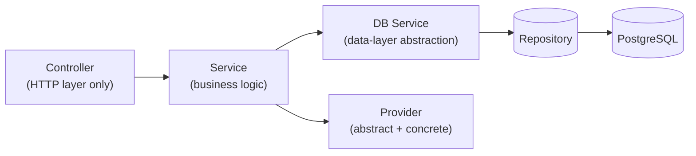

# Module Structure Convention

Standard anatomy for every feature module in this NestJS project.

> **Status**: this is the **target convention** for all new modules, effective immediately.
> Existing modules (`src/auth/`, `src/users/`, `src/media/`, etc.) predate it and have **not**
> been migrated — they still follow the older `src/<module>/` + `src/db/repositories/<module>/`
> (three-layer, no DB Service) shape. Don't take their current layout as the pattern to copy;
> follow this document instead, and treat migrating them as a separate, explicitly-scoped task,
> not something to do incidentally while touching unrelated code.

## Directory Template

```
src/api/payments/                          # Business logic module (HTTP layer + orchestration)
  swagger/
    payments.swagger.ts                    # ALL @ApiOperation/@ApiResponse/@ApiBody decorator
                                            # compositions for PaymentsController — one file per
                                            # controller, imported into the controller as a single
                                            # decorator per route (see "Swagger" below).
  constants/
    payments.constants.ts                  # Module-local constants (defaults, magic strings,
                                            # internal enums) — NOT user-facing messages; those
                                            # come from the single global messages file, see
                                            # "Messages" below.
  types/
    payment.type.ts                        # Module-local TS types/interfaces — domain shape,
                                            # service/db-service method contracts. Replaces the
                                            # older per-module `interfaces/` folder name.
  dto/
    create-payment.dto.ts
    payment-response.dto.ts
  providers/
    payment-gateway.provider.ts            # abstract
    stripe.provider.ts                     # concrete
  payments.controller.ts
  payments.service.ts
  payments.module.ts

src/db/repositories/payments/              # Data access (centralized, NOT inside the module)
  payments.repository.ts                   # Drizzle queries ONLY. One table (or a tightly
                                            # related cluster) at a time. No cross-repository
                                            # orchestration, no transactions spanning repos, no
                                            # business rules.
  payments.db-service.ts                   # PaymentsDbService — the abstraction between
                                            # PaymentsService and PaymentsRepository. See
                                            # "The DB Service layer" below.
```

If a module grows more than one controller, or more than one business service, group them into
their own subfolders rather than piling flat files at the module root:

```
src/api/payments/
  controllers/
    payments.controller.ts
    payments-refunds.controller.ts
  services/
    payments.service.ts
    payments-invoicing.service.ts
  swagger/
    payments.swagger.ts                    # one swagger file per controller, same base name
    payments-refunds.swagger.ts
  constants/
    payments.constants.ts
  types/
    payment.type.ts
  dto/
  providers/
  payments.module.ts
```

> [!IMPORTANT]
> Repositories and DB Services do NOT live inside the business module. They are centralized
> under `src/db/repositories/<domain>/` and registered in the global `DBModule`. This lets any
> module inject any domain's DB Service (never its Repository directly — see below) without
> cross-module coupling or a circular import between business modules.

### Request Flow

Four layers, not three — a DB Service now sits between the business Service and the Repository:



- **Controller** — HTTP layer only. Decorators, route binding, calling the service, wrapping the
  result with the existing response utils. No computation, no branching on business state, no
  data shaping beyond what a DTO's own `static from()` factory does. See "Controllers must stay
  minimal" below.
- **Service** — business logic and orchestration. Enforces business rules, decides what happens,
  coordinates one or more DB Services and/or Providers. Never imports a Repository directly, and
  never runs a Drizzle query itself.
- **DB Service** (new layer — see below) — the data-access abstraction a Service actually talks
  to. Composes Repository calls (including multi-repository transactions), maps raw DB rows to
  domain `types/`, but adds **no business rules** and calls **no Providers** — it's still
  data-layer, just one level above raw queries.
- **Repository** — Drizzle queries only, scoped to one table or a tightly related cluster.
  Unchanged from the previous convention.

### The DB Service layer

`<Module>DbService` (e.g. `PaymentsDbService`) is the thing that changed from the old
Controller→Service→Repository shape. Its job is to be the **one thing a business Service is
allowed to depend on for data access** — Repositories stay purely mechanical (one Drizzle query
shape in, rows out), and anything that needs *composing* — a multi-table transaction, mapping
several repository calls into one domain-shaped result — belongs in the DB Service, not smeared
across the business Service or duplicated into the Repository.

Don't confuse `<Module>DbService` with the existing global `DBService` (`src/db/db.service.ts`)
— that class is the raw Drizzle connection holder (`this.dbService.db.insert(...)`) that
Repositories themselves inject; it is unrelated to, and one layer below, the new per-module DB
Service described here. A `<Module>DbService` injects `<Module>Repository`, not `DBService`
directly — only Repositories talk to the raw connection.

## Module File

```ts
import { Module } from '@nestjs/common';
import { ConfigService } from '@nestjs/config';
import { PaymentsController } from './payments.controller';
import { PaymentsService } from './payments.service';
// NOTE: PaymentsRepository / PaymentsDbService are NOT imported here — DBModule provides both
import { PaymentGatewayProvider } from './providers/payment-gateway.provider';
import { StripeProvider } from './providers/stripe.provider';
import { PaypalProvider } from './providers/paypal.provider';

@Module({
  // No need to import DBModule — it is @Global()
  controllers: [PaymentsController],
  providers: [
    // PaymentsDbService is NOT registered here — DBModule provides it globally
    PaymentsService,
    {
      provide: PaymentGatewayProvider,
      useFactory: (config: ConfigService): PaymentGatewayProvider => {
        const gw = config.get<string>('PAYMENT_GATEWAY') ?? 'stripe';
        return gw === 'paypal' ? new PaypalProvider(config) : new StripeProvider(config);
      },
      inject: [ConfigService],
    },
  ],
  exports: [PaymentsService],
})
export class PaymentsModule {}
```

## Controllers must stay minimal

A controller method's body is: bind parameters via decorators, call exactly one service method,
wrap the result with the existing response utils (`ResponseUtil`, `src/common/helpers/response.utils.ts`),
return it. No computation, no branching, no data transformation beyond a DTO's own `static from()`.
Every route also carries exactly one Swagger decorator composed in that controller's `swagger/`
file — see "Swagger" below — not a pile of inline `@ApiOperation`/`@ApiResponse`/`@ApiBody` calls.

```ts
@Controller({ path: RouteNames.PAYMENTS, version: '1' })
@ApiTags('Payments')
@ApiBearerAuth()
export class PaymentsController {
  constructor(private readonly paymentsService: PaymentsService) {}

  @Post()
  @ApiCreatePayment()
  async create(
    @CurrentUser() user: AuthUser,
    @Body() dto: CreatePaymentDto,
  ): Promise<ApiResponse<PaymentResponseDto>> {
    const payment = await this.paymentsService.create(user.id, dto);
    return ResponseUtil.success(PaymentResponseDto.from(payment));
  }

  @Get()
  @ApiListPayments()
  async list(
    @CurrentUser() user: AuthUser,
    @Query() query: ListPaymentsQueryDto,
  ): Promise<ApiResponse<PaginatedPaymentsDto>> {
    const result = await this.paymentsService.findByUser(user.id, query.page, query.pageSize);
    return ResponseUtil.success(PaginatedPaymentsDto.from(result, query.page, query.pageSize));
  }

  @Delete(':id')
  @Roles('admin')
  @ApiRefundPayment()
  async refund(@Param('id', ParseUUIDPipe) id: string): Promise<ApiResponse<null>> {
    await this.paymentsService.refund(id);
    return ResponseUtil.success(null, MESSAGES.PAYMENTS.REFUNDED);
  }
}
```

Pagination query params (`page`/`pageSize`) move into a small `ListPaymentsQueryDto` in this
example rather than three separate `@Query(...)` parameter decorators — keeps the controller
signature to "one DTO in, one response DTO out" wherever a route takes more than one input field.

## Swagger — one file per controller

Every controller's Swagger metadata (`@ApiOperation`, `@ApiResponse` per status code with a
worked example body, `@ApiBody`/`@ApiParam`/`@ApiQuery` as needed) is composed **once**, in that
controller's `swagger/<name>.swagger.ts` file, as `applyDecorators(...)`-wrapped functions — not
scattered inline across the controller. The controller method then carries exactly one decorator.

```ts
// src/api/payments/swagger/payments.swagger.ts
import { applyDecorators } from '@nestjs/common';
import { ApiBody, ApiOperation, ApiResponse } from '@nestjs/swagger';
import { CreatePaymentDto } from '../dto/create-payment.dto';
import { PaymentResponseDto } from '../dto/payment-response.dto';

export function ApiCreatePayment(): ReturnType<typeof applyDecorators> {
  return applyDecorators(
    ApiOperation({ summary: 'Create a payment', description: 'Charges the given payment token via the configured gateway and records the result.' }),
    ApiBody({
      type: CreatePaymentDto,
      examples: { default: { value: { amount: 2500, currency: 'usd', paymentToken: 'tok_visa' } } },
    }),
    ApiResponse({
      status: 201,
      description: 'Payment created',
      type: PaymentResponseDto,
      examples: { default: { value: { id: 'a1b2c3d4-...', amount: 2500, status: 'succeeded', createdAt: '2026-01-01T00:00:00.000Z' } } },
    }),
    ApiResponse({ status: 402, description: 'Gateway declined the charge' }),
  );
}

export function ApiListPayments(): ReturnType<typeof applyDecorators> { /* ... */ }
export function ApiRefundPayment(): ReturnType<typeof applyDecorators> { /* ... */ }
```

```ts
// payments.controller.ts
@Post()
@ApiCreatePayment()
async create(...) { ... }
```

If the module has multiple controllers, it has multiple swagger files (one per controller, same
base name), all living under the module's one `swagger/` folder — see the multi-controller layout
above.

## Messages — one file, no inline strings

Every user-facing string a controller or service produces (exception messages, custom success
messages passed to `ResponseUtil.success`) comes from a single global constants file, not an
inline literal. **This file does not exist yet** — create
`src/common/constants/messages.constants.ts` the first time a module under this convention needs
it, shaped as one nested `const` keyed by module:

```ts
// src/common/constants/messages.constants.ts
export const MESSAGES = {
  PAYMENTS: {
    NOT_FOUND: 'Payment not found',
    REFUNDED: 'Payment refunded successfully',
  },
  AUTH: {
    INVALID_CREDENTIALS: 'Invalid email or password',
  },
} as const;
```

```ts
// usage
throw new NotFoundException(MESSAGES.PAYMENTS.NOT_FOUND);
return ResponseUtil.success(null, MESSAGES.PAYMENTS.REFUNDED);
```

Module-local `constants/<module>.constants.ts` files are for non-user-facing values only
(defaults, internal magic strings/numbers) — a message a human ends up reading always goes in the
shared file above, never in a module-local one, so there's exactly one place to check for wording
consistency and one place to update for i18n later.

## Service (business logic — orchestrates DB Service + Provider)

```ts
import { PaymentsDbService } from '@db/repositories/payments/payments.db-service';

@Injectable()
export class PaymentsService {
  constructor(
    private readonly paymentsDb: PaymentsDbService,     // Injected from global DBModule
    private readonly gateway: PaymentGatewayProvider,
  ) {}

  async create(userId: string, dto: CreatePaymentDto): Promise<Payment> {
    const result = await this.gateway.charge({ amount: dto.amount, currency: dto.currency, token: dto.paymentToken });
    return this.paymentsDb.recordCharge({ userId, amount: dto.amount, currency: dto.currency, gatewayId: result.transactionId, status: result.status });
  }

  async findById(id: string): Promise<Payment> {
    const payment = await this.paymentsDb.findById(id);
    if (!payment) throw new NotFoundException(MESSAGES.PAYMENTS.NOT_FOUND);
    return payment;
  }

  async refund(id: string): Promise<void> {
    const payment = await this.findById(id);
    await this.gateway.refund(payment.gatewayId);
    await this.paymentsDb.markRefunded(id);
  }

  async findByUser(userId: string, page: number, pageSize: number): Promise<{ data: Payment[]; total: number }> {
    return this.paymentsDb.findByUserPaginated(userId, page, pageSize);
  }
}
```

Note `PaymentsService` never imports `PaymentsRepository` and never touches Drizzle — every data
need goes through `PaymentsDbService`.

## DB Service (data-layer abstraction — new)

File: `src/db/repositories/payments/payments.db-service.ts`

```ts
@Injectable()
export class PaymentsDbService {
  constructor(private readonly repo: PaymentsRepository) {}

  /** Composes the repository call(s) a "record a successful charge" write needs. */
  async recordCharge(data: Omit<Payment, 'id' | 'createdAt'>): Promise<Payment> {
    return this.repo.create(data);
  }

  async findById(id: string): Promise<Payment | null> {
    return this.repo.findById(id);
  }

  async markRefunded(id: string): Promise<void> {
    await this.repo.updateStatus(id, 'refunded');
  }

  async findByUserPaginated(userId: string, page: number, pageSize: number): Promise<{ data: Payment[]; total: number }> {
    return this.repo.findByUserId(userId, page, pageSize);
  }
}
```

This particular module's DB Service is thin because each business operation only ever touches one
repository call — that's fine and expected for a simple module. The layer earns its keep on a
module where one Service operation needs several repository calls composed together (a signup
flow inserting `tenants` + `users` + `user_identities` in one transaction is exactly this shape —
see the "Auth flows" section of `apps/documentation/docs/backend/auth/overview.md` for a flow that
will need it once implemented) — the transaction boundary and the composition belong in the DB
Service, not in the business Service and not duplicated across Repository methods.

## Repository (centralized under src/db/repositories/)

File: `src/db/repositories/payments/payments.repository.ts` — unchanged in shape and purpose from
the previous convention: raw Drizzle queries, one table (or tightly related cluster), nothing else.

After creating the repository and DB service, register both in `src/db/db.module.ts`:
1. Import both classes.
2. Add both to the `providers`/`exports` arrays (whatever DBModule uses — mirror how the existing
   repository is registered there).

```ts
// src/db/repositories/payments/payments.repository.ts
@Injectable()
export class PaymentsRepository {
  constructor(private readonly dbService: DBService) {}

  async create(data: Omit<Payment, 'id' | 'createdAt'>): Promise<Payment> {
    const rows = await this.dbService.db.insert(payments).values(data).returning();
    return rows[0]!;
  }

  async findById(id: string): Promise<Payment | null> {
    const rows = await this.dbService.db.select().from(payments).where(eq(payments.id, id)).limit(1);
    return rows[0] ?? null;
  }

  async updateStatus(id: string, status: string): Promise<void> {
    await this.dbService.db.update(payments).set({ status }).where(eq(payments.id, id));
  }

  async findByUserId(userId: string, page: number, pageSize: number): Promise<{ data: Payment[]; total: number }> {
    const offset = (page - 1) * pageSize;
    const [totalResult, rows] = await Promise.all([
      this.dbService.db.select({ count: count() }).from(payments).where(eq(payments.userId, userId)),
      this.dbService.db.select().from(payments).where(eq(payments.userId, userId))
        .orderBy(desc(payments.createdAt)).limit(pageSize).offset(offset),
    ]);
    return { data: rows, total: totalResult[0]?.count ?? 0 };
  }
}
```

## Types, DTOs — every property needs an example, every method needs a return type

```ts
// types/payment.type.ts — module-local domain type, not a DTO
export interface Payment {
  id: string; userId: string; amount: number; currency: string;
  gatewayId: string; status: string; createdAt: Date;
}

// dto/create-payment.dto.ts — every @ApiProperty needs an `example`, no exceptions
export class CreatePaymentDto {
  @ApiProperty({ example: 2500, description: 'Amount in the smallest currency unit (cents).' })
  @IsNumber() @Min(1) amount!: number;

  @ApiProperty({ example: 'usd' })
  @IsString() @IsNotEmpty() currency!: string;

  @ApiProperty({ example: 'tok_visa' })
  @IsString() @IsNotEmpty() paymentToken!: string;
}

// dto/payment-response.dto.ts
export class PaymentResponseDto {
  @ApiProperty({ example: 'a1b2c3d4-5e6f-7890-abcd-ef1234567890' }) id!: string;
  @ApiProperty({ example: 2500 }) amount!: number;
  @ApiProperty({ example: 'succeeded' }) status!: string;
  @ApiProperty({ example: '2026-01-01T00:00:00.000Z' }) createdAt!: Date;

  static from(p: Payment): PaymentResponseDto {
    const dto = new PaymentResponseDto();
    Object.assign(dto, { id: p.id, amount: p.amount, status: p.status, createdAt: p.createdAt });
    return dto;
  }
}
```

Every method in every layer (controller, service, DB service, repository) declares an explicit
return type — `Promise<PaymentResponseDto>`, `Promise<Payment | null>`, `Promise<void>`, etc. —
never left to inference and never `any`. This is what makes the layering enforceable at
compile-time: a Service that accidentally returns a raw Drizzle row instead of a `Payment` domain
type, or a Controller that accidentally returns an entity instead of a `*ResponseDto`, is a type
error, not something that only shows up in a code review.

## Documentation-first: write the module's docs before the code

Per the root workflow (`CLAUDE.md`'s "Module Development Workflow"), every new module gets its
documentation written and confirmed with the user **before** implementation starts, not
backfilled after. The required pair, under `apps/documentation/docs/backend/<module>/` —
`overview.md` and `api-reference.md` — mirrors `apps/documentation/docs/backend/auth/` exactly;
treat that pair as the template:

- **`overview.md`**: objectives (what this module is for and why it exists), architecture (data
  model, request pipeline specifics beyond the global one, any module-specific middleware/guards),
  and the module's own flow narratives (mapped to schema tables, independent of endpoint-level
  detail).
- **`api-reference.md`**: the endpoint-by-endpoint contract — every route's request/response
  shape with a worked example (matching what ends up in the route's Swagger file), error codes,
  and any cross-request mechanics (e.g. auth's OAuth `state`-signing) that don't belong on a
  single endpoint's own description.

## Wiring into the App

1. **Write `overview.md` + `api-reference.md` first** (see above) and get them confirmed before
   writing any code.
2. Add `PAYMENTS = 'payments'` to `src/common/route-names.ts`.
3. Scaffold `src/api/payments/` per the directory template above (`swagger/`, `constants/`,
   `types/`, `dto/`, controller, service, module).
4. Create the repository and DB service in `src/db/repositories/payments/`
   (`payments.repository.ts` + `payments.db-service.ts`).
5. Register both in `src/db/db.module.ts` (import + add to the providers/exports arrays).
6. Add any new user-facing strings to `src/common/constants/messages.constants.ts` (create it if
   it doesn't exist yet) rather than inlining them.
7. Import `PaymentsModule` in `app.module.ts`.
8. Create the migration (see `sql-first-workflow.md`).
9. Run `pnpm db:migrate` then `pnpm db:introspect` to update `src/db/drizzle/schema.ts`.
