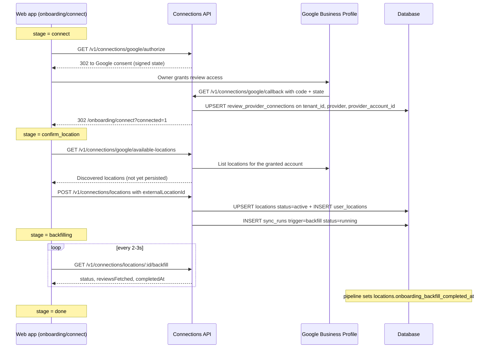
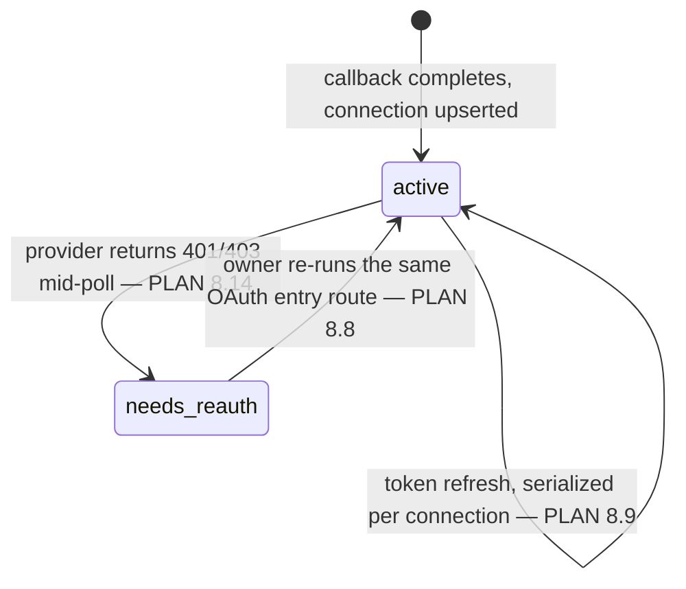

# Connections Module

## Overview

The connections module owns the link between a tenant and the external service its reviews
actually come from. For MVP that service is Google Business Profile (GBP), and the module's job
is narrow but load-bearing: hold the OAuth grant that lets the platform read a business's reviews
and write replies back, record which physical location that grant is scoped to, and expose enough
sync observability that "why haven't any new reviews shown up?" is answerable from the product
rather than from server logs. The relevant tables live in
`apps/backend/src/db/drizzle/migrations/0003_review_provider_locations.sql`
(`review_provider_connections`, `locations`, `user_locations`) and `0004_reviews.sql`
(`sync_runs`); every enum they reference is declared in `0000_foundation.sql`.

**This is review-data access, not login.** The [auth module](../auth/overview.md) owns *signing
in* — `user_identities.provider` is a `user_identity_provider` (`entra_id`, `google`) and answers
"which external account is this person." This module owns *reading review data* —
`review_provider_connections.provider` is a `review_provider` (`google`) and answers "which
external account's business reviews may we read and reply to." `PLAN.md` §2 decouples them
deliberately: a tenant that signs in with Microsoft SSO still has to connect Google Business
Profile separately, because Entra ID has nothing to say about a Google review, and the GBP grant
is a per-business authorization the owner makes once — not a per-session identity assertion. The
two never share a row, a table, or an enum value, and nothing in this module should read
`user_identities` or vice versa. See the auth overview's
[Data model](../auth/overview.md#data-model) for the same distinction stated from the other side.

The module's consumers are the onboarding **connect** flow and the Settings → **Connection** tab
in the web app, plus the review pipeline itself. Onboarding is where a connection is created:
`PLAN.md` §4.3a's owner self-registration ends with the owner signed in and redirected to
`/onboarding/connect`, and from there the UI runs a **four-stage** flow — connect → confirm the
discovered location → watch the historical backfill fill a progress bar → done. That third stage
is why this module exposes a pollable backfill-progress endpoint rather than only a fire-and-forget
"start import" call. Settings is where an existing connection is inspected and disconnected. The
review pipeline reads the connection and the location, not this module's HTTP surface.

The one thing this module deliberately does **not** own is the ingestion itself. The 15-minute
poller, the upsert-by-`external_review_id` path, classification, and the historical-response
backfill *job* are the review pipeline's — documented separately in
[../review-pipeline/overview.md](../review-pipeline/overview.md). This module writes the rows that
gate and describe that pipeline (`locations.status`,
`locations.onboarding_backfill_completed_at`, `review_provider_connections.status`) and reads back
the rows the pipeline writes (`sync_runs`, `locations.last_sync_*`). Where the boundary is
genuinely subtle — who sets `onboarding_backfill_completed_at`, who flips a connection to
`needs_reauth` — it's called out explicitly below rather than left to inference.

## Data model

| Table | Purpose |
|---|---|
| `review_provider_connections` | One row per (tenant, provider, provider account). Holds `provider_account_id`, a `credential_reference` (a **pointer** to the stored OAuth credential, never the token itself), `token_expires_at` (nullable), `connected_by_user_id`, and `status` (`google_connection_status`: `active` \| `needs_reauth`). Unique on `(tenant_id, provider, provider_account_id)`. |
| `locations` | One row per business location reachable through a connection. `provider_connection_id` (FK, `ON DELETE CASCADE`), `provider` (denormalized from the connection — see below), `external_location_id`, `name`, `address` (nullable), `status` (`location_status`), plus the sync-observability trio `last_synced_at` / `last_sync_status` / `last_sync_error` and the pipeline gate `onboarding_backfill_completed_at`. Unique on `(provider_connection_id, external_location_id)` — the idempotent-upsert key (`PLAN.md` §2). |
| `user_locations` | Which users may see/act on which location. Unique on `(user_id, location_id)`. Trivially redundant at MVP (one tenant, one location) and kept anyway — see [MVP scope](#mvp-scope). |
| `sync_runs` | One row per poll or backfill attempt against a location. `"trigger"` (`sync_trigger`), `started_at`, `completed_at` (nullable), `status` (`sync_run_status`), `reviews_fetched` (nullable), `error_message` (nullable). Written by the pipeline, read by this module's sync-health endpoints. Partial unique index `UNIQUE (location_id) WHERE status = 'running'` — one active run per location (`PLAN.md` §8.1). |

Two structural details on that table worth knowing before reading any endpoint:

- **`locations.provider` is denormalized** from `review_provider_connections.provider`
  (`PLAN.md` §1's ER comment says exactly this). No constraint keeps the two in step — whatever
  writes a `locations` row must copy the value off the connection row it points at, not accept it
  from a request body.
- **`user_locations` is the only table in this module with no `tenant_id`.** Tenant scoping has to
  be enforced by joining through `locations`. This has a second, less obvious consequence: the
  global `log_db_changes()` trigger extracts `audit_logs.tenant_id` generically from the written
  row's own `tenant_id` key (`PLAN.md` §6.1), so every `user_locations` audit row lands with
  `tenant_id = NULL` and is invisible to a tenant-scoped audit query. Not fatal — the `locations`
  and `review_provider_connections` writes around it are captured correctly — but don't rely on a
  tenant-filtered `audit_logs` read to reconstruct location-visibility changes.

The enums that matter, with their exact value lists as declared in `0000_foundation.sql`:

- `review_provider` — `google`.
- `google_connection_status` — `active`, `needs_reauth`. (Name kept from the pre-generalization
  `google_connections` table; it now types a provider-agnostic column.)
- `location_status` — `active`, `inactive`.
- `sync_health_status` — `ok`, `error`.
- `sync_trigger` — `scheduled`, `backfill`.
- `sync_run_status` — `running`, `ok`, `error`.

**Two pairs are easy to confuse, and confusing either one is a real bug, not a naming nit:**

- **`review_provider` vs. `user_identity_provider`.** Both list `google`. They mean completely
  different things — review-data source vs. login identity — and live on different tables
  (`review_provider_connections`/`locations` vs. `user_identities`/`platform_admin_identities`).
  A tenant can have a `user_identities` row with `provider = 'entra_id'` and a
  `review_provider_connections` row with `provider = 'google'` at the same time; that's the
  expected configuration for this engagement, not a mismatch to reconcile.
- **`location_status` vs. `sync_health_status`.** `PLAN.md` §2's `locations` section keeps these
  as two separate columns on purpose: `status` answers "is this still a valid place to poll at
  all?" (business closed, owner disconnected) while `last_sync_status` answers "did the most
  recent poll attempt succeed?". A location is legitimately `status = 'active'` with
  `last_sync_status = 'error'` (still valid, just failed last time), and a
  `status = 'inactive'` location's sync health should be ignored entirely rather than surfaced as
  a problem. Collapsing them into one field loses the ability to distinguish "broken" from
  "switched off."

A third, quieter overlap: `sync_health_status` (`ok`, `error`) is **not**
`sync_run_status` (`running`, `ok`, `error`). `locations.last_sync_status` has no `running`
value, so it can never express "a poll is in progress right now" — that state only exists on the
`sync_runs` row. Any UI that wants "syncing…" reads `sync_runs`, not the location.

## Connection flows

Four flows, each mapped to the rows it actually writes.

**1. Initial connect during onboarding.** The owner arrives at `/onboarding/connect` already
authenticated (the auth module's signup callback put them there — see
[../auth/api-reference.md](../auth/api-reference.md)). The four UI stages map onto the API like
this:

The ordering is not cosmetic. `locations.onboarding_backfill_completed_at` is the gate that keeps
the regular poller and the classifier from touching a location before its one-time historical
import has finished (`PLAN.md` §8.2) — without it, the live classifier could pick up a review the
backfill hasn't yet marked `responded` and push a years-old, already-answered review through
classification, AI generation, and an escalation notification. The scheduler simply doesn't
enqueue scheduled runs for a location whose column is still `NULL`, so "done" in the UI and
"eligible for live polling" in the backend are the same event.

**2. Reconnect / `needs_reauth`.** A GBP grant stops working for ordinary reasons: the owner
revokes it in their Google account, the refresh token rotates out, the password changes. Whoever
first sees a 401/403 from the provider — in practice the poller, mid-run — sets
`review_provider_connections.status = 'needs_reauth'`, marks the in-flight `sync_runs` row
`status = 'error'` with a real `error_message`, and stops rather than retrying inside the same run
(`PLAN.md` §8.14). It also populates `locations.last_sync_status = 'error'` and
`last_sync_error`, which is what makes the failure visible in Settings without a log dive.

Recovery reuses the *same* entry route as a first-time connect. There is no separate "reauth"
endpoint, because the OAuth round trip is identical and the write is an upsert either way: the
callback matches on `(tenant_id, provider, provider_account_id)` and **updates** the existing row —
new `credential_reference`, new `token_expires_at`, `status` back to `active` — rather than
attempting a blind insert that would just violate the unique index (`PLAN.md` §8.8 states this as
an explicit upsert requirement, not an error to handle).

Token *refresh* — as opposed to re-consent — is invisible to this module's HTTP surface but has a
concurrency requirement worth stating here because it's where the credential lives: a scheduled
poll and a human-triggered reply post can both discover a near-expired token at the same instant,
and if the provider rotates refresh tokens on use, one of the two concurrent refreshes invalidates
the other's token and produces a *false* `needs_reauth`. Refresh must be serialized per
`review_provider_connections` row — an advisory lock, or a cached-token re-check before
refreshing (`PLAN.md` §8.9).

**3. Disconnect.** The Settings tab's disconnect action is destructive-looking but must not be
destructive. `PLAN.md` §8.15 makes this a process guarantee rather than a schema constraint:
disconnect **never** issues a `DELETE` on `locations`. It flips `locations.status = 'inactive'`,
the poller stops selecting inactive locations, and historical `reviews`/`sync_runs` rows stay
intact. The reason is a cascade chain: `locations.provider_connection_id` is
`ON DELETE CASCADE`, and both `reviews.location_id` and `sync_runs.location_id` cascade from
`locations` — so deleting a connection row would silently take the tenant's entire review history
and sync history with it, and would also free §8.1's `running` lock out from under a poller that
is still mid-batch, which then hits FK violations on its next upsert. A real `DELETE` on a
`locations` row is a support/admin action that must first check for (and refuse, or wait out) any
`sync_runs` row still `running` for that location.

That leaves an honest problem this module has to work around: **`google_connection_status` has no
`disconnected` value**, so there is nowhere on the connection row to record that the owner
disconnected. See [Gap](#gap-between-current-code-and-target-design) for the follow-up migration
this needs and the interim behavior.

**4. Per-poll sync-health updates.** Every pipeline run, scheduled or backfill, writes the same
two places: a `sync_runs` row for the run itself (`started_at` → `completed_at`, `status`,
`reviews_fetched`, `error_message`) and a rolled-up snapshot on the location
(`last_synced_at`, `last_sync_status`, `last_sync_error`). The duplication is intentional —
`sync_runs` is the history a support engineer paginates, `locations.last_sync_*` is the single
current value the UI renders without a subquery. This module only ever **reads** both; the writes
belong to the pipeline.

## API surface

All routes are versioned under `/v1/connections` (`RouteNames.CONNECTIONS`, `version: '1'`).

| Method | Path | Auth | Notes |
|---|---|---|---|
| `GET` | `/v1/connections` | Bearer | The tenant's connection summary — backs Settings' Connection tab and the dashboard access guard. |
| `GET` | `/v1/connections/google/authorize` | Bearer | `302` into Google's consent screen. Also the reconnect path (`PLAN.md` §8.8). |
| `GET` | `/v1/connections/google/callback` | Public | OAuth callback. Upserts the connection, `302` back to the frontend. |
| `DELETE` | `/v1/connections/google` | Bearer, `@Roles('owner')` | Disconnect. Deactivates locations; never deletes rows (`PLAN.md` §8.15). |
| `GET` | `/v1/connections/google/available-locations` | Bearer | Live provider-side location discovery. Not persisted. |
| `GET` | `/v1/connections/locations` | Bearer | The tenant's persisted `locations` rows. |
| `POST` | `/v1/connections/locations` | Bearer, `@Roles('owner')` | Select/confirm a location; starts the backfill. |
| `GET` | `/v1/connections/locations/:locationId/backfill` | Bearer | Backfill progress polling — drives the onboarding progress bar. |
| `GET` | `/v1/connections/locations/:locationId/sync-health` | Bearer | Current rolled-up sync health for one location. |
| `GET` | `/v1/connections/locations/:locationId/sync-runs` | Bearer | Paginated `sync_runs` history. |

Full request/response contracts, field tables, and every error code: see
[Connections Module — API Reference](./api-reference.md).

Two routing notes that matter at implementation time. `google` is a literal segment here, not a
`:provider` param, because `review_provider` has exactly one value today — but the static
`locations` group sits at the same depth, so the day a second provider lands and `google` becomes
`:provider`, the `locations` routes must be registered **before** it or they'll be swallowed as a
provider name. And the backfill-progress route is polled every 2–3 seconds by the onboarding
screen, which exceeds the global `short` throttle tier (30/min) inside the first minute — it needs
its own `@Throttle` override, see the API reference.

## MVP scope

**One connection and one location per tenant.** The schema does not enforce either. There is no
partial unique index like `UNIQUE (tenant_id) WHERE status = 'active'` on `locations`, and
`review_provider_connections` is unique on `(tenant_id, provider, provider_account_id)` — which
permits several connections per tenant, one per Google account. Both limits are **application
rules** enforced by this module's service layer (a `409` on a second location), not database
invariants. That's deliberate: `PLAN.md` §2 restores `user_locations` precisely because "one
location for MVP" implies multi-location is coming, and every review/notification query that
scopes by location will need to join through it — adding a constraint now that multi-location
would immediately have to drop is worse than enforcing the current rule one layer up.

`user_locations` therefore gets written even though nothing reads it discriminatingly yet: when a
location is confirmed, the confirming user gets a row. At MVP every user in the tenant trivially
sees the only location, so a query that joins through `user_locations` and one that filters on
`locations.tenant_id` return the same rows — the point is that the join is already in place when
that stops being true.

**What the frontend exposes today vs. the backend target.** Mirroring how auth handles this: the
restriction is the frontend's, and the backend does not encode it.

| Capability | Frontend today | Backend target |
|---|---|---|
| Connect a GBP account | Onboarding `connect` stage — one button | `GET /v1/connections/google/authorize` + callback |
| Choose a location | `confirm_location` stage renders exactly **one** discovered location and a Continue button (`use-onboarding-connect-flow.ts` hardcodes a single `DISCOVERED_LOCATION`) | `available-locations` returns a **list**; `POST /v1/connections/locations` takes one `externalLocationId`. A multi-location picker is a frontend change only |
| Backfill progress | `backfilling` stage: a 0–100 bar plus "imported / total", currently advanced by a `setInterval` timer with no API behind it | `GET .../backfill` polled until `status` is terminal |
| Connection status | Settings → Connection renders `ConnectionInfo` (`businessName`, `lastSyncedAt`, `status: "connected" \| "disconnected"`), sourced from `GoogleConnectionService`, which is `localStorage`-backed and self-documents as a placeholder for a real API call | `GET /v1/connections` returns the same three fields plus the ones the UI has no place for yet — `needsReauth`, `lastSyncStatus`, `lastSyncError`, `tokenExpiresAt` |
| Disconnect | Settings → Connection, owner-visible, with an inline confirm | `DELETE /v1/connections/google` |
| Sync history | Nothing renders it | `GET .../sync-runs` — documented and built, because "did the poller run?" is a support question with no other answer |

The frontend's `ConnectionStatus` is a two-value union (`connected` \| `disconnected`) while
`google_connection_status` is `active` \| `needs_reauth` — these do **not** line up, and the
mapping is not one-to-one. `needs_reauth` is a *connected-but-broken* state that the current UI
can only render as one of its two values, and rendering it as `connected` (technically true — a
row exists) hides exactly the failure the field was added to surface. The API returns both a
coarse `status` the current UI can consume and the underlying `connectionStatus`, so the frontend
can start showing a third "action needed" state without an API change.

## Gap between current code and target design

**Nothing in this module exists in `apps/backend/src/` today.** Verified: the only file under
`src/` that mentions `review_provider_connections`, `locations`, `user_locations`, or `sync_runs`
is the migration that creates them. There is no `src/api/connections/`, no
`src/db/repositories/connections/`, no `CONNECTIONS` entry in `src/common/route-names.ts`, and no
GBP provider client anywhere. This is a from-scratch module, which is the easy case: there is no
generic-boilerplate legacy to unpick the way [auth](../auth/overview.md#gap-between-current-code-and-target-design)
has, only conventions to follow from the first commit.

What has to be built, following `apps/backend/docs/conventions/module-structure.md` and
`apps/backend/CLAUDE.md`:

- **`src/api/connections/`** with the required subfolders — `swagger/`, `constants/`, `types/`,
  `dto/`, `providers/`. The surface above is two coherent groups (connection/location lifecycle
  vs. sync observability), so expect `controllers/connections.controller.ts` +
  `controllers/connections-sync.controller.ts` under the multi-controller layout, with **one
  swagger file per controller** (`swagger/connections.swagger.ts`,
  `swagger/connections-sync.swagger.ts`) — never inline `@ApiOperation`/`@ApiResponse` on a route.
- **A `ReviewProviderProvider` abstract base plus a `GoogleBusinessProfileProvider`
  implementation** under `providers/`, selected by factory in module registration. This is the
  same Provider/Strategy shape the codebase already uses for Email/SMS/AI, and the reason
  `0003_review_provider_locations.sql`'s own header comment gives for generalizing the table away
  from a Google-only name. Everything provider-specific — consent URL construction, location
  listing, the shape of an `external_location_id` — lives behind it.
- **`src/db/repositories/connections/`** with `connections.repository.ts` (Drizzle queries only)
  and `connections.db-service.ts`, both registered in `src/db/db.module.ts`. The DB service earns
  its keep here: confirming a location is a genuine multi-table transaction (upsert `locations`,
  insert `user_locations`, insert the `backfill` `sync_runs` row) and that boundary belongs in the
  DB service, not smeared across the business service. `sync_runs` is read by this module and
  written by the pipeline — decide deliberately whether it gets a repository here or is read
  through the pipeline's; do not end up with two repositories writing the same table.
- **`CONNECTIONS = 'connections'` in `src/common/route-names.ts`** — controllers must use the
  enum, never a raw string.
- **`src/common/constants/messages.constants.ts`** — still does not exist (`src/common/constants/`
  is not even a directory yet). Every user-facing string this module produces goes in it under a
  `CONNECTIONS` key. No inline literals in a controller, service, or DB service.
- **Config**: no GBP env vars exist. `GOOGLE_CLIENT_ID`/`GOOGLE_CLIENT_SECRET`/
  `GOOGLE_CALLBACK_URL` are already in `src/config/env.config.ts` — for auth's Google *login*
  strategy — and reusing them here would be a mistake, not a shortcut: the two grants need
  different scopes, different consent copy, and different revocation blast radii, and sharing one
  client means revoking review access also breaks login. Add a separate `GBP_*` set
  (`GBP_CLIENT_ID`, `GBP_CLIENT_SECRET`, `GBP_CALLBACK_URL`), plus the operational knobs the
  backfill and staleness rules need — see the API reference.
- **Every DTO property gets an `example`; every method on every layer gets an explicit return
  type.** Both are hard requirements of the convention, and both are cheap to get right on a new
  module and expensive to retrofit.

Schema gaps — things this module needs that the migrations do not have. Flagged here rather than
silently assumed, the same way auth's API reference flags the missing `refresh_tokens` table:

- **No `disconnected` state for a connection.** `google_connection_status` is
  (`active`, `needs_reauth`) only. Disconnect cannot be recorded on the connection row, and
  deleting the row is unsafe (the cascade chain in [flow 3](#connection-flows) above). Required
  follow-up migration: either `ALTER TYPE google_connection_status ADD VALUE 'disconnected'` or a
  nullable `disconnected_at TIMESTAMPTZ` column on `review_provider_connections`. A nullable
  timestamp is the better shape — it records *when*, survives a later reconnect as history, and
  keeps `status` describing credential health rather than mixing in owner intent. Interim behavior
  is documented on the disconnect endpoint.
- **No denominator for backfill progress.** `sync_runs` has `reviews_fetched` and nothing to
  divide it by. The onboarding UI renders a 0–100 bar and "imported / total"; that total is not
  derivable from the schema. Required follow-up if a determinate bar is wanted: a nullable
  `sync_runs.reviews_total` (or `reviews_target`), written once the first provider page reports a
  total. Until then the endpoint returns `totalToImport: null` and the UI must fall back to an
  indeterminate bar — see the API reference, which specifies both shapes.
- **No `scopes` column.** `PLAN.md` §2 lists `scopes` on `review_provider_connections` as "if
  useful for debugging, optional for MVP" and it was not added. The consequence is concrete: after
  a reconnect there is no way to detect that the owner granted *narrower* scopes than before, so a
  connection can look `active` while lacking reply permission, and the first symptom is a failed
  post. Cheap to add, worth adding before the reply-posting path ships.
- **No composite index for the sync-run history query.** `sync_runs` has
  `idx_sync_runs_location_id` but nothing on `(location_id, started_at DESC)`, which is exactly
  what the history endpoint orders by. Irrelevant at MVP row counts (a few thousand per location
  per year); a one-line follow-up when it isn't.
- **One-active-location is unenforced at the database level** — a deliberate decision, see
  [MVP scope](#mvp-scope), listed here so it isn't mistaken for an oversight.
