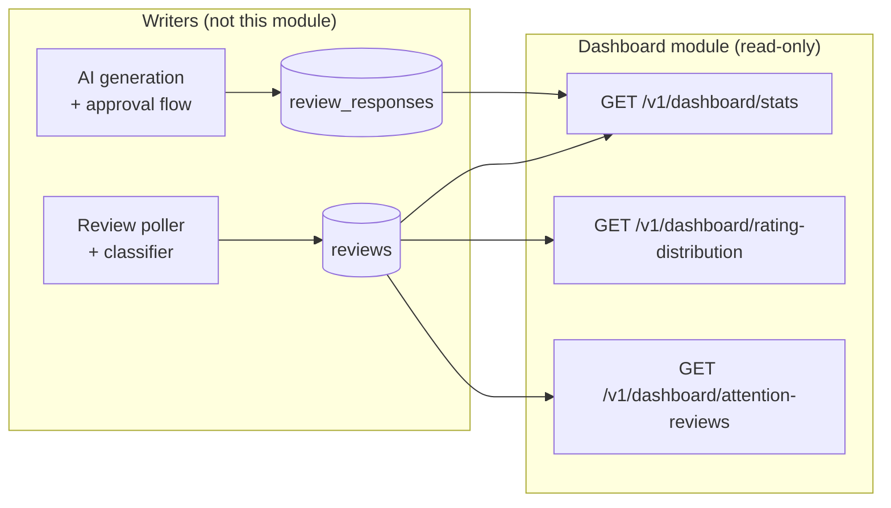

# Dashboard Module

## Overview

The dashboard module serves the four stat cards, the rating-distribution bars, and the "Needs
your attention" grid on the app's landing screen. It is **read-only and owns no tables**. Every
number it returns is an aggregate over two tables another module writes: `reviews` and
`review_responses` (`apps/backend/src/db/drizzle/migrations/0004_reviews.sql`, plus the three
columns `0006_prompts.sql` adds to `review_responses` by `ALTER`), with the enum values those
columns take declared in `0000_foundation.sql`. There is no `dashboard_*` table, no materialized
view, and no counter column anywhere — if a figure on this screen is wrong, the bug is either in
the SQL predicate documented below or in the ingestion/classification pipeline that produced the
rows, never in stale denormalized state.

It exists as its own module rather than as three extra routes on [the reviews
module](../reviews/overview.md) (being written in parallel) because the two have opposite
shapes. The reviews module is a write surface over a domain entity: it returns `Review` rows
with their `review_responses` children, and it mutates them (approve, edit, dismiss, post).
This module returns
**view models** — numbers and a truncated projection assembled for one specific screen, with
derived fields (`initials`, `snippet`, `percentage`) that correspond to no column in any table.
Mixing those into `../reviews/` would mean one controller whose routes disagree about whether
they return domain rows or presentation shapes, and one repository that both mutates review
state and computes tenant-wide aggregates. Splitting them keeps `../reviews/` honest about the
entity and confines the screen-shaped compromises here, where they are bounded by the fact that
nothing in this module writes anything.

The tradeoff worth naming: a view-model module has exactly one consumer, so its contract is
coupled to a UI that may change. That is acceptable here specifically because the module is
read-only — a screen redesign changes what this module selects and how it truncates, and can
never corrupt data. It would not be acceptable for a module that writes.



This document covers what each number means and how it is derived. For the wire contracts —
query parameters, response bodies, status codes, errors — see [Dashboard Module — API
Reference](./api-reference.md).

## Data model

No owned tables. The table below is this module's real data model: one row per figure the API
exposes, mapped to the exact columns and predicate that produce it. `$t` is the caller's
`tenant_id`, taken from the JWT and never from a request parameter (see the auth reference's
[session/token model](../auth/api-reference.md#session--token-model-1)); `$from` is the range
lower bound described in [Metric definitions](#metric-definitions).

| Metric | Source table | Columns | Filter | Index support |
|---|---|---|---|---|
| `reviewCount` | `reviews` | `COUNT(*)` | `tenant_id = $t AND reviewed_at > $from AND removed_upstream_at IS NULL` | **Missing** — needs `(tenant_id, reviewed_at)` |
| `averageRating` | `reviews` | `AVG(rating)` | Same predicate as `reviewCount` | **Missing** — same index, ideally covering `rating` |
| `pendingApproval` | `reviews` ⋈ `review_responses` | `COUNT(DISTINCT reviews.id)`, `review_responses.status` | Above, plus `EXISTS` a `review_responses` row with `tenant_id = $t AND review_id = reviews.id AND status = 'pending_approval'` | **Missing** — needs a partial index on `review_responses(review_id) WHERE status = 'pending_approval'` |
| `escalatedOpen` | `reviews` | `COUNT(*)`, `classification`, `status` | Above, plus `classification = 'escalated' AND status IN ('new', 'in_review')` | **Missing** — needs a partial index, see [Gap](#gap-between-current-code-and-target-design) |
| `range` | — | — | Echo of the validated query parameter | n/a |
| `rangeLabel` | — | — | **Not returned by the API** — client-formatted, see [Metric definitions](#the-date-range-and-what-bounds-it) | n/a |
| Distribution `star` | — | — | Fixed axis `5, 4, 3, 2, 1`, emitted even for stars with zero rows | n/a |
| Distribution `count` | `reviews` | `COUNT(*) GROUP BY rating` | Same predicate as `reviewCount` | **Missing** — `(tenant_id, reviewed_at, rating)` would make this index-only |
| Distribution `percentage` | — | — | `ROUND(100.0 * count / MAX(count) OVER ())` — normalized to the **largest** bucket, not the total | n/a |
| Attention `id` | `reviews` | `id` | `tenant_id = $t AND classification = 'escalated' AND status IN ('new', 'in_review') AND removed_upstream_at IS NULL` — **no date range**, see below | **Missing** — needs the partial index below |
| Attention `reviewerName` | `reviews` | `reviewer_name` | Nullable column; `anonymized_at` clears it — falls back to a placeholder | n/a |
| Attention `initials` | `reviews` | derived from `reviewer_name` | Not a column. Computed server-side in the row → type mapping | n/a |
| Attention `rating` | `reviews` | `rating` | `CHECK (rating BETWEEN 1 AND 5)` guarantees `1`–`5` | n/a |
| Attention `snippet` | `reviews` | derived from `review_text` | Not a column. First 80 characters, `…` appended when longer | n/a |
| Attention `escalationReason` | `reviews` | `escalation_reason` | `low_rating` \| `blocklist_match`. **Nullable in SQL** while the client type requires a value — see [Gap](#gap-between-current-code-and-target-design) | n/a |

Enum values referenced above, all from `0000_foundation.sql`:

- `review_status` — `new`, `in_review`, `responded`, `dismissed`.
- `review_classification` — `auto_reply_candidate`, `escalated`, `pending_classification`.
- `escalation_reason` — `low_rating`, `blocklist_match`.
- `response_status` — `draft`, `pending_approval`, `approved`, `rejected`, `posted`,
  `post_failed`, `superseded`.

Two columns on `reviews` this module reads but never mentions on the wire: `anonymized_at` and
`removed_upstream_at`. Both are exclusion/fallback signals, covered under [Rows the aggregates
deliberately skip](#rows-the-aggregates-deliberately-skip).

## Metric definitions

### The date range and what bounds it

The frontend's `DateRange` is a closed set of three values — `7d`, `30d`, `90d`
(`apps/web/src/types/domain.ts`), rendered as three tabs. **On the wire this is a `range` query
enum, not explicit `from`/`to` timestamps.** Reasons, in order of weight:

1. **One definition of the boundary, server-side.** "Last 7 days" has to be resolved to a
   timestamp comparison somewhere. Done on the server, the stat cards and the rating
   distribution provably share one window. Done on the client, they share it only as long as
   two call sites keep agreeing.
2. **A closed enum is validatable and finite.** `@IsEnum` rejects everything else at the DTO
   layer, and there are exactly three windows per tenant to reason about — which matters for the
   index and caching questions in [Caching and cost](./api-reference.md#caching-and-cost).
   `from`/`to` accepts arbitrary, unbounded, potentially inverted windows nobody asked for, needs
   its own span cap, and has no UI behind it — there is no custom date picker on this screen.

The cost is that a custom range needs an API change. That is the right trade now, and the
forward path is additive rather than a rewrite: add optional `from`/`to` later as a superset,
keeping `range` as sugar over it, so no existing caller breaks.

**The window is rolling, not calendar-aligned.** `$from` is `now() - interval 'N days'`, and the
window is half-open: `reviewed_at > $from` (there is no upper bound — a `reviewed_at` in the
future would be provider data we should not silently hide). Calendar-day boundaries were
rejected because they have no defensible anchor: **no table in the schema carries a timezone
column** — not `tenants`, not `tenant_settings`, not `locations` — so "midnight" would mean the
server's timezone, which is an operational detail leaking into a business number. The
consequence is honest and should be expected: two calls seconds apart can return different
counts, and the numbers drift continuously instead of stepping at midnight. Calendar windows are
a follow-up gated on a real timezone column, not on this module.

**`rangeLabel` is client-formatted; the server does not send it.** The field is declared on
`DashboardStats` and populated in the fixtures, but a search of `apps/web/src/` shows it is
**never read** — the tab labels come from `messages/en.json` under `dashboard.dateRanges.*` via
`next-intl`. A localized display string belongs where the locale is known; the API echoes the
validated `range` value instead, which is all the client needs to key its own label. See
[`GET /v1/dashboard/stats`](./api-reference.md#get-v1dashboardstats).

### `averageRating` is InnoPeak's average, not Google's rating

This is the single easiest number on the screen to conflate, and the UI deliberately shows both
at once, a few hundred pixels apart:

- **`DashboardStats.averageRating`** — `AVG(reviews.rating)` over the reviews **InnoPeak has
  ingested**, restricted to the selected range and the current tenant. It is this module's
  number, it moves with the range tab, and it is what the "Average rating" stat card renders as
  `averageRating.toFixed(1)`.
- **`Tenant.googleRating` / `Tenant.googleReviewCount`** — Google's own published aggregate for
  the location, as synced from Google Business Profile. All-time, computed by Google over every
  review it holds, unaffected by the range tab, and rendered on the business-profile card.

They are genuinely different figures and will not match. The fixtures make the gap concrete:
`googleRating` is `4.6` over `312` reviews while the 30-day `averageRating` is `4.1` over `24`.
Both are correct. Divergence has several ordinary causes — a shorter window, reviews posted
before the GBP connection was made, reviews removed upstream, and Google's own
weighting/filtering of what it counts, which it does not document and we cannot reproduce.

Never present one as a correction of the other, never compute one from the other, and never
substitute one for the other when the source is missing. `averageRating` belongs to this module;
`googleRating` belongs to [the connections module](../connections/overview.md) and reaches the
screen through the tenant profile, not through any endpoint documented here.

`AVG` over an empty window returns SQL `NULL`. The client calls `.toFixed(1)` unconditionally,
so the API returns **`0`**, not `null`, and the card shows `0.0 ★`. Rounding is to one decimal
place, matching what the card displays — the API does not return more precision than the UI can
show, so two clients cannot round the same value differently.

### `pendingApproval` counts reviews, not responses

A single escalated review can carry two or three sibling `review_responses` rows generated
together in one AI call (`PLAN.md` §2's `review_responses` subsection, `generation_group_id`).
Counting rows with `status = 'pending_approval'` would report `3` for one review awaiting one
decision, and the card would disagree with the reviews queue about how much work is outstanding.

So this is `COUNT(DISTINCT reviews.id)` — reviews having **at least one** `review_responses` row
at `pending_approval` — expressed as an `EXISTS` subquery rather than a `JOIN` + `DISTINCT`, so
the planner can stop at the first matching sibling. Only `pending_approval` counts. `draft` is
pre-submission, `approved` is decided and waiting on the poster, and `rejected` / `superseded` /
`posted` / `post_failed` are all past the approval decision.

**The range is applied to `reviews.reviewed_at`, not to the response's `created_at`.** All four
stat cards then describe one population — "of the reviews in this window, how many are ...?" —
which is what a row of four cards under a single range tab implies. The tradeoff is real: a
draft created today for a review left from 100 days ago is invisible on the 7-day dashboard.
That is accepted, because the alternative is four cards silently counting four different
populations. The dashboard is a summary, not a work list; [the reviews
queue](../reviews/overview.md) is the authoritative, unbounded list of what needs a decision.

### `escalatedOpen` — what "escalated" and "open" each mean

**Escalated** is `reviews.classification = 'escalated'`, written once by the classification rule
in `PLAN.md` §3: a review escalates if it matches an active blocklist term (recording
`escalation_reason = 'blocklist_match'` plus `matched_keywords`), or failing that if
`rating < tenant_settings.escalation_rating_threshold` (recording
`escalation_reason = 'low_rating'`). Two consequences of reading a stored decision rather than
re-evaluating the rule:

- Per `PLAN.md` §8.11, classification is **not retroactive** — changing the threshold or the
  blocklist does not reclassify existing reviews. This count is therefore a record of decisions
  made under whatever settings were live at ingestion time, not an answer to "what would escalate
  under today's settings." A tenant that just lowered its threshold will not see this number move.
- Per `PLAN.md` §8.17, a review both low-rated and blocklist-matched records only
  `blocklist_match`, because §3 checks the blocklist first. This does not affect the count —
  either condition escalates identically — but it does mean `escalationReason` in the attention
  list under-reports the low-rating signal. `rating` is on the row regardless.

**Open** is `status IN ('new', 'in_review')`. `PLAN.md` §2's `reviews` subsection is explicit
that `status` is the review's own queue-level lifecycle and nothing else — `new`, `in_review`
(has a draft or pending response), `responded` (a response has been posted), `dismissed`. The
two terminal values are excluded: a responded review needed attention and got it; a dismissed
one was deliberately closed. Deriving "open" from `review_responses` state instead would
reintroduce exactly the drift that subsection warns against, where two places hold the same
state and disagree.

Note that `escalatedOpen` and `pendingApproval` overlap by design and must not be added
together: an escalated review sitting at `in_review` with a pending snippet counts in both.

### Rating distribution — `percentage` is a bar width, not a share

`count` is `COUNT(*) GROUP BY rating` over the same predicate and the same window as
`reviewCount`. The fixture confirms the population is shared: the five counts (`8, 7, 5, 3, 1`)
sum to `24`, exactly the 30-day `reviewCount`. All five stars are always emitted, including
zero-count ones, so the card renders five bars for any tenant.

`percentage` is **normalized to the largest bucket**, not to the total:
`ROUND(100.0 * count / MAX(count))`. That is what the fixture computes and it is why the
percentages sum to 301, not 100 — the card feeds the value straight into a bar's `width`
(`rating-distribution-card.tsx`), so the biggest bucket must reach full width. Postgres `ROUND`
on `numeric` rounds half away from zero, matching JavaScript's `Math.round` on the values in
play, so the server reproduces the client's current numbers exactly (`100, 88, 63, 38, 13`).

This is a presentation value living in an API response, flagged rather than hidden:
share-of-total is the more natural reading of a field called "percentage," and a reader will
assume it. It stays this way only because changing it needs a coordinated client change, and the
client can derive share-of-total from the counts at any time — so the cost is a misleading field
name, nothing more.

**This endpoint must accept the same `range` parameter as `/stats`, and today's client does not
send one.** `DashboardService.getRatingDistribution()` takes no arguments while the card's
subtitle is a hardcoded "Based on last 30 days of reviews" — so the bars silently disagree with
the stat cards whenever the tab is `7d` or `90d`. Fixing that is a frontend change; the API's
`30d` default keeps the current client working meanwhile.

### `AttentionReview` is a projection, not a `Review`

`AttentionReview` and `Review` are different types in `apps/web/src/types/domain.ts`, and the
difference is the point. `Review` carries `reviewText`, `reviewedAt`, `classification`,
`status`, and `replyDrafts` — the domain row plus its children, which is what
[`../reviews/`](../reviews/overview.md) returns. `AttentionReview` carries six fields, **two of
which are not columns in any table**:

| Field | Column? | Computed where |
|---|---|---|
| `id` | `reviews.id` | — |
| `reviewerName` | `reviews.reviewer_name` (nullable) | — |
| `rating` | `reviews.rating` | — |
| `escalationReason` | `reviews.escalation_reason` (nullable) | — |
| `initials` | **No** | Server-side, in the DB Service's row → type mapping |
| `snippet` | **No** | Server-side, same place |

Both derived fields are computed **server-side in the mapping layer, not in SQL and not on the
client**. Not in SQL, because there is no reason to make Postgres do string work a plain function
does more readably and more testably, and pushing it into the query would put presentation rules
inside a repository whose job is Drizzle queries only. Not client-side, because both need the
same NULL and `anonymized_at` fallback logic as `reviewerName`, which is server-side knowledge;
because the frontend type declares both as required non-optional strings, so a client-side choice
would mean the API returning a shape the type rejects; and because `initials` is already carried
the same way on `NotificationRecipient` elsewhere in the same type file — the frontend convention
is that initials arrive alongside the name.

`snippet` is a hard cut at 80 characters with `…` (U+2026) appended only when
`char_length(review_text) > 80` — no word-boundary snapping, matching the fixtures, which cut
mid-word (`"...best deal in town for the t…"`). The card also applies `line-clamp-3`, so the
server-side cut is about payload size and consistency, not layout. `initials` is the first
character of the first and last whitespace-separated tokens of `reviewer_name`, uppercased —
`"Connor Blake"` → `"CB"`.

**Consistency rule with `../reviews/`:** this projection never contradicts the full-review
contract, it only truncates it. `snippet` is always a prefix of the `reviewText` that module
returns, and `rating` / `escalationReason` / `id` are the same values. A client that fetches the
full review after clicking through must never see a different rating or reason — if it does, the
two modules have drifted and this module is wrong, since it is the one deriving.

**The attention list is not range-bounded.** `DashboardService.getAttentionReviews()` takes no
range, and that is correct rather than an omission: an escalated review still open after 100
days needs attention more urgently, not less. This creates a deliberate inconsistency worth
knowing about — the list can contain reviews the range-bounded `escalatedOpen` card does not
count, so on the `7d` tab the card can read `1` while the grid shows three cards. That the two
happen to agree at `30d` in the fixtures is a property of the fixture, not an invariant.

Ordering is `reviewed_at DESC NULLS LAST, id DESC`. `id` is a `uuidv7()` and therefore
time-ordered, which makes it a stable, meaningful tiebreak rather than an arbitrary one.
Severity-first ordering (rating ascending) was considered and rejected: the grid already shows
the rating and the escalation badge on every card, so the reader can see severity, and a
recency-ordered list matches the queue it links into.

### Rows the aggregates deliberately skip

- **`removed_upstream_at IS NOT NULL`** — a reviewer deleted their review on Google after we
  ingested it (`PLAN.md` §2's `reviews` subsection). Excluded from every metric and from the
  attention list: it is no longer public, so counting it in a rating average would report a
  number about text nobody can read. The column is nullable and **unindexed**, so this predicate
  is best folded into the partial indexes listed in the
  [Gap](#gap-between-current-code-and-target-design).
- **`reviewed_at IS NULL`** — the column is nullable, so a provider payload arriving without a
  timestamp produces a row that **no ranged metric can see**, making `reviewCount` an
  under-count. Deliberately not papered over with `COALESCE(reviewed_at, created_at)`: mixing
  "when the reviewer posted" with "when we ingested" in one comparison gives a number that means
  neither, and defeats any index on `reviewed_at`. Whether `reviewed_at` should be `NOT NULL`
  with an ingestion-time fallback is [the reviews module's](../reviews/overview.md) decision, not
  this module's; flagged here because it bounds these numbers.
- **`anonymized_at IS NOT NULL`** — a GDPR-retention row (`PLAN.md` §6). `rating` survives
  anonymization, so these rows **keep counting** in `reviewCount`, `averageRating`, and the
  distribution; only `reviewer_name` and `review_text` are cleared. In the attention list they
  therefore render with a placeholder name, empty `initials`, and an empty `snippet` rather than
  being hidden — an escalated review that is still open is still work, and silently dropping it
  would make the grid disagree with the queue.

## API surface

All routes are versioned under `/v1/dashboard` (`RouteNames.DASHBOARD`, `version: '1'`). None of
them exists yet — see [Gap](#gap-between-current-code-and-target-design).

| Method | Path | Auth | Notes |
|---|---|---|---|
| `GET` | `/v1/dashboard/stats` | Bearer | The four stat cards. `?range=7d\|30d\|90d`, default `30d`. |
| `GET` | `/v1/dashboard/rating-distribution` | Bearer | Five rows, star `5`→`1`. Same `range` parameter and default. |
| `GET` | `/v1/dashboard/attention-reviews` | Bearer | Open escalations, newest first. `?limit=`, default `6`. Not range-bounded. |

No `@Roles(...)` on any of them — both `owner` and `member` see this screen, and `PLAN.md` §2
gives `member` the review workflow including the escalation view. With no `@Roles` metadata,
`RolesGuard` passes automatically (see the auth overview's [request
pipeline](../auth/overview.md#global-request-pipeline)).
Tenant scoping comes from the JWT's `tenant_id`, never from a parameter.

Full request/response contracts, error codes, and worked JSON: [Dashboard Module — API
Reference](./api-reference.md).

## MVP scope

**What the frontend renders today** (`apps/web/src/app/(dashboard)/dashboard/`): three range
tabs; four stat cards; five distribution bars; a "Needs your attention" grid, three-up at large
widths; and a business-profile card. `use-dashboard-stats.ts` fetches all three endpoints in one
`Promise.all` per range change and shows a single loading state for the whole screen.

**The backend target adds** the `range` parameter on the distribution endpoint (the client sends
none today) and `limit` on the attention list. Everything else in the frontend's current shape is
already the target.

**Deliberately not in scope, each for a stated reason:**

- **No per-location slicing, and no `locationId` parameter.** Every metric is tenant-scoped.
  `PLAN.md` §2's `user_locations` subsection sets MVP at one location per tenant, and §8.16
  accepts that `tenant_settings` and `blocklist_terms` are keyed on `tenant_id` alone with no
  per-location override. Since the escalation threshold and blocklist that produced
  `classification` are tenant-wide, a per-location `escalatedOpen` would slice counts by location
  while the decisions behind them were made tenant-wide — a number that invites the wrong
  reading. When multi-location ships for real, `location_id` is already on `reviews` and
  `idx_reviews_location_id` already exists; the semantics need revisiting, not the schema.
- **No trend or delta values.** No "+12% vs previous period" anywhere in `stat-card.tsx`.
  Computing one means a second aggregate over the preceding window per card, for a number nothing
  displays.
- **No sentiment breakdown.** `reviews.sentiment` (`positive`/`neutral`/`negative`) exists and is
  populated, but `PLAN.md` §3 is explicit that sentiment is informational only and does not drive
  routing, and no card shows it.
- **No response-time metrics.** `review_responses.decided_at` and `posted_at` make a
  "median time to respond" computable, but nothing on the screen asks for it.
- **No export.** CSV/PDF export of these figures is a separate concern from rendering them.

**Frontend/backend boundary — the business-profile card is not this module's data.** It renders
`Tenant.businessType`, `address`, `phone`, `googleRating`, and `googleReviewCount`: the tenant
profile and the GBP-synced location, owned by [the settings
module](../settings/overview.md) and [the connections module](../connections/overview.md), both
being written in parallel. Do not add
an endpoint here that returns it, and do not join `locations` into a dashboard aggregate to
shortcut it. Worth flagging for whoever owns those docs: of those five fields, only `address` has
a column today (`locations.address`) — `businessType`, `phone`, `googleRating`, and
`googleReviewCount` exist nowhere in the migrations, so that card needs schema work in the
connections module, not here.

## Gap between current code and target design

**Nothing of this module exists in `apps/backend/src/` today.** There is no `src/api/dashboard/`,
no `src/db/repositories/dashboard/`, and no route, service, or repository referencing any of these
aggregates — a search for "dashboard" across `src/` matches only unrelated boilerplate (a queue-UI
module, a cookie-middleware test, an email template). Everything below is net-new.

To build, following `apps/backend/docs/conventions/module-structure.md` and
`apps/backend/CLAUDE.md`:

- **`src/api/dashboard/`** with the convention's subfolders: `swagger/dashboard.swagger.ts` (one
  file per controller, one composed decorator per route — never inline `@ApiOperation` on the
  method), `constants/dashboard.constants.ts` (range → day-count map, snippet length, default and
  maximum `limit` — module-local constants only, not user-facing strings), `types/` for the
  domain shapes, and `dto/` where **every** `@ApiProperty` carries an `example`.
- **`dashboard.controller.ts`** — HTTP only: bind the validated query DTO, call exactly one
  service method, wrap with `ResponseUtil`, return. No computation, no inline response shaping.
  Every method declares an explicit return type.
- **`dashboard.service.ts`** — resolves `range` to `$from`, calls the DB Service, applies the
  `AVG`-`NULL` → `0` rule and the `percentage` normalization. Depends on the DB Service, never on
  a repository.
- **`src/db/repositories/dashboard/dashboard.repository.ts`** — the aggregate Drizzle queries and
  nothing else. **`.../dashboard.db-service.ts`** — composes them and owns the row → type mapping,
  which is where `initials` and `snippet` are derived. Both live under `src/db/repositories/`,
  not inside the API module; `DBModule` registers and exports them.
- **`RouteNames.DASHBOARD = 'dashboard'`** added to `src/common/route-names.ts`, which has no such
  entry today. Never a raw string in `@Controller()`.
- **`src/common/constants/messages.constants.ts`** — every success `message` this module returns
  comes from here. **The file does not exist yet**; the auth module flags the same prerequisite.

**Required follow-up migration — the indexes these aggregates need do not exist.** `reviews` has
`idx_reviews_tenant_id`, `idx_reviews_reviewed_at`, `idx_reviews_status`, and
`idx_reviews_classification`, all single-column; `review_responses` has
`idx_review_responses_tenant_id` and `idx_review_responses_status`. Postgres can `BitmapAnd` two
single-column indexes, but every query in this module filters `tenant_id` **and** something else,
which is what composite and partial indexes are for. Needed:

```sql
-- Every ranged metric: reviewCount, averageRating, and the distribution's GROUP BY.
-- rating is trailing so the distribution can be satisfied index-only.
CREATE INDEX idx_reviews_tenant_id_reviewed_at_rating
    ON reviews (tenant_id, reviewed_at DESC, rating)
    WHERE removed_upstream_at IS NULL;

-- escalatedOpen and the attention list share one predicate and one sort.
CREATE INDEX idx_reviews_tenant_open_escalations
    ON reviews (tenant_id, reviewed_at DESC)
    WHERE classification = 'escalated'
      AND status IN ('new', 'in_review')
      AND removed_upstream_at IS NULL;

-- pendingApproval's EXISTS probe. idx_review_responses_status is a plain index on a
-- seven-value enum, which is not a useful entry point for this lookup.
CREATE INDEX idx_review_responses_review_id_pending_approval
    ON review_responses (review_id)
    WHERE status = 'pending_approval';
```

These belong in a **new numbered migration file**, not an edit to `0004_reviews.sql`, which is
already applied. That follows the precedent `0006_prompts.sql` set: a later module needing changes
to an earlier module's table carries them in its own file, with a comment explaining why
(`ALTER TABLE review_responses` there). The root `CLAUDE.md`'s one-file-per-module rule then means
this module's file accumulates any future dashboard-driven index work, rather than a new file per
index.

**Schema constraint gap — `escalation_reason` is nullable, the client type is not.**
`0004_reviews.sql` declares `escalation_reason escalation_reason` with no `NOT NULL`, so nothing
at the database level stops a row with `classification = 'escalated'` and
`escalation_reason IS NULL`. `AttentionReview.escalationReason` is a required
`"low_rating" | "blocklist_match"`, and the card renders an `EscalationBadge` from it
unconditionally. `PLAN.md` §3 does set a reason on both escalation paths, so this should not occur
— but "should not occur" is not a constraint. Two options, in preference order: add
`CHECK (classification <> 'escalated' OR escalation_reason IS NOT NULL)` to `reviews` in the same
follow-up migration, which makes the invariant real for every reader; or, failing that, have this
module's query add `AND escalation_reason IS NOT NULL` and accept that a malformed row silently
vanishes from the grid. Do not emit `null` into a field the client's type forbids.
