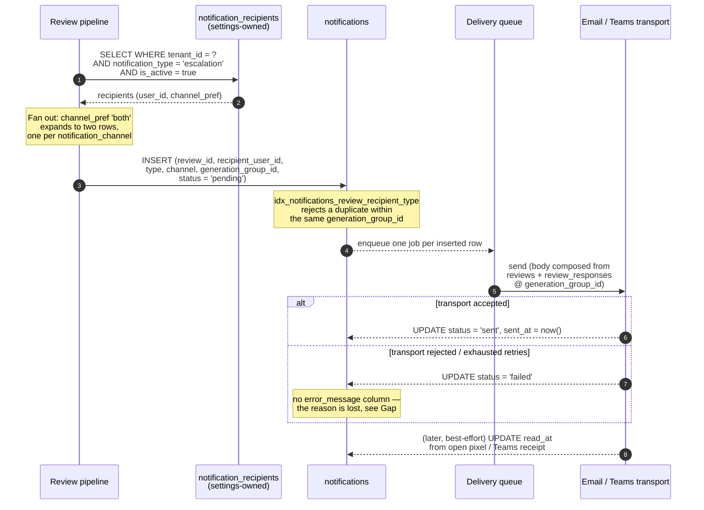
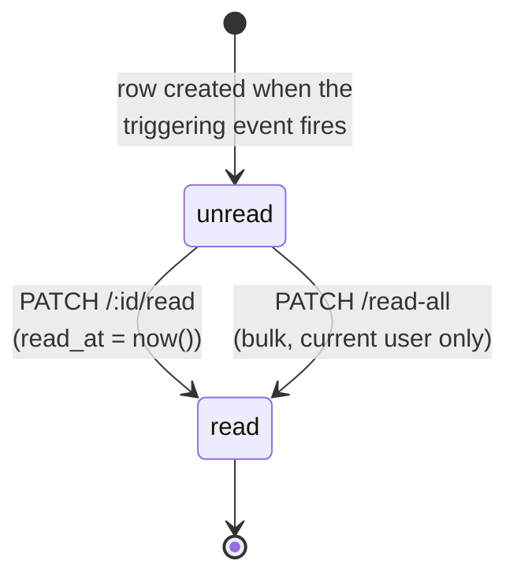

# Notifications Module

## Overview

The notifications module owns **one table** in the InnoPeak schema — `notifications`
(`apps/backend/src/db/drizzle/migrations/0005_notifications.sql`) — and is expected to serve
**two products** that look similar from a distance and are structurally different up close. Getting
that distinction right is the whole job of this document, because the schema as it stands only
models one of them.

- **Outbound delivery records.** An escalation fires, the pipeline resolves who should hear about
  it, and writes one `notifications` row **per recipient per channel**. That row is a delivery
  ledger entry: `channel` says whether it went out by email or Teams, `status` (`pending` →
  `sent` \| `failed`) says what happened, `sent_at` says when, `generation_group_id` pins which
  snippet batch was included in the message body. This is exactly what `PLAN.md` §2's
  `notification_recipients` / `notifications` subsection designed, and what §4.1's end-to-end flow
  means by "Notify responsible employee (email / Teams)."
- **The in-app notification centre.** The frontend now ships a bell-icon popover
  (`apps/web/src/app/(dashboard)/_components/notification-panel.tsx`) listing notifications with
  per-item read/unread state, a per-item "mark read" on click, and a "mark all as read" action. Its
  `Notification` type (`apps/web/src/types/domain.ts`) carries `title`, `description`, `isRead`,
  `createdAt`, and an optional `reviewId` used to deep-link the row to a review detail page.

**These two are not the same records, and `notifications` cannot back both.** The short version,
verified column by column against `0005_notifications.sql` and the enums in `0000_foundation.sql`:
`notification_channel` is `('email', 'teams')` — there is **no `in_app` value**; `notification_type`
has exactly **one** value, `escalation`, against the frontend's four; there is **no `title` or
`description`** column anywhere, so there is nothing for a feed row to render; `review_id` is
`NOT NULL`, so a notification not about a review (the frontend's `connection_issue`) has no
representable shape; and — the one that decides it — a recipient whose `notification_recipients`
preference is `both` produces **two** `notifications` rows for a single escalation, which a feed
built on this table would show the user twice. A `read_at` column *does* exist, and
`recipient_user_id` *is* a real per-user foreign key, so two of the four things the centre needs are
already there. That is not enough, and `read_at` in particular means something else — see
[Data model](#data-model).

The conclusion this document commits to: **in-app notifications are a separate concern from
delivery records, and need their own table.** The full reasoning, the rejected alternative
(extending `notifications` in place), and the exact follow-up migration are in
[Gap between current code and target design](#gap-between-current-code-and-target-design). For the
endpoint-by-endpoint contract — including which routes work against today's schema and which are
blocked on that migration — see [Notifications Module — API Reference](./api-reference.md).

The **actual sending** — SMTP/SES email transport, the Teams Bot Framework or webhook call, retry
and backoff policy, and the worker that drains the queue — is not this module's surface. It belongs
to the review pipeline and is documented in [Review Pipeline](../review-pipeline/overview.md).
This module owns the **records** of those attempts and the API that reads them.

## Data model

| Table | Purpose |
|---|---|
| `notifications` | The outbound delivery ledger. One row per (escalation event, recipient, channel) — **intended**; the applied unique index omits `channel`, so per-channel rows do not work yet, see below. Owned by this module — `0005_notifications.sql`. |
| `notification_recipients` | **Owned by the settings module.** Recipient *configuration*: which users want which `notification_type`, on which channel, and whether that config is currently `is_active`. Lives in `0003_review_provider_locations.sql`. Read by this module's fan-out, never written by it — see the settings module's own documentation for its API and lifecycle. |
| `reviews` | `notifications.review_id` target (`NOT NULL`, `ON DELETE CASCADE`). Supplies the deep-link the frontend's `reviewId` needs, and the escalation context in the message body. Owned by the review pipeline. |
| `review_responses` | Joined via `generation_group_id` to recover *which snippets* a given notification included. Not FK-linked — `generation_group_id` is a bare nullable `UUID` on both tables, deliberately (`PLAN.md` §2). Owned by the review pipeline. |
| `users` | `notifications.recipient_user_id` target (`NOT NULL`, `ON DELETE RESTRICT` — a user with delivery history cannot be hard-deleted, only anonymized; see `PLAN.md` §6.2). |
| `audit_logs` | Every `INSERT`/`UPDATE`/`DELETE` on `notifications` is captured row-level by the `notifications_audit_trigger` → `log_db_changes()`. Not optional and not annotation-driven — see `PLAN.md` §6.1. |

`notifications` columns, in full, because the rest of this document depends on knowing exactly
what is and isn't there:

```text
id                    UUID PK      DEFAULT uuidv7()
tenant_id             UUID NOT NULL  → tenants(id)  ON DELETE CASCADE
review_id             UUID NOT NULL  → reviews(id)  ON DELETE CASCADE
recipient_user_id     UUID NOT NULL  → users(id)    ON DELETE RESTRICT
generation_group_id   UUID           (nullable, no FK)
type                  notification_type     NOT NULL
channel               notification_channel  NOT NULL
status                notification_status   NOT NULL   (no DEFAULT)
sent_at               TIMESTAMPTZ    (nullable)
read_at               TIMESTAMPTZ    (nullable)
created_at            TIMESTAMPTZ NOT NULL DEFAULT NOW()
updated_at            TIMESTAMPTZ NOT NULL DEFAULT NOW()
```

There is **no `title`, no `description`/`body`, no `error_message`, and no attempt counter.** All
four absences have API consequences documented in the
[API reference](./api-reference.md#get-v1notificationsdeliveries).

### Enums

Four enum types matter here, all declared in `0000_foundation.sql`:

| Enum | Values | Used on |
|---|---|---|
| `notification_type` | `escalation` | `notifications.type`, `notification_recipients.notification_type` |
| `notification_channel` | `email`, `teams` | `notifications.channel` |
| `notification_channel_pref` | `email`, `teams`, `both` | `notification_recipients.channel` |
| `notification_status` | `pending`, `sent`, `failed` | `notifications.status` |

**`notification_channel` vs. `notification_channel_pref` is the easy-to-confuse pair in this
module** — two enums, near-identical names, deliberately different domains:

- `notification_channel_pref` (`email` \| `teams` \| **`both`**) is a **preference**, on the
  settings-owned `notification_recipients` row. It answers "where does this person want to be
  notified?"
- `notification_channel` (`email` \| `teams`, **no `both`**) is a **fact**, on a `notifications`
  row. It answers "where did this specific message actually go?"

The missing `both` is the point, not an oversight: `both` is a fan-out instruction, and a delivery
record is per-channel by definition — one email send and one Teams send succeed or fail
independently and must be able to carry different `status` values. `PLAN.md` §2 added the
preference enum precisely because "`notifications.channel` only logs which channel a specific
already-sent notification went out on, it's not a preference." Reading `notifications.channel` as a
user setting, or writing `'both'` into it, are both category errors — the second one won't even
cast.

`notification_type` sharing one domain across both tables is deliberate and confirmed by
`PLAN.md` §2 ("no digest/summary notification type is planned"). It is also why the enum has
exactly one value today, and why the frontend's four-value `NotificationType` union does not fit
it — see [MVP scope](#mvp-scope).

### Indexes and the constraint that carries the design

```sql
CREATE INDEX idx_notifications_tenant_id ON notifications(tenant_id);
CREATE INDEX idx_notifications_review_id ON notifications(review_id);
CREATE INDEX idx_notifications_recipient_user_id ON notifications(recipient_user_id);
CREATE INDEX idx_notifications_generation_group_id ON notifications(generation_group_id);

CREATE UNIQUE INDEX idx_notifications_review_recipient_type
    ON notifications(review_id, recipient_user_id, type, generation_group_id);
```

That unique index is the module's central behavioural guarantee and its central trap, both
documented at `PLAN.md` §8.13:

- **Guarantee** — within one escalation event, a given recipient gets at most one notification
  row per type. A retried insert (worker redelivery, duplicate queue message) collides on the
  index — but only becomes a *no-op* if the insert actually says `ON CONFLICT DO NOTHING`, which
  no document currently specifies. A bare `INSERT` raises `23505` and, because the fan-out writes
  all recipients in one transaction, takes every other recipient's row down with it.
- **The index cannot express per-channel rows, so the fan-out below is blocked today.** The key is
  `(review_id, recipient_user_id, type, generation_group_id)` — **`channel` is not in it**. A
  recipient whose `notification_channel_pref` is `both` needs two rows differing only by
  `channel`, and the second violates the index. Combined with the transactional fan-out, one
  `both` recipient means *nobody* on that escalation is notified, and the retry replays
  identically — the exact outcome this stage exists to prevent. Widening the index to include
  `channel` is a **required follow-up migration**, tracked in
  [Gap](#gap-between-current-code-and-target-design); until it lands, treat `both` as
  unsupported rather than as working behaviour.
- **Why `generation_group_id` is in the key** — `reviews.id` never changes across a
  supersede/reclassify cycle (`PLAN.md` §8.6, §8.12). Without the fourth column, a review that
  escalates, gets handled, and escalates *again* on an upstream edit would collide with its own
  first notification and the second `INSERT` would just fail — silently, with the responsible
  employee never hearing about the second escalation.
- **The trap** — Postgres treats `NULL`s in a unique index as distinct from each other. A
  `notifications` row inserted with `generation_group_id = NULL` is **not deduplicated at all**.
  `generation_group_id` is nullable in the DDL and has no FK, so nothing at the database level
  enforces that the escalation path populates it. That enforcement is an application invariant, and
  it is load-bearing.

The behavioural surface of all of this — what a client sees, and what it must *not* infer — is
specified as explicit API truth in
[API reference § Once-only notification](./api-reference.md#once-only-notification-per-escalation-event).

Note also what is **absent**: `notification_recipients` has no unique constraint on
`(tenant_id, user_id, notification_type)`, only plain indexes on `tenant_id` and `user_id`. Two
config rows for the same user and type are therefore possible, and the fan-out would try to send
twice. `idx_notifications_review_recipient_type` absorbs that — the second insert collides. That is
a real safety net, not a designed one; the constraint belongs on the settings-owned table, and
raising it there is that module's call, not this one's.

### `read_at` does not mean what the notification centre needs

`notifications.read_at` exists, and it is tempting to read it as "the user has seen this." It
isn't. `PLAN.md` §2 defines it explicitly:

> Treat `notifications.read_at` as best-effort only, not something to gate logic on — email
> open-tracking is unreliable (Apple Mail Privacy Protection, Gmail image proxying routinely fire
> it without a real open). Fine for Teams (real read receipts via the Bot Framework), just don't
> rely on it uniformly across both channels.

So `read_at` is **delivery-side telemetry about an external client**, populated by a tracking pixel
or a Bot Framework read receipt — not a record of a user action in our own UI. An in-app "mark as
read" is the opposite in every respect: it is a first-party, deliberate, exactly-reliable user
action that the UI must be able to gate on. Overloading one column with both meanings would leave a
single field that is authoritative for one channel, advisory for another, and unreliable for a
third — which is strictly worse than two columns on two tables. This is the single strongest reason
the in-app centre gets its own table rather than an `in_app` value bolted onto
`notification_channel`.

## Notification flows

### Escalation → fan-out → delivery → status

The escalation itself is classified by the review pipeline (`PLAN.md` §3, §4.1). This module picks
up at the point a review has been marked `classification = 'escalated'` and its snippet batch has
been generated under a fresh `generation_group_id`.



Four things worth stating plainly about this flow:

1. **`status` has no `DEFAULT`.** Every insert must name it. `'pending'` is the intended initial
   value, but the schema won't supply it.
2. **The row is written before the send is attempted**, so a crashed worker leaves a `pending` row
   that is recoverable and visible, rather than an escalation with no trace. That makes
   "`pending` and old" a real, queryable operational condition — see the delivery-status endpoint.
3. **`notifications` does not reference `notification_recipients.id`.** The fan-out resolves the
   config down to a `recipient_user_id` and stores that. Deactivating or deleting a recipient
   config therefore never orphans or rewrites delivery history — the ledger records who was
   notified, not which config row said so.
4. **The body is not stored.** Reconstructing "what did we actually send" is a join through
   `generation_group_id` to `review_responses` — which is exactly why `PLAN.md` §2 added that
   column, so the record pins the snippet set that was live at send time instead of drifting with
   later edits.

### In-app read-state flow

This is the flow the frontend already implements against mock data, and the one with no backend
behind it. It needs no fan-out and no transport — a row is created, listed, and marked read.



Notes that shape the API contract:

- **Read is one-way.** There is no "mark unread." The frontend never offers it, and adding it later
  would be a new endpoint, not a change to these.
- **Marking read is idempotent.** Re-marking an already-read row is a success, not a conflict — the
  frontend clicks it on navigation, and a double-click must not error.
- **The frontend marks read optimistically and silently.** `use-notifications.ts` updates local
  state first and fires the request with `void`, surfacing no toast on failure; only the initial
  load failure is surfaced. The API must therefore be cheap and must not depend on its response
  being read.
- **Unread count is derived, not stored.** The frontend currently computes it client-side from the
  loaded list. Once the list is paginated server-side that stops working, which is why a dedicated
  count endpoint exists rather than being folded into the list's `meta`.

## API surface

All routes are versioned under `/v1/notifications` (`RouteNames.NOTIFICATIONS`, already present in
`src/common/route-names.ts`, `version: '1'`).

| Method | Path | Auth | Notes |
|---|---|---|---|
| `GET` | `/v1/notifications` | Bearer | Paginated in-app feed for the current user. **Blocked on the follow-up migration.** |
| `GET` | `/v1/notifications/unread-count` | Bearer | Unread count for the current user. **Blocked on the follow-up migration.** |
| `PATCH` | `/v1/notifications/:id/read` | Bearer | Mark one in-app notification read. Idempotent. **Blocked on the follow-up migration.** |
| `PATCH` | `/v1/notifications/read-all` | Bearer | Mark every unread in-app notification read for the current user. **Blocked on the follow-up migration.** |
| `GET` | `/v1/notifications/deliveries` | Bearer, `@Roles('owner')` | Delivery ledger, paginated, filterable by `reviewId` / `status` / `channel`. Works against today's schema. |
| `GET` | `/v1/notifications/deliveries/:id` | Bearer, `@Roles('owner')` | One delivery record, with the snippet set that went out. Works against today's schema. |

The two `deliveries` routes read `notifications` as designed and need no schema change. The four
feed routes are the in-app centre and need the table specified in [Gap](#gap-between-current-code-and-target-design)
first — they are documented in full anyway, because the frontend is already written against their
shape.

Full request/response contracts, field tables, error codes, and the migration-dependency callouts
per route: [Notifications Module — API Reference](./api-reference.md).

## MVP scope

Mirroring how the auth module separates frontend exposure from backend surface (see
[Auth § Frontend / backend boundary](../auth/overview.md#frontend--backend-boundary)) — except the
split here runs the other way. Auth's frontend exposes *less* than the backend supports. Here the
frontend exposes *more* than the backend models.

**Stated plainly: the shipped in-app notification panel runs entirely on frontend mock data.**
`apps/web/src/app/_libs/services/notification.service.ts` is a static class returning
`structuredClone(MOCK_NOTIFICATIONS)` from
`apps/web/src/app/_libs/mock-data/notifications.ts` after a `setTimeout`; its `markAsRead` and
`markAllAsRead` resolve after 150ms and do nothing. Its own docstring says so — "becomes a real
backend call (plus a live push channel) once that API exists." No notification data reaches that
panel from the backend today, and nothing the user clicks in it persists past a page reload.

What the frontend exposes today, against what the backend models:

| Frontend expects | Backend today | Verdict |
|---|---|---|
| `Notification.id` | `notifications.id` | Present. |
| `Notification.createdAt` | `notifications.created_at` | Present. |
| `Notification.isRead` | `notifications.read_at` exists — but means email-open telemetry, not a user action (`PLAN.md` §2) | **Wrong semantics**, see [`read_at`](#read_at-does-not-mean-what-the-notification-centre-needs). |
| `Notification.reviewId` (optional) | `notifications.review_id`, `NOT NULL` | Present but **mandatory**, so a review-less notification can't exist. |
| `Notification.title` | — | **Missing entirely.** |
| `Notification.description` | — | **Missing entirely.** |
| `NotificationType: 'review_escalated'` | `notification_type.escalation` | Maps. |
| `NotificationType: 'reply_needs_approval'` | — | **Not modeled.** |
| `NotificationType: 'reply_approved'` | — | **Not modeled.** |
| `NotificationType: 'connection_issue'` | — | **Not modeled**, and would need a nullable `review_id`. |
| One feed row per event | One `notifications` row **per channel** — `channel_pref = 'both'` writes two | **Duplicates in the feed.** |
| Per-user rows | `recipient_user_id` FK | Present, correct granularity. |

The backend's **MVP target**, in build order:

1. **`GET /v1/notifications/deliveries` + `/:id`.** Buildable today, no migration. Answers the
   operational question that has no answer at all right now: did the escalation email actually go
   out, and to whom.
2. **The follow-up migration**, then the four feed routes — replacing
   `NotificationService`'s mock body with real `fetch` calls. This is the change that makes the bell
   icon mean something.
3. **Notification types beyond `escalation`** (`reply_needs_approval`, `reply_approved`,
   `connection_issue`) are frontend-invented and have no `PLAN.md` mandate — §2 says no additional
   `notification_type` is planned. They are cheap on the in-app table (its own enum, no delivery
   fan-out, no transport) and expensive on `notifications` (each implies an email/Teams policy
   nobody has specified). Ship the enum values for the in-app feed; do **not** extend
   `notification_type` or the delivery path for them without a product decision.

`notification_recipients` management — who is on the escalation list and on which channel — is
**not** this module's API. It is settings-owned, and this module only reads it.

## Gap between current code and target design

### 1. The in-app notification centre has no table (the big one)

Everything in [MVP scope](#mvp-scope)'s comparison table reduces to one decision, and there are
only two ways to take it.

**Rejected: extend `notifications` in place.** This would mean
`ALTER TYPE notification_channel ADD VALUE 'in_app'`, adding `title` and `description`, dropping
`review_id`'s `NOT NULL`, and adding the frontend's three extra `notification_type` values. It
fails on four counts, in increasing severity:

- `status` and `sent_at` stop meaning anything. An in-app row is delivered the instant it is
  inserted — there is no `pending`, no transport to fail, no `sent_at` distinct from `created_at`.
  A third of the table's columns would be permanently inapplicable to a third of its rows.
- `read_at` would be authoritative for `in_app`, advisory for `teams`, and actively unreliable for
  `email`, in one column that application code must branch on `channel` to interpret — against
  `PLAN.md` §2's explicit instruction not to gate logic on it.
- Relaxing `review_id` to nullable weakens a `NOT NULL` guarantee the delivery path legitimately
  relies on, for the sole benefit of rows that aren't deliveries.
- `idx_notifications_review_recipient_type` is a *delivery-dedup* key. With a nullable `review_id`
  it stops functioning as one (NULL-distinctness again, §8.13), and it is the wrong shape for a
  feed regardless — a feed wants "recent rows for this user," which the key's leading `review_id`
  column cannot serve.

**Specified: a separate table.** The follow-up migration, per the project's SQL-first workflow
(`apps/backend/docs/conventions/sql-first-workflow.md` — write the SQL, update
`meta/_journal.json`, `pnpm db:migrate`, then `pnpm db:introspect`):

```sql
-- 0007_in_app_notifications.sql

CREATE TYPE in_app_notification_type AS ENUM (
    'review_escalated',
    'reply_needs_approval',
    'reply_approved',
    'connection_issue'
);

CREATE TABLE IF NOT EXISTS in_app_notifications (
    id UUID PRIMARY KEY DEFAULT uuidv7(),
    tenant_id UUID NOT NULL REFERENCES tenants(id) ON DELETE CASCADE,
    user_id UUID NOT NULL REFERENCES users(id) ON DELETE CASCADE,
    type in_app_notification_type NOT NULL,
    title VARCHAR(255) NOT NULL,
    description TEXT,
    review_id UUID REFERENCES reviews(id) ON DELETE CASCADE,
    notification_id UUID REFERENCES notifications(id) ON DELETE SET NULL,
    generation_group_id UUID,
    read_at TIMESTAMPTZ,
    created_at TIMESTAMPTZ NOT NULL DEFAULT NOW(),
    updated_at TIMESTAMPTZ NOT NULL DEFAULT NOW()
);

CREATE INDEX idx_in_app_notifications_tenant_id ON in_app_notifications(tenant_id);
CREATE INDEX idx_in_app_notifications_review_id ON in_app_notifications(review_id);
CREATE INDEX idx_in_app_notifications_user_created
    ON in_app_notifications(user_id, created_at DESC);
CREATE INDEX idx_in_app_notifications_user_unread
    ON in_app_notifications(user_id) WHERE read_at IS NULL;
CREATE UNIQUE INDEX idx_in_app_notifications_dedupe
    ON in_app_notifications(user_id, type, review_id, generation_group_id);

CREATE TRIGGER in_app_notifications_audit_trigger
    AFTER INSERT OR UPDATE OR DELETE ON in_app_notifications
    FOR EACH ROW EXECUTE FUNCTION log_db_changes();
```

Column by column, why each one is there:

| Column | Why |
|---|---|
| `user_id` | `ON DELETE CASCADE`, unlike `notifications.recipient_user_id`'s `RESTRICT`. A feed row has no audit value worth blocking a delete over; a delivery record does. |
| `type` | Its **own** enum, so the frontend's four values don't force `notification_type` — and by extension the settings module's `notification_recipients.notification_type` — to grow values that have no delivery policy. |
| `title`, `description` | The rendered strings, frozen at creation. `description` nullable; `title` is not, the panel always renders it. Composed from the shared messages constants at write time, not at read time, so a wording change never rewrites history. |
| `review_id` | **Nullable**, exactly matching the frontend's optional `reviewId`. `connection_issue` has no review. This is the deep-link target. |
| `notification_id` | Optional back-link to the delivery row this feed entry accompanies, `ON DELETE SET NULL`. Lets one screen answer "you were emailed about this, and here's whether that email landed" without a four-column composite join. Null for feed-only types. |
| `generation_group_id` | Bare nullable `UUID`, no FK — same shape as on `notifications` and `review_responses`. Present only so the dedupe key below can distinguish re-escalations. |
| `read_at` | The real, first-party read timestamp. `NULL` = unread. Nothing else writes it, nothing external can spoof it. |

The dedupe index deserves the same warning `PLAN.md` §8.13 attaches to its sibling, plus one
difference: `(user_id, type, review_id, generation_group_id)` deduplicates re-delivery **within**
an escalation event while letting a genuine re-escalation through on its new
`generation_group_id`, identically to `notifications`. But for `connection_issue` both
`review_id` and `generation_group_id` are `NULL`, so NULL-distinctness means those rows are **not
deduplicated at all** — which is the correct behaviour there (each incident is a fresh notice), and
is called out here so it reads as a decision rather than the same bug twice.

Two operational notes on this table:

- The audit trigger is row-level and unconditional. `PATCH /read-all` is a bulk `UPDATE`, so it
  writes one `audit_logs` row per notification marked. That is a real cost at volume and an
  argument for the endpoint's `updatedCount` being bounded in practice, not for skipping the
  trigger — `PLAN.md` §6.1 keeps coverage unconditional on purpose.
- GDPR: `title` and `description` are free text composed from review content and may contain a
  reviewer name. The retention/erasure job (`PLAN.md` §6, §6.1) must cover this table and its
  `audit_logs` snapshots the same way it covers `reviews`.

### 2. A failed delivery records no reason

`notifications` has `status = 'failed'` and **nothing else**. No `error_message`, no attempt count,
no last-attempt timestamp — compare `review_responses.error_message` and
`sync_runs.error_message`, which both exist for exactly this purpose. So the one question the
delivery-status endpoint exists to answer — "what happened if it didn't send?" — currently has no
stored answer. The same follow-up migration should add:

```sql
ALTER TABLE notifications ADD COLUMN error_message TEXT;
```

Until it lands, `GET /v1/notifications/deliveries` returns `failureReason: null` on every failed
row; the endpoint's contract is written to accommodate that. Attempt counts and backoff state are
**not** proposed here — retry policy is the pipeline's, and if it needs durable per-attempt state
that is the pipeline's migration to specify, not this one's.

### 3. `src/notifications/` is unrelated boilerplate

`apps/backend/src/notifications/` already exists and is the generic NestJS enterprise
boilerplate's notifications module — FCM push plus in-app for a different product. Treat it the
way [auth's gap section](../auth/overview.md#gap-between-current-code-and-target-design) treats its
own leftovers: it compiles, its tests pass, and it models a different product.

It is a genuinely awkward leftover rather than a harmless one, because it is *superficially the
right module*. It already owns `RouteNames.NOTIFICATIONS`, and its controller already exposes
`GET /`, `GET /unread-count`, `PATCH /:id/read`, and `PATCH /read-all` with the same
`{ data, meta }` pagination shape this document specifies. That is convergent evolution on an
obvious CRUD shape, not reusable code:

- It reads a boilerplate `notifications` table with `user_id`, `title`, `body`, `data JSONB`,
  `is_read`, and a free-text `type: string` (see `interfaces/notification.interface.ts`). **That is
  not the InnoPeak `notifications` table** — the names collide, the columns don't.
- Its channel union is `'email' | 'in-app' | 'push' | 'sms'`, none of which is
  `notification_channel`, and `'push'`/`'sms'` have no schema or product basis here.
- It has no `tenant_id` anywhere — no fan-out, no recipient config, no `review_id`, no
  `generation_group_id`, no delivery `status`.
- It carries a `device_tokens`-backed `POST /devices` FID-registration route and an
  `FcmProvider`. There is no `device_tokens` table in any InnoPeak migration and no push
  requirement in `PLAN.md`.
- Its admin-only `POST /` sends an arbitrary notification to an arbitrary user. Nothing in this
  product's design has a human authoring notifications by hand; they are pipeline output.

Required: **do not retrofit.** Build the new module at `src/api/notifications/` per the convention
below, and **drop** `src/notifications/`, its `FcmProvider`/`PushProvider` pair, and the FCM
config it reads — or explicitly defer them with the same reasoning auth applies to
`GithubOAuthStrategy` and `MfaService`: unused surface against tables that don't exist is dead
code, not forward-compatibility. `RouteNames.NOTIFICATIONS` stays; the module behind it is
replaced. `src/db/repositories/notifications/notifications.repository.ts` is likewise
boilerplate-shaped and gets rewritten, not extended.

### 4. Module-structure conventions the new module must follow

Per `apps/backend/docs/conventions/module-structure.md` and `apps/backend/CLAUDE.md`, none of which
`src/notifications/` currently satisfies:

- **Location** `src/api/notifications/`, with `swagger/`, `constants/`, and `types/` subfolders
  (`types/`, not `interfaces/`).
- **Four layers**: Controller → Service → `NotificationsDbService` → `NotificationsRepository`. The
  service never imports a repository and never runs a Drizzle query. Both data-layer classes live
  under `src/db/repositories/notifications/` — centralized, not inside the business module — and
  are registered/exported by the global `DBModule`.
- **Two controllers, therefore two swagger files.** The feed and the delivery ledger are different
  resources with different auth (`Bearer` vs. `@Roles('owner')`) and different tables. Split them
  into `controllers/notifications.controller.ts` and
  `controllers/notification-deliveries.controller.ts` with
  `swagger/notifications.swagger.ts` and `swagger/notification-deliveries.swagger.ts` — one swagger
  file per controller, one composed decorator per route, never inline `@ApiOperation`/`@ApiResponse`
  on the method.
- **Minimal controllers.** Bind params, call exactly one service method, wrap with `ResponseUtil`,
  return. The boilerplate controller violates this in three places — it maps DTOs inline, computes
  `Math.ceil(total / pageSize)` in the handler, and throws `NotFoundException('Notification not
  found')` with an inline literal. Pagination `meta` is built in the service or DB service (see
  `apps/backend/docs/conventions/api-patterns.md`), and the 404 comes from the messages constants.
- **Messages.** Every user-facing string — exception messages, `ResponseUtil.success` messages, and
  the `title`/`description` written onto `in_app_notifications` rows — comes from
  `src/common/constants/messages.constants.ts`. **That file does not exist yet**; the first module
  to need it creates it, exactly as noted in auth's gap section.
- **Every DTO property carries an `example`**, and every method on every layer declares an explicit
  return type — no inference, no `any`.
- **Route-name collision ordering.** `deliveries` is a static segment under the same controller
  path prefix as the feed. If a `GET /v1/notifications/:id` is ever added, it must be declared
  *after* the static `unread-count` and `deliveries` routes, or Nest will match those as an `:id`.
  Splitting the two controllers (above) does not remove this hazard — they share the `/v1/notifications`
  prefix, and registration order across them is module-import order.
