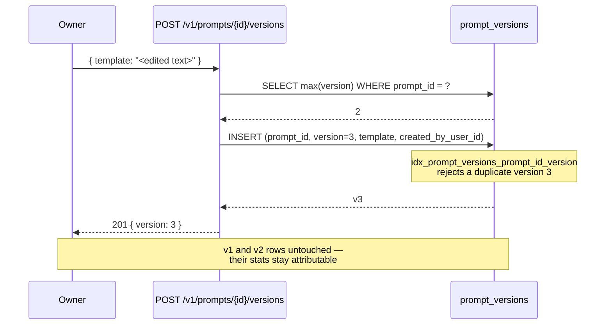
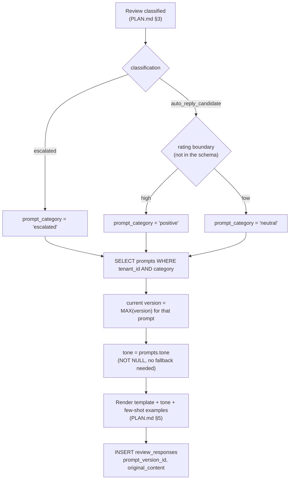

# Prompts Module

## Overview

The prompts module owns the **AI reply instructions a tenant edits by hand** — the templates that
tell the generation stage how to write a reply to a Google Business Profile review, versioned so
every edit is preserved, and tone-tunable independent of the template. It is backed by two tables
added in `apps/backend/src/db/drizzle/migrations/0006_prompts.sql` (`prompts`, `prompt_versions`)
plus three columns that same migration `ALTER`s onto `review_responses`.

It exists because the product's whole premise is protecting the business's public voice: nothing
posts to Google without a human approving it (`PLAN.md` §4.2), and the fastest way to reduce how
often that human has to rewrite a draft is to let them edit the instructions the draft came from.
That only works if editing an instruction is *measurable* — an owner needs to see whether the
wording they changed last week actually raised the share of drafts they approve without touching.
Both halves of that requirement drive the schema: versions are **append-only** so a prior wording
stays comparable, and every generated `review_responses` row records the exact
`prompt_version_id` it came from so approvals and rejections attribute to a specific edit rather
than to "the prompt" as a moving target.

Two consumers, with very different access patterns. The **owner-facing Settings → Prompts
screen** (`apps/web/src/app/(dashboard)/settings/prompts/`) reads the prompt list with each
prompt's current version, appends a version when the owner saves an edit, sets the prompt's tone,
expands prior versions as read-only history, and shows per-version approval stats. The **AI
generation stage** reads only: it picks a prompt by `category`, resolves that prompt's current
version and its tone, and writes the version's `id` onto the
`review_responses` row it creates. The generation pipeline itself — classification, few-shot
example selection, the Azure OpenAI call, the `review_responses` insert — is documented at
[Review pipeline — Overview](../review-pipeline/overview.md); this module documents only the
prompt-shaped inputs it consumes and the analytics it reads back out.

Nothing described here is implemented yet. `apps/backend/src/` contains no prompts module, no
prompts repository, and the migration that defines these tables has not been applied or
introspected — see [Gap between current code and target
design](#gap-between-current-code-and-target-design), which states exactly what exists and what
does not. For the endpoint-by-endpoint contract, see [Prompts Module — API
Reference](./api-reference.md).

## Data model

| Table | Purpose |
|---|---|
| `prompts` | Prompt **identity and live settings**: one row per `(tenant_id, category)`. Carries the owner-facing `name` and nullable `description` shown on the Settings card, the `category` the generation stage selects on, and `tone` — a mutable setting updated in place, same as `name`/`description`, independent of the (append-only) template. No template text on this table — deliberately. |
| `prompt_versions` | The **immutable edit log**: `prompt_id`, a monotonic `version` (`CHECK (version > 0)`), the `template` text itself, and `created_by_user_id` (`ON DELETE SET NULL`). Insert-only; there is no `updated_at` column because a row is never updated. |

Plus three columns `0006_prompts.sql` adds to `review_responses` (defined in
`0004_reviews.sql`), which is what makes prompt performance computable at all:

| Column | Type | Why |
|---|---|---|
| `prompt_version_id` | `UUID`, nullable, `REFERENCES prompt_versions(id) ON DELETE SET NULL` | Which exact version generated this draft. Nullable because `imported` and `human_manual` rows never went through a prompt. |
| `original_content` | `TEXT`, nullable | The AI's text before any human edit. `content` is what got approved; the difference between the two is the approved-as-is / approved-after-edit split. |
| `decided_at` | `TIMESTAMPTZ`, nullable | When the row's status became terminal. `review_responses` has `posted_at` but **no `approved_at`** — `PLAN.md` §2 recommended one and `0004_reviews.sql` did not add it, so `decided_at` is the only decision timestamp in the schema. |

Indexes and constraints, all verified in `0006_prompts.sql`:

- `idx_prompts_tenant_id_category` — **unique** on `prompts(tenant_id, category)`. Caps a tenant
  at exactly one prompt per category and, since `tenant_id` leads, also serves the plain
  "list this tenant's prompts" read.
- `idx_prompt_versions_prompt_id_version` — **unique** on `prompt_versions(prompt_id, version)`.
  Does double duty: it makes "the current version" an index-only `ORDER BY version DESC LIMIT 1`
  lookup, and it is the concurrency control for appends (see [Editing a
  prompt](#editing-a-prompt-appends-a-version)).
- `idx_review_responses_prompt_version_id` — plain index on the new FK column.
- Both tables carry an `AFTER INSERT OR UPDATE OR DELETE` audit trigger (`prompts_audit_trigger`,
  `prompt_versions_audit_trigger`) executing `log_db_changes()` from `0000_foundation.sql`, so
  every template edit lands in `audit_logs` as well as in `prompt_versions` — and a tone change
  lands in `audit_logs` via the same `prompts_audit_trigger` that covers `name`/`description`
  edits, with no dedicated trigger of its own. That redundancy is fine — `audit_logs` is a
  cross-table forensic record, `prompt_versions` is a product feature with its own UI.

### Enums

Both are declared locally in `0006_prompts.sql` rather than in `0000_foundation.sql`, because the
foundation file's migration is already applied and `CREATE TYPE` for a later module is ordinary
schema evolution:

- **`prompt_category`** — `positive`, `neutral`, `escalated`. Drives which prompt the generation
  stage selects for a given review.
- **`prompt_tone`** — `friendly`, `professional`, `formal`, `playful`, `empathetic`. Exactly the
  five values the frontend's `PromptTone` union carries
  (`apps/web/src/types/domain.ts`), so no mapping layer is needed in either direction.

`prompt_category` is deliberately **not** the same domain as `review_classification`
(`auto_reply_candidate`, `escalated`, `pending_classification`, from `0000_foundation.sql`). The
mapping is not one-to-one and that is a real gap, not a naming inconvenience — see
[Selecting a prompt for a review](#selecting-a-prompt-for-a-review).

### Why two tables, and why `tone` sits on `prompts` rather than its own table

The template and the tone have opposite mutability requirements, which is what actually forces the
split — it isn't just "more tables feels safer":

- **The template needs history; `template` can't be a plain column.** Overwriting the text means
  the question "did last week's edit improve the approval rate?" has no data behind it — the
  pre-edit wording is gone and every historical `review_responses` row now claims to have come
  from text that never generated it. Splitting versions into their own insert-only table is what
  makes `review_responses.prompt_version_id` a stable, meaningful foreign key. This is the same
  derive-state-from-an-immutable-log preference `review_responses` itself already follows for its
  status transitions (`PLAN.md` §4.2).
- **No `current_version_id` pointer on `prompts` either.** The current version is
  `MAX(version) WHERE prompt_id = ?`, which `idx_prompt_versions_prompt_id_version` already makes
  cheap. A pointer column would add a circular FK between the two tables and a second place the
  truth lives — one an append could forget to update, leaving the UI showing v3 while generation
  still renders v2.
- **`tone` needs the opposite treatment, so it belongs where `name`/`description` already live.**
  Changing the tone is not an edit to the prompt's content — it doesn't need a history, doesn't
  attribute to a specific draft, and mixing it into `prompt_versions` would create a version row
  with identical `template` text every time someone only changed the tone. A plain mutable column
  on `prompts`, updated in place exactly like `name`/`description` already are, is the correct
  shape for a live setting — no separate table, no separate audit trigger, no join needed to read
  it alongside the rest of the prompt. An earlier draft of this schema kept tone in a dedicated
  `prompt_owner_tones` table keyed by `(prompt_id, user_id)`, reasoning that tone is a personal
  stylistic choice two owners might set differently. That only matters once a tenant can have more
  than one owner tuning the same prompt, which isn't the product today — there is exactly one
  owner per tenant — so the extra table bought schema-readiness for a scenario that doesn't exist
  yet, at the cost of a join and an index on every read. If a genuine per-member preference is
  ever wanted, that is a new table keyed by `(prompt_id, user_id)`, built when the requirement is
  real, not a speculative one carried from day one.
- **`prompts` still earns its own row** rather than being folded into `prompt_versions`: `name`,
  `description`, `category`, and now `tone` are facts about the prompt's current state, not about
  any one edit of it. Storing them per-version would duplicate them on every save and make
  "rename this prompt" or "change its tone" an append.

## Prompt flows

### Editing a prompt appends a version

Saving an edit **never** updates a row. It inserts a new `prompt_versions` row whose `version` is
one higher than the current maximum for that prompt, and the previous row is left exactly as it
was — still linked from every `review_responses` row it generated.

Two consequences the API surface has to reflect:

- **There is no `PUT /v1/prompts/:promptId` that mutates a template**, and there is no
  "restore version N" endpoint. Rolling back is expressed as appending the old text as a *new*
  version, so the rollback itself is dated, attributed, and separately measurable. The frontend
  already models history as read-only for this reason (`prompt-version-history.tsx`: "No restore
  action here; this is history, not rollback").
- **The append races.** Two saves landing at once both read `max(version) = 2` and both try to
  insert version 3; the unique index makes the second fail rather than silently reordering
  history. The write is therefore a single `INSERT ... SELECT coalesce(max(version), 0) + 1`
  retried once on unique violation, surfacing a conflict if the retry also loses — the append-only
  analogue of the guarded compare-and-swap `PLAN.md` §8.4 specifies for `review_responses.status`.

A version change is **not retroactive**: drafts already generated keep pointing at the version
that produced them, and pending drafts are not regenerated when the template changes. That is the
same deliberate scope boundary `PLAN.md` §8.11 draws for `tenant_settings`/`blocklist_terms`
changes, and here it is load-bearing rather than merely tolerable — retroactive re-attribution
would destroy the only signal this module exists to produce.

### Tone tuning is a plain update, not a version

Setting a tone is `UPDATE prompts SET tone = ?, updated_at = now() WHERE id = ? AND tenant_id = ?`
— no insert, no upsert, no separate table to reach through. It changes nothing about the template
and appends no version: a tone change is not an edit to the prompt's content, it is a setting
layered on top of it, and mixing the two would make every tone toggle create a version-history
entry with identical template text.

**Scoped to the prompt, not the caller.** `tone` carries no notion of *whose* preference it is —
it is the tenant's current setting for that prompt, full stop, exactly like `name`/`description`.
That is a deliberate simplification: there is exactly one owner per tenant today, so "the tenant's
tone for this prompt" and "this owner's tone for this prompt" are the same fact, and a column
carrying that fact needs no join, no default-resolution logic, and no separate audit trigger. If a
genuine per-member tone preference is ever wanted — several owners on one tenant, each wanting the
AI to sound different to them — that is new schema (a table keyed by `(prompt_id, user_id)`, built
when the requirement is real), not a reinterpretation of this column, since by then `tone` would
already mean "the tenant's setting" to every existing row.

**Never missing, by construction.** `tone` is `NOT NULL DEFAULT 'professional'`, so every prompt
has a concrete tone from the moment it's created — there is no "no preference set yet" state for
the API or the generation stage to handle, and no fallback logic needed on either side. The
frontend's `getOwnerTone`/`toneByOwner` helpers, which resolve a per-owner entry with a client-side
`?? "professional"` fallback, are the shape this replaces — see the [Gap
list](#gap-between-current-code-and-target-design) for what that means for the frontend contract.

### Selecting a prompt for a review

**`PLAN.md` §5 does not specify this.** Read it before assuming otherwise: §5 (AI Generation
Flow) is five steps — pull 50 `posted` `review_responses` as few-shot examples, call Azure OpenAI,
insert one row for `auto_reply_candidate` or two-to-three sharing a `generation_group_id` for
`escalated`, store `generation_metadata`. It never mentions a prompt table, a prompt category, a
template, or a tone, and the only place "prompt version" appears in the whole document is as a
suggested key inside `review_responses.generation_metadata` (jsonb) in §2. §5 predates
`0006_prompts.sql` and describes generation *without* a normalized prompts table. Everything below
is a design this module adds on top of §5, not a restatement of it — which also means §5's own
text needs updating once this ships, or the two documents will describe different pipelines.

At generation time the pipeline needs three things from this module, in one read: the right
prompt, its current template, and the owner's tone.

Three things to note about that flow:

- **The positive/neutral boundary does not exist in the schema.** `escalated` maps cleanly from
  `reviews.classification = 'escalated'`, but `auto_reply_candidate` has to split across two
  categories and no column encodes where. `tenant_settings.escalation_rating_threshold` only
  decides escalate-versus-auto-reply. `reviews.sentiment` (`review_sentiment`) looks tempting but
  is nullable and `PLAN.md` §3 states explicitly that sentiment "does not drive routing in MVP".
  This needs a decision before build — see the [Gap](#gap-between-current-code-and-target-design).
- **The `prompt_version_id` write is what everything downstream depends on.** A generation path
  that inserts a `review_responses` row without it produces a draft that no prompt can ever be
  credited or blamed for, and it is silent — the stats simply come back smaller. The same applies
  to `original_content`: it must be written at insert time, equal to the generated text, because
  nothing can reconstruct it later once a human edits `content`.
- **The reviewer-name house rule lives in `prompt_versions.template`.** `PLAN.md` §6 chose not to
  retroactively scrub `review_responses.content` during a GDPR purge, and instead handles it "at
  the prompt level: instruct the AI (and human editors) not to restate the reviewer's name in
  generated replies." That instruction is now literally a row in this table, which makes the
  default templates a compliance artifact, not just copy.

### Reading prompt performance

Stats are an aggregate over `review_responses` rows joined to `prompt_versions`, scoped to one
prompt and optionally to one version. Every counter comes from the columns `0006_prompts.sql`
added plus `status`/`source`/`created_at`, which the [API
reference](./api-reference.md#get-v1promptspromptidstats) specifies value by value. The
`review_responses` side of that table — its status machine, its `source` values, its partial
unique indexes — is documented in [Reviews module](../reviews/overview.md) rather than repeated
here.

## API surface

Base path `/v1/prompts` (URI versioning, `version: '1'`, via a `RouteNames.PROMPTS` entry that
does not exist yet). Every route is owner-scoped: reply prompts sit behind Settings, and
`PLAN.md` §2 gives Settings access to `owner` only — a `member` has review-workflow access and no
more.

| Method | Path | Auth | Notes |
|---|---|---|---|
| `GET` | `/v1/prompts` | Bearer, `owner` | The tenant's prompts, each with its current version and its tone. The Settings screen's only load call. |
| `GET` | `/v1/prompts/:promptId` | Bearer, `owner` | One prompt, same shape as a list entry. Convenience read; the frontend does not need it today. |
| `GET` | `/v1/prompts/:promptId/versions` | Bearer, `owner` | Paginated version history, newest first. Read-only — no restore. |
| `POST` | `/v1/prompts/:promptId/versions` | Bearer, `owner` | Appends a version. The only write that touches template text. |
| `PUT` | `/v1/prompts/:promptId/tone` | Bearer, `owner` | Updates the prompt's `tone` column. A plain update, not an upsert — the row always exists. |
| `GET` | `/v1/prompts/:promptId/stats` | Bearer, `owner` | Prompt-performance aggregate; `?version=N` scopes it to one version. |

Deliberately absent, each for a stated reason rather than an oversight:

- **No `POST /v1/prompts`, no `DELETE /v1/prompts/:promptId`.** `idx_prompts_tenant_id_category`
  caps a tenant at one prompt per `prompt_category` value, so the set is closed at exactly three
  rows and is provisioned at tenant signup, not by an API call. A delete would also be
  destructive well beyond the row itself: `prompt_versions.prompt_id` is `ON DELETE CASCADE` and
  `review_responses.prompt_version_id` is `ON DELETE SET NULL`, so deleting a prompt silently
  severs the analytics link on every draft it ever generated.
- **No `PUT`/`PATCH` on the prompt itself.** Nothing edits `name`/`description` today — the
  frontend renders them read-only — and mutating them is unrelated to versioning.
- **No `PUT /v1/prompts/:promptId` for the template**, per
  [Editing a prompt](#editing-a-prompt-appends-a-version).

Full request/response contracts, field tables, and error codes: [Prompts Module — API
Reference](./api-reference.md).

## MVP scope

Same split as the auth module's [frontend/backend
boundary](../auth/overview.md#frontend--backend-boundary): what the UI exposes is a frontend
decision, and the backend surface above is documented in full regardless.

What the shipped frontend exercises today, all against
`apps/web/src/app/_libs/services/prompt.service.ts` — a mock service reading
`apps/web/src/app/_libs/mock-data/prompts.ts`, with no HTTP call anywhere:

| Frontend capability | Where | Backend route it becomes |
|---|---|---|
| Load three prompt cards with current template | `usePrompts` → `PromptService.getPrompts` | `GET /v1/prompts` |
| Save an edit as a new version | `usePrompts.saveNewVersion` → `PromptService.createVersion` | `POST /v1/prompts/:promptId/versions` |
| Change tone from a select | `usePrompts.updateTone` → `PromptService.updateOwnerTone` | `PUT /v1/prompts/:promptId/tone` |
| Expand prior versions, read-only | `prompt-version-history.tsx` | Inline in `GET /v1/prompts`, or `GET /v1/prompts/:promptId/versions` once history outgrows one page |
| Per-version approval stats line | `usePromptAnalytics` → `computePromptVersionStats` | `GET /v1/prompts/:promptId/stats?version=N` |

Where the frontend's shape and the backend target differ, and what has to give:

- **Stats are computed client-side today, and cannot stay that way.**
  `apps/web/src/app/_libs/utils/prompt-analytics.ts` derives all eight counters by loading *every*
  review with its drafts (`usePromptAnalytics` calls `ReviewService.getReviews()` once and
  aggregates in the browser). Against real data that means shipping the tenant's entire review
  and draft history — reviewer names and review text included, i.e. GDPR-relevant personal data
  per `PLAN.md` §6 — to a browser in order to render six numbers. `GET
  /v1/prompts/:promptId/stats` replaces it; the client-side function stays useful only as the
  executable definition of what each counter means, and its test file
  (`prompt-analytics.test.ts`) is the contract the server aggregate must reproduce.
- **The frontend's draft-status union is narrower than the schema's.** `ReplyDraftStatus` has four
  values (`pending_approval`, `approved`, `rejected`, `superseded`); `response_status` has seven,
  adding `draft`, `posted`, `post_failed`. The server must fold the extras in rather than drop
  them — a `posted` row was approved, and omitting it would silently undercount approvals on
  exactly the drafts that succeeded most. See the
  [status mapping](./api-reference.md#get-v1promptspromptidstats).
- **The frontend has no `category`.** `AiPrompt` carries `id`/`name`/`description` only, with mock
  ids like `prompt_positive`. Real responses carry a UUID `id` plus an explicit `category`, which
  the UI can ignore until it needs to label cards by routing category.
- **The frontend inlines full version history in the prompt object.** `AiPrompt.versions` is the
  complete array, oldest → newest. The backend returns the current version inline and paginates
  history separately; with three prompts and few edits the list endpoint can embed history
  wholesale for MVP, and clients should treat the paginated endpoint as the one that scales.
- **The frontend's `toneByOwner: PromptOwnerTone[]` doesn't match this contract, and that's a
  real mismatch, not a formality.** The target backend returns `tone` as a plain scalar field on
  the prompt (see [Why two tables](#why-two-tables-and-why-tone-sits-on-prompts-rather-than-its-own-table)
  above) — there is no array, no per-owner entries, nothing to index into. The frontend's
  `getOwnerTone(prompt, ownerId)` helper and its array-of-one type need to become a direct
  `prompt.tone` read; this is a frontend change to make alongside implementing this module, not
  something the API can paper over by wrapping the scalar back into a one-element array.
- **Not exposed anywhere yet**: version rollback, prompt rename, per-member (as opposed to
  per-owner) tone, and any cross-prompt comparison view. None require a schema change.

## Gap between current code and target design

**Nothing in this module is implemented.** Verified against the repository:

- `apps/backend/src/` contains **no** `prompts` module, no `src/api/prompts/`, and no
  `src/db/repositories/prompts/`. The only path under `apps/backend/src` matching `prompt` at all
  is the migration file itself.
- **`0006_prompts.sql` has not been applied to any database, and
  `src/db/drizzle/schema.ts` has not been regenerated from it.** The journal
  (`src/db/drizzle/migrations/meta/_journal.json`) does carry the `0006_prompts` entry at
  `idx: 6`, so the file is wired for `pnpm db:migrate` — but the generated schema contains no
  `prompts`, or `prompt_versions` table, and no `promptVersionId`,
  `originalContent` or `decidedAt` field on `review_responses`; its only `prompt`-shaped symbol is
  an unrelated `systemPrompt` column on the boilerplate AI-agents table. Until `pnpm db:migrate`
  and then `pnpm db:introspect` are run (in that order, per the SQL-first workflow in
  `apps/backend/CLAUDE.md`), no Drizzle query in this module can be written at all.
- The frontend is fully built but entirely mock-backed — `PromptService` resolves from
  `MOCK_PROMPTS` after a `setTimeout`, and its own docstring says it "becomes a real backend call
  once that API exists".

### Schema gaps — required follow-up migrations

Called out explicitly rather than assumed, the same way the auth API reference flags its missing
`refresh_tokens` table:

1. **No positive/neutral boundary column.** `prompt_category` has three values but the schema can
   only derive one of them (`escalated`, from `reviews.classification`). Splitting
   `auto_reply_candidate` into `positive` versus `neutral` needs either a module-local constant
   (a hardcoded rating cut-off in `src/api/prompts/constants/`) or a new
   `tenant_settings` column alongside `escalation_rating_threshold` — the latter if tenants should
   configure it, which the Settings screen has no control for today. **This blocks generation**,
   not just prompt management: without it there is no rule for which of two prompts a 3-star
   auto-reply candidate uses.
2. **No default templates anywhere in the backend.** `prompts` and `prompt_versions` are empty on
   a fresh tenant, and `prompt_versions.template` is `NOT NULL` — so generation has nothing to
   render until three prompts and their v1 rows exist. `PLAN.md` §8.10 enumerates the signup
   transaction as `tenants` + `users` + `tenant_settings` (+ `user_identities` on the SSO branch)
   and does **not** include prompts; it predates these tables. Provisioning three `prompts` rows
   and three v1 `prompt_versions` rows belongs in that same transaction, seeded from a
   platform-default constant. The frontend's mock templates are the closest thing to agreed
   default copy that exists, and they are not backend artifacts.
3. **The default templates must carry the reviewer-name rule.** Per `PLAN.md` §6, not restating
   the reviewer's name is the mitigation that lets a GDPR purge leave `review_responses.content`
   alone. The frontend's mock templates interpolate `{{reviewer_name}}` and carry no such
   instruction — whatever ships as the seeded default has to, or the purge design's stated
   assumption is quietly false.
4. **No composite index for the stats aggregate.** `idx_review_responses_prompt_version_id` gets
   the aggregate to the right rows, but every remaining predicate (`status`, `source`,
   `tenant_id`) and every projected column (`content`, `original_content`, `created_at`,
   `decided_at`) is a heap fetch. A composite `(prompt_version_id, status)` — or a covering
   `(prompt_version_id) INCLUDE (status, source, decided_at, created_at)` — would make it an
   index scan. Acceptable at MVP volumes (one location, a 15-minute poll), flagged because it is
   the one query in this module whose cost grows with total review history rather than with
   prompt count. A partial variant (`WHERE prompt_version_id IS NOT NULL`) would also shrink the
   index substantially, since `imported`/`human_manual` rows leave the column NULL and will
   dominate the table after the §7 backfill.
5. **`original_content` and `decided_at` are nullable with no backfill.** `0006_prompts.sql` adds
   both as plain nullable columns. Any `review_responses` row that already exists when the
   migration runs has `original_content IS NULL` (unclassifiable as approved-as-is versus edited)
   and `decided_at IS NULL` (invisible to the time-to-decision average). Since `approved_at` was
   never added to `review_responses` either, `updated_at` is the only proxy available for a
   backfill. Either backfill both in a follow-up migration or accept — and document in the UI —
   that stats begin at the migration date.
6. **`prompt_versions` carries no `tenant_id` of its own.** It's reachable only through
   `prompts.tenant_id`, so tenant scoping there is a join, not a column predicate. The DB service
   must verify `prompt_id` belongs to the caller's tenant on every version append; there is no
   column-level guard against inserting a version onto another tenant's prompt.
7. **`RouteNames` has no `PROMPTS` entry** (`src/common/route-names.ts`), and controller paths must
   come from that enum, never a raw string.

### Module-structure conventions this module must follow

It is a brand-new module, so unlike auth it starts on the current convention
(`apps/backend/docs/conventions/module-structure.md`, `apps/backend/CLAUDE.md`) rather than
needing migration onto it:

- **Location `src/api/prompts/`** — not `src/prompts/`, which is the pre-convention layout several
  existing modules still use. With `swagger/`, `constants/`, `types/`, and `dto/` subfolders.
- **Four layers, not three**: `PromptsController` → `PromptsService` → `PromptsDbService` →
  `PromptsRepository`. Both data-layer classes live centrally under
  `src/db/repositories/prompts/` (`prompts.repository.ts`, `prompts.db-service.ts`) and are
  registered by the global `DBModule`. `PromptsService` never imports the repository and never
  runs a Drizzle query. The version-append retry and the "does this prompt belong to my tenant"
  check both belong in the DB service, being data-layer composition rather than business rules.
- **Minimal controller**: bind params, call exactly one service method, wrap with `ResponseUtil`
  (`src/common/helpers/response.utils.ts`), return. Every method has an explicit return type such
  as `Promise<ApiResponse<PromptListResponseDto>>`.
- **One swagger file per controller**: `swagger/prompts.swagger.ts`, one exported
  `applyDecorators(...)` composer per route, one decorator on each controller method. No inline
  `@ApiOperation`/`@ApiResponse`.
- **Every user-facing string from `src/common/constants/messages.constants.ts`** under a `PROMPTS`
  key. That file **does not exist yet** — `src/common/constants/` is not even a directory today —
  so this module creates it, as the convention anticipates.
- **Module-local `constants/prompts.constants.ts`** for non-user-facing values only: the default
  tone (`professional`), the rating boundary from gap 1, template length limits, page-size
  defaults. Never messages.
- **Every DTO property carries an `example`**, no exceptions, and DTOs use `class-validator` for
  rules plus `@ApiProperty`/`@ApiPropertyOptional` for docs.
- **`@Roles('owner')` on every route**, which depends on the auth module's `RolesGuard` being
  adapted to the schema's single `user_role` enum first — today it reads a `roles: string[]` shape
  from tables the InnoPeak schema does not have. See the auth
  [Gap](../auth/overview.md#gap-between-current-code-and-target-design); this module cannot enforce
  owner-only access until that lands.
