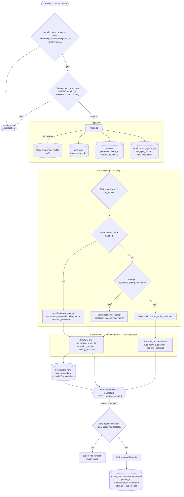

# Review Pipeline

## Overview

The review pipeline is the background half of this product. Nothing in it is reachable over HTTP:
there is no controller, no DTO, no route, and therefore no `api-reference.md` alongside this file.
It is a chain of scheduled and queued jobs that fetch reviews from the Google Business Profile
(GBP) API, route each one, ask Azure OpenAI for reply text, tell a human when something needs
attention, and — once a human approves — write the reply back to Google. The API modules
documented elsewhere (`../reviews/overview.md`, `../connections/overview.md`,
`../notifications/overview.md`, `../prompts/overview.md`) are almost entirely *readers* of what
this pipeline writes. `reviews`, `review_responses`, `sync_runs` and `notifications` rows are
created here and displayed there.

That asymmetry is the single most useful thing to hold onto while reading the rest of this
document. Only three writes in the whole system originate from a user action: approving or
rejecting a `review_responses` row, editing a prompt, and connecting/disconnecting a location.
Every other row — every review, every draft, every escalation notification, every sync run — is
written by a worker process with no request context, no authenticated user, and no ability to ask
anyone a question when something is ambiguous. So each stage has to be independently idempotent
and independently claimable: a job that runs twice must not double-charge the AI budget or
double-notify a manager, and a job that dies halfway must not permanently wedge the location it
was working on. `PLAN.md` §8 catalogues the specific races this creates; each stage below cites the
entries that apply to it rather than restating them.

The authoritative design is `apps/backend/docs/PLAN.md` — §3 (the classification rule), §4.1
(end-to-end flow), §4.2 (the `review_responses` state machine), §5 (AI generation), §6 (retention
and erasure), §7 (historical backfill), §8 (concurrency). The schema is
`apps/backend/src/db/drizzle/migrations/`: `0000_foundation.sql` (every enum this pipeline writes),
`0003_review_provider_locations.sql` (`locations`, `review_provider_connections`),
`0004_reviews.sql` (`reviews`, `sync_runs`, `review_responses`), `0005_notifications.sql`, and
`0006_prompts.sql` (the prompt tables plus three columns added to `review_responses`). Every table,
column and enum value named below was checked against those files; where a stage needs something
the schema does not have, it is flagged inline as a **required follow-up migration** rather than
quietly written as if it existed. **None of the pipeline itself exists in `apps/backend/src/`
today** — a grep for `sync_run`, `review_response`, `escalat`, `blocklist` or `businessprofile`
across the backend's TypeScript returns nothing. What does exist is the generic queue/cron
machinery it will run on (`src/background/`), described in
[Scheduling and transport](#scheduling-and-transport); see
[Gap](#gap-between-current-code-and-target-design) for the build list.

## Pipeline stages

Adapted from `PLAN.md` §4.1, with the backfill gate (§8.2) and the notification stage's real
tables made explicit:



Each stage below states its trigger, inputs, exact writes, failure modes, and the concurrency
guards it needs.

### Ingestion — the 15-minute poller

**Trigger.** A cron tick every 15 minutes fans out one queued job per eligible location. Eligible
means `locations.status = 'active'` (`location_status`) **and**
`locations.onboarding_backfill_completed_at IS NOT NULL` — the second condition is §8.2's gate, not
an optimization. The cron tick itself must not do any fetching; it enqueues and returns, so a slow
GBP account cannot delay other tenants' polls.

**Inputs.** The `locations` row, its `review_provider_connections` parent (for
`credential_reference`, `token_expires_at` and `status`), and the location's high-water mark for
"what have we already seen." That last input has no dedicated column: the pipeline derives it from
`MAX(reviews.external_updated_at)` for the location, or refetches a bounded recent window and
relies on the upsert to absorb the overlap. Either is acceptable; what is not acceptable is
treating `locations.last_synced_at` as a cursor — it records when a poll *ran*, not how far it got,
and it is written even on failure.

**Writes.**

| Table | Columns written | Notes |
|---|---|---|
| `sync_runs` | `tenant_id`, `location_id`, `"trigger" = 'scheduled'`, `started_at`, `status = 'running'` at claim; then `status`, `completed_at`, `reviews_fetched`, `error_message` at the end | `"trigger"` is a quoted identifier in `0004_reviews.sql` — it is a reserved word. `sync_trigger` is `scheduled` \| `backfill`; `sync_run_status` is `running` \| `ok` \| `error`. `status` is `NOT NULL` with **no default**, so the insert must set `'running'` explicitly. |
| `reviews` | `tenant_id`, `location_id`, `external_review_id`, `external_reviewer_id`, `rating`, `review_text`, `reviewer_name`, `reviewed_at`, `external_updated_at` | Upserted, never blind-inserted. `classification` and `status` are left to their defaults (`pending_classification`, `new`) on insert and **not** touched on update. |
| `locations` | `last_synced_at`, `last_sync_status` (`sync_health_status`: `ok` \| `error`), `last_sync_error` | Written on both success and failure; `last_sync_error` must be nulled on success or a stale message lingers in the UI forever. |

The upsert is idempotent because of `idx_reviews_location_id_external_review_id` — a **unique**
index on `(location_id, external_review_id)` in `0004_reviews.sql`. That is the conflict target:
`ON CONFLICT (location_id, external_review_id) DO UPDATE`. Note it is keyed on `location_id`, not
`tenant_id` — an `external_review_id` is only unique within the location it belongs to, so any
upsert that omits `location_id` from the conflict target will not compile against this schema.

`rating` is stored as a raw integer 1–5, enforced by `reviews_rating_check`. GBP returns a
`STAR_RATING` string enum (`FIVE`, `FOUR`, …); mapping it is the ingestion adapter's job (`PLAN.md`
§2, `reviews`). An unmappable value must fail the row, not coerce to 0 — the CHECK constraint would
reject it anyway, so raise the mapping error where it can be logged usefully.

**Failure modes.**

- **401/403 from GBP** — the token was revoked or expired. §8.14 prescribes the handling: set
  `review_provider_connections.status = 'needs_reauth'` (`google_connection_status`), close the
  `sync_runs` row as `status = 'error'` with a real `error_message`, populate
  `locations.last_sync_status = 'error'` / `last_sync_error`, and **stop** — no retry within the run.
- **429 / quota exhaustion** — retry with backoff *within* the run, bounded, then close the run as
  `error`. Distinguish it from an auth failure in `error_message`; a rate limit must never flip the
  connection to `needs_reauth`.
- **Partial page failure** — reviews already upserted stay upserted. `reviews_fetched` records how
  many were actually written, not how many were expected, so a partial run is visibly partial.
- **Process crash mid-run** — the `sync_runs` row stays `'running'` forever. §8.1 handles this in
  the lock-acquisition query rather than with a reaper cron; the cosmetic cleanup rides along on the
  nightly retention job (see [Retention and erasure jobs](#retention-and-erasure-jobs)).
- **Review disappeared upstream** — a reviewer can delete their review;
  `reviews.removed_upstream_at` exists to mark it rather than leaving a stale row with no signal.
  Detecting the absence means diffing a full listing against known rows, which an incremental poll
  does not do — so honestly it is a full-sync-only signal until a reconciliation pass is added.
- **`reviewed_at` absent from the payload** — the column is nullable so ingestion survives, but §6
  wants this alerted on as a data-quality signal, because the retention job then falls back to
  `created_at`.

**Guards.** Overlapping runs: §8.1 — the partial unique index
`idx_sync_runs_location_id_running` (`UNIQUE (location_id) WHERE status = 'running'`) is already in
`0004_reviews.sql`, paired with the 30-minute staleness predicate §8.1 specifies so a crashed run
cannot wedge the location.

> **§8.1's staleness tolerance does not work as written, and this is the one guard the whole
> pipeline hangs off.** §8.1 deliberately avoids a reaper cron by folding staleness into the
> lock-acquisition *query* — *"'is there already a run for this location?' becomes 'is there a
> RECENT one?'"*. But that is a **read** predicate, and acquisition still has to `INSERT` a second
> `status = 'running'` row for the same `location_id`, which the partial unique index rejects no
> matter how old the existing row is. So a crashed poller wedges its location permanently:
> `onboarding_backfill_completed_at` never gets set, and per §8.2 that gates the tenant's entire
> live pipeline — they never ingest another review. The nightly sweep below is the only recovery
> path, and it is unbuilt.
>
> **Acquisition must reclaim, not just tolerate** — one transaction:
>
> ```sql
> UPDATE sync_runs SET status = 'error', completed_at = now(),
>        error_message = 'reclaimed: no progress for 30 minutes'
>  WHERE location_id = $1 AND status = 'running' AND started_at < now() - interval '30 minutes';
> INSERT INTO sync_runs (tenant_id, location_id, trigger, status, started_at) VALUES (...);
> ```
>
> This is a defect in `PLAN.md` §8.1 itself, not just in this document — the migration comment at
> `0004_reviews.sql:67-69` ("Pair with an application-level staleness check") inherits the same
> assumption. A review edited upstream mid-flight: §8.6, detected by
`external_updated_at` changing on upsert. Connection or location changing state mid-poll: §8.14 and
§8.15 — and per §8.15 the product must never `DELETE` a `locations` row as part of "disconnect", so
the poller may assume its location row survives the run.

Two additional per-review checks belong in this stage, not in classification, because they depend
on the raw API payload:

- **An externally authored reply appeared** — §8.12's poll-side fix. If the incoming review carries
  a `reviewReply` and no `review_responses` row for that review is at `status = 'posted'`, someone
  replied directly on Google. Supersede every non-terminal response for that review (`draft`,
  `pending_approval`, `approved`) and insert the discovered reply as `source = 'imported'`,
  `status = 'posted'`, `content = reviewReply.comment`, `posted_at = reviewReply.updateTime`, then
  set `reviews.status = 'responded'`. This is keyed on "does a `posted` row exist", not on
  `external_updated_at`, because a reply does not reliably bump the review's own `updateTime`.
- **`external_updated_at` changed** — §8.6. Supersede any non-terminal response and re-trigger
  classification.

> **Required follow-up migration / design decision.** §8.12's live import writes
> `source = 'imported'`, but `idx_review_responses_review_id_imported`
> (`UNIQUE (review_id) WHERE source = 'imported'`) was added for §7's backfill idempotency and
> allows exactly **one** imported row per review. If an owner edits their own manual Google reply
> after we have imported it, the second import violates that index. Either update the existing
> imported row in place, or narrow the index. Updating in place is smaller and is what this document
> assumes — it has to be stated in code, because the schema does not express it.

### Classification

**Trigger.** Queued per review, immediately after that review is upserted by ingestion (or after a
supersede re-triggers it per §8.6/§8.12). Classification is a separate job from ingestion on
purpose: a poll that fetches 200 reviews should not hold its `sync_runs` lock open while 200
classifications run, and a classification failure should not fail the poll.

**Inputs.** The `reviews` row (`rating`, `review_text`), the tenant's
`tenant_settings.escalation_rating_threshold` (`NOT NULL`, CHECK between 1 and 5), and the tenant's
active `blocklist_terms` rows. Both settings tables are keyed on `tenant_id` only, not
`location_id` — §8.16 accepts that as a scope boundary, so a multi-location tenant shares one
threshold and one blocklist.

**The rule, in this exact order** (`PLAN.md` §3):

1. The review text matches an active blocklist term → `classification = 'escalated'`,
   `escalation_reason = 'blocklist_match'`, and the matching term(s) written into
   `matched_keywords` (`JSONB`).
2. Otherwise `rating < tenant_settings.escalation_rating_threshold` → `classification = 'escalated'`,
   `escalation_reason = 'low_rating'`. Strictly less than; `rating >= threshold` is a candidate.
3. Otherwise → `classification = 'auto_reply_candidate'`.

**Writes.** `reviews.classification` (`review_classification`: `auto_reply_candidate` \|
`escalated` \| `pending_classification`), `reviews.escalation_reason` (`escalation_reason`:
`low_rating` \| `blocklist_match`, nullable — left `NULL` for a candidate),
`reviews.matched_keywords` (only on a blocklist match), and `reviews.status` moving from `'new'` to
`'in_review'` as part of the claim below. `reviews.sentiment` (`review_sentiment`: `positive` \|
`neutral` \| `negative`) may also be written here; per §3 it is informational only and does not
drive routing in MVP.

Two behaviours §8 accepts rather than fixes apply directly here. Per §8.17, the order above means a
review that is *both* low-rated and blocklist-matched only ever records `blocklist_match` —
`escalation_reason` is single-valued and there is nowhere to put the second reason, so do not try to
encode both by stuffing the rating into `matched_keywords`. Per §8.11, **classification is not
retroactive**: changing the threshold or adding a blocklist term does not reclassify
already-classified reviews. There is no reclassification job and none is planned; the only re-entry
into this stage is §8.6/§8.12's supersede path.

**Failure modes.** A tenant with no `tenant_settings` row has no threshold to compare against.
§8.10 makes creating that row part of the signup transaction precisely so this cannot happen, but
the classifier should still fail loudly (leaving `classification = 'pending_classification'`)
rather than defaulting to a hardcoded 3. A blocklist match that throws leaves the review claimed at
`in_review` and still `pending_classification` — a visible, queryable stuck state via
`idx_reviews_classification`, which is the right outcome.

**Guard.** Double classification: §8.3 — claim the review with
`UPDATE reviews SET status = 'in_review' WHERE id = ? AND status = 'new'` and skip on zero rows
affected.

> **Required follow-up (code, not schema).** §8.3's claim predicate is `status = 'new'`, but §8.6
> and §8.12 both re-trigger classification for a review already at `in_review` (or `responded`), so
> as written the CAS can never succeed on the re-entry path and a supersede would silently never
> regenerate. The supersede step must reset `reviews.status = 'new'` in the same transaction that
> supersedes the responses. Note also that §2 defines `in_review` as "has a draft/pending response"
> while §8.3 sets it *before* any draft exists — workable, but it means `in_review` alone does not
> prove a draft exists; the dashboard badge is a computed combination per §2, not a column read.

### AI generation

**Trigger.** Queued immediately after a successful classification, carrying the review id and the
classification outcome. It is a separate job from classification because it is the only stage that
costs money per invocation and the only one whose latency is measured in seconds.

**Inputs.**

- **Few-shot examples** — per `PLAN.md` §5, the tenant's most recent 50 `review_responses` rows
  where `status = 'posted'`, across `source` in `ai_generated`, `human_edited`, `human_manual`,
  `imported`. Worth being precise about: those are *all four* values of `response_source`, so the
  `source` list restricts nothing — it is in §5 to state intent (imported historical replies count,
  which is the whole reason §7's backfill exists), not to exclude anything. The real filter is
  `tenant_id` plus `status = 'posted'`.
- **The prompt** — the current version of the tenant's `prompts` row for the relevant category
  plus that same row's `tone` column, both owned by the prompts module. See
  `../prompts/overview.md` for how "current version" is derived (`MAX(version)` over
  `prompt_versions`, no pointer column) and why tone lives directly on `prompts` rather than a
  separate table. This stage consumes them, never writes them.
- **The review itself** — `review_text`, `rating`, `reviewer_name`. §6 requires the prompt to
  instruct the model not to restate the reviewer's name, because `review_responses.content` is
  explicitly *not* retroactively scrubbed during a retention purge. That house rule is what makes
  the purge design safe, and it lives in the prompt template — a prompts-module obligation this
  stage depends on.

**The call.** Azure OpenAI, GPT-4, `westeurope` deployment only. §5 is explicit that the region is
validated *at the client-config level*, not left to convention: the client should refuse to
construct against a non-`westeurope` endpoint, so a misconfigured environment fails at boot rather
than silently sending personal data to another region. §6 extends the same standard to where the
data lives at rest — a hosting concern, same requirement.

**Writes.** One `review_responses` insert per generated variant:

| Classification | Rows | `response_type` | `generation_group_id` | `status` | `source` |
|---|---|---|---|---|---|
| `auto_reply_candidate` | 1 | `auto_reply_suggestion` | may be `NULL` | `pending_approval` | `ai_generated` |
| `escalated` | 2–3 | `escalation_snippet` | one shared UUID across the batch, **never `NULL`** | `pending_approval` | `ai_generated` |

Every row also gets `tenant_id`, `review_id`, `content`, `generation_metadata` (JSONB — model
name/version, region `westeurope`, token counts, per §2), and `prompt_version_id` (added by
`0006_prompts.sql`, FK to `prompt_versions`, `ON DELETE SET NULL`). `original_content`, also from
`0006`, gets the same text as `content` at generation time, so a later human edit leaves the
pre-edit AI text recoverable for the prompt-performance analytics that column serves.
`created_by_user_id` stays `NULL`: no user created these. And note `review_responses.status`
defaults to `'draft'` in the schema while §5 wants `pending_approval`, so the insert must set it
explicitly — `draft` stays legal in §4.2's machine for a human-composed draft, but the AI path
skips it.

The non-null `generation_group_id` for escalations is load-bearing beyond grouping: §8.13's
notification dedup index includes that column, and Postgres treats `NULL`s in a unique index as
distinct, so a `NULL` there silently disables deduplication. Generate the UUID in the application
before the batch insert, not per row.

**Failure modes.** Azure erroring, timing out, or content-filtering creates no `review_responses`
row at all, so there is nowhere in the schema to record the failure —
`review_responses.error_message` only helps once a row exists, and the review is left at
`classification = 'escalated'` / `status = 'in_review'` with zero responses: queryable, but not
self-explaining. For escalations, insert all 2–3 rows in one transaction; a group of one is worse
than a clean failure, because the UI's "regenerate all" acts on the group. And retries here cost
money, so the generic `DEFAULT_JOB_OPTIONS` (3 attempts) is the wrong default — override `attempts`
per publish via `PublishOptions`.

> **Required follow-up migration.** No column records "AI generation failed for this review, and
> why." Add a `reviews.generation_error TEXT` / `generation_failed_at TIMESTAMPTZ` pair — the
> alternative, a placeholder `review_responses` row, has no `response_status` value to sit in.
> Until then, generation failures live only in the DLQ and the logs: the exact "log spelunking" §2
> added `sync_runs` to avoid for the poller.

> **Required follow-up (design + index).** Three smaller gaps around the few-shot query. (1) "Most
> recent 50" has no defined ordering column — `posted_at` is nullable, so the query needs
> `ORDER BY COALESCE(posted_at, created_at) DESC`, stated rather than inferred. (2) No index
> supports it: `0004_reviews.sql` indexes `tenant_id` and `status` separately, so this is a
> scan-and-sort over the tenant's whole response history; a composite
> `(tenant_id, status, posted_at DESC)` is the fix. (3) `prompt_category` is `positive` \|
> `neutral` \| `escalated`, but classification produces only `auto_reply_candidate` \| `escalated`.
> Choosing `positive` vs `neutral` for a candidate requires `reviews.sentiment`, which §3 makes
> optional and which is nullable — so the mapping needs an explicit documented fallback (e.g.
> sentiment `negative`/`NULL` on a candidate → `neutral`). See `../prompts/overview.md`.

### Notification

**Trigger.** Queued after a successful escalation generation, carrying the review id and the
`generation_group_id` that was just created. Only escalations notify; an `auto_reply_candidate`
produces no `notifications` row.

**Inputs.** The tenant's active `notification_recipients` rows for
`notification_type = 'escalation'` — the configured recipients, owned by the settings module, with
`is_active = true` and a `channel` preference of `notification_channel_pref` (`email` \| `teams` \|
`both`). Plus the review and the snippet set identified by `generation_group_id`, because §2
requires the notification to carry the suggested snippets and to be pinned to the exact set that
went out.

**Writes.** One `notifications` row per (recipient, channel) actually attempted:
`tenant_id`, `review_id`, `recipient_user_id`, `generation_group_id`, `type = 'escalation'`
(`notification_type` has exactly one value — no digest type is planned), `channel`
(`notification_channel`: `email` \| `teams` — note this is a *different, narrower* enum than the
recipient's `notification_channel_pref`, so a `both` preference means two rows), `status`
(`notification_status`: `pending` \| `sent` \| `failed`), and `sent_at` on success. `status` is
`NOT NULL` with no default: insert as `'pending'`, then update.

`read_at` is deliberately best-effort per §2 and must not gate any logic — Teams gives real read
receipts, while email open-tracking fires spuriously under Apple Mail Privacy Protection and
Gmail's image proxy. `recipient_user_id` is `ON DELETE RESTRICT`, which matters for §6.2: a user
with notification history cannot be hard-deleted, consistent with anonymize-in-place being the only
supported staff-erasure path.

**Transport and retry live here.** The records-and-read side — listing a user's notifications,
marking one read — is the notifications module's HTTP surface (`../notifications/overview.md`).
Delivery is this stage's: write the row `pending`, invoke the channel adapter, update to `sent`
(with `sent_at`) or `failed`. Email should go through the existing `EmailModule` / `email` queue
rather than a new SMTP client; Teams needs a new outbound adapter (Bot Framework or an incoming
webhook), which does not exist today.

**Failure modes.** A rejected send sets `status = 'failed'` and the job retries with backoff —
safe, because the unique index below turns a duplicate *insert* into a detectable no-op and the
*update* to `sent` is idempotent. An empty recipient list is not a failure but is worth alerting
on: an escalated review nobody is told about is the one outcome this stage exists to prevent.

**Guard.** A review escalating twice must still only notify once *per escalation event*: §8.13.
The already-applied `idx_notifications_review_recipient_type` —
`UNIQUE (review_id, recipient_user_id, type, generation_group_id)` in `0005_notifications.sql` — is
what enforces it, which is why the previous stage must never leave `generation_group_id` null.

> **Required follow-up migration.** That index does **not** include `channel`. A recipient whose
> preference is `both` needs two rows for one escalation event, one per channel, differing only by
> `channel` — so the second insert violates the index. Widen it to
> `(review_id, recipient_user_id, type, generation_group_id, channel)`; the alternative, collapsing
> `both` into one row, loses per-channel delivery status. `both` is a supported
> `notification_channel_pref` value today, so this is a live schema bug, not a hypothetical.
> Separately, `notifications` has no `error_message` (nor `failed_at`), so a `failed` row cannot say
> why — `review_responses` has exactly that column for the same reason. Add `error_message TEXT`.

### Posting back to Google

**Trigger.** A human approving a `review_responses` row over HTTP (the reviews module) enqueues
this job. The approval itself is not part of this pipeline; the post is. Also triggered by a retry
of a `post_failed` row.

**Inputs.** The `review_responses` row at `status = 'approved'`, its `reviews` parent, the
location's connection credentials, and — critically — a **live** read of that one review's current
reply state from the GBP API.

**Writes and the state machine.** `response_status` is `draft` \| `pending_approval` \| `approved`
\| `rejected` \| `posted` \| `post_failed` \| `superseded`, and §4.2 is the authoritative machine.
On a successful post:

1. `review_responses.status = 'posted'`, `posted_at = now()`, `error_message` cleared —
   as a **compare-and-swap**, `UPDATE ... WHERE id = ? AND status = 'approved'`, never a blind
   write. Do **not** rewrite `decided_at`: it records the *human* decision (set at approve time by
   [the approve endpoint](../reviews/api-reference.md#post-v1reviewsreviewidresponsesresponseidapprove)),
   and `prompts`' average-time-to-decision metric divides by it — overwriting it here silently
   redefines that metric as "time until Google accepted the reply."
2. `reviews.status = 'responded'`.

**Why the CAS matters, and what has to happen before the `PUT`.** Between approve and post, a
poller run can supersede this row (§8.6, an upstream edit) or an import can land (§8.12). With a
blind write the worker publishes text answering a review that no longer exists *and* forces a
`superseded` row to `posted` — a transition §4.2 does not contain. So: re-read the row
`FOR UPDATE WHERE id = ? AND status = 'approved'` immediately before calling Google, abort if it
does not match, and make the completion write the CAS above.

**The crash window is a third state §8.12 does not model.** §8.12's freshness check keys on "does
a `posted` row exist for this review". If the `PUT` succeeds at Google but the worker dies before
its DB write, no `posted` row exists — so the next poll sees a `reviewReply` it cannot account for
and concludes *someone replied externally*: it supersedes our own `approved` row and re-imports our
own text as `source = 'imported'`, dropping `approved_by_user_id` and telling the approver their
reply "did not go through because the review was already answered externally." Two guards, both
cheap: write a `post_attempted_at` marker (or a `posting` state) **before** the `PUT`, and have the
freshness check compare the fetched `reviewReply.comment` against our `content` before declaring
it external. Note the sibling supersede is **not** listed above — it belongs in the approve
transaction, scoped by `review_id`, per
[the reviews module](../reviews/api-reference.md#post-v1reviewsreviewidresponsesresponseidapprove);
doing it here would leave live `pending_approval` siblings alongside an `approved` row, which is
exactly the §8.5 window the live-reply index exists to close.

On an API error: `review_responses.status = 'post_failed'` with a real `error_message`, and
`post_failed → approved` is the documented retry edge in §4.2.

Google's reply endpoint is `PUT .../reviews/{reviewId}/reply`, setting the review's single
`reviewReply {comment, updateTime}` sub-field. There is no reply id — §2 dropped
`google_response_id` for exactly this reason and `posted_at` is the substitute — which also means a
re-post overwrites: editing a posted reply flips the old `posted` row to `superseded` and makes the
new row `posted`. Order matters against the schema here, because
`idx_review_responses_review_id_live_reply` is `UNIQUE (review_id) WHERE status IN ('approved',
'posted')`: the supersede of the old row must commit *before* the new one is set `approved` or
`posted`, or the index rejects the write. That same index is why an approval of a second sibling
fails at the database rather than at the API — deliberate, per §8.5.

**Failure modes.**

- **A reply already exists on Google that we did not write** — the sharp half of §8.12. Google's
  reply endpoint is an unconditional upsert with no "already exists" check, so posting would
  silently overwrite a reply the owner wrote themselves, report success, and mark `posted`. §8.12's
  fix is mandatory: fetch that single review's current reply state immediately before the `PUT`. If
  a reply exists, **abort the post**, supersede the `approved` row instead, import the discovered
  reply (`source = 'imported'`, `status = 'posted'`), and surface to the approver that their action
  did not go through. One extra lightweight API call per post is the stated price.
- **401/403** — same as ingestion's §8.14 path: flip the connection to `needs_reauth`. The response
  goes to `post_failed`, not `superseded` — still valid text, just unpostable right now. A 429 or
  content-policy rejection is the same, with the provider's message in `error_message`.
- **Blind job retries** — the generic 3-attempt default is dangerous here, since attempt 2 must
  re-run the freshness check rather than replay a decision made against attempt 1's world. Set
  `attempts: 1` and rely on the UI retry path, or make the freshness check unconditional at the top
  of the handler.

**Guards.** Two staff acting at once: §8.4 — every status change is a guarded compare-and-swap
against the status the client loaded (`... WHERE id = ? AND status = 'pending_approval'`), and zero
rows affected is surfaced to the second user, not swallowed. Sibling snippets racing to post: §8.5.
Someone replied directly on Google while our draft was pending: §8.12, both the poll-side and the
pre-post freshness check.

> **Required follow-up migration.** `PLAN.md` §2 asks for **both** `approved_by_user_id` and
> `approved_at` on `review_responses`. Only `approved_by_user_id` is in `0004_reviews.sql`.
> `decided_at` from `0006_prompts.sql` covers "when the status became terminal", and `approved` is
> not terminal — a row can sit `approved` for a while before posting, or fail and retry. Add
> `approved_at TIMESTAMPTZ` to keep the approval audit trail §2 asked for; without it, "who
> approved this and when" is only answerable from `audit_logs`.

## Historical backfill

**Trigger.** Once per tenant, immediately after the owner completes the Google connection and picks
a location during onboarding, and **before** any live polling for that location. `PLAN.md` §7 is
the design; the connections module owns the HTTP side that starts it and reports progress
(`../connections/overview.md`), and this pipeline owns the job. Without it the tenant's very first
AI-generated reply has zero few-shot examples, so it imitates nothing and sounds like nobody: the
backfill's product is `review_responses` rows with `source = 'imported'`, the tone corpus the
[AI generation](#ai-generation) stage reads.

**What it does.** It reuses the poller's upsert path verbatim — §7 is explicit that this is "one
full historical fetch instead of an incremental delta", not a second ingestion code path. Per page
of reviews, oldest replied-to first:

- Upsert `reviews` on `(location_id, external_review_id)`, same conflict target as the poller.
- If the review carries an existing `reviewReply`, insert `review_responses` with
  `source = 'imported'`, `status = 'posted'`, `content = reviewReply.comment`,
  `posted_at = reviewReply.updateTime`.
- Set `reviews.status = 'responded'` directly and leave `classification` at its
  `pending_classification` default. §7 is emphatic that backfilled reviews **skip the live workflow
  entirely** — they are historical record feeding generation, not queue items needing routing,
  drafting, or an escalation notification. The tenant already handled them before this system
  existed.

It is tracked in `sync_runs` with `"trigger" = 'backfill'` rather than in a one-off table, so
support can answer "did backfill actually run for this tenant" from the same operability view as
regular polling. It stops on whichever comes first: 50 imported replies collected, review history
exhausted, or a page cap — the cap exists so a location with thousands of unreplied reviews cannot
paginate unboundedly. Its idempotency comes from `idx_review_responses_review_id_imported`, and no
separate consent step is needed because this reads data already covered by the GBP scope granted
during the OAuth connect (§7).

**The gate.** `locations.onboarding_backfill_completed_at` is set by the **backfill job** at the end
of a successful run — not by the connections module's HTTP handler, which only *reads* it for
progress. Per §8.2 the scheduler does not enqueue poll or classify work for a location until it is
non-null. That is the only thing preventing the live classifier from picking up an already-replied
historical review before backfill marks it `responded`, and pushing it through classification,
generation, and an escalation notification about a review from two years ago.

**Failure modes.** A failed backfill leaves the gate null, which keeps the location correctly gated
but also means the tenant's pipeline never starts — a permanently failing backfill is a hard
onboarding block, made visible by the `sync_runs` row (`status = 'error'`, `error_message`). A
tenant with fewer than 50 historical replies (possibly zero) is a normal outcome, not an error; §7
asks for it to be visible via `sync_runs.reviews_fetched` rather than silently generating from a
thin example set, and makes a generic-tone fallback prompt a fast-follow. §8.1's `running` lock
applies here too, since backfill writes the same table — and a stale `running` backfill row would
block the location's entire pipeline, which is why §8.1's staleness tolerance sits in the
acquisition query.

> **Required follow-up migration.** `sync_runs` has one counter, `reviews_fetched INTEGER`, written
> at the end of the run. The connections module exposes a *progress bar* over HTTP during
> onboarding, and §7's stopping condition is counted in **imported replies**, not reviews fetched —
> two different numbers, one column, and nothing written until completion. Either write
> `reviews_fetched` incrementally as pages land (making it a live progress counter) or add
> `imported_responses_count INTEGER` and, ideally, `pages_fetched INTEGER`. As it stands the
> progress endpoint can only report "running" or "done".

## Retention and erasure jobs

Two mechanisms driving one underlying action, per `PLAN.md` §6: a **scheduled retention purge**
(storage limitation) and an **on-demand erasure path** (right to erasure). The reviewer is a third
party who never logs in, so there is no self-service portal — a request arrives externally and a
human actions it, deliberately manual for MVP, consistent with the "nothing irreversible without a
person clicking it" philosophy the whole approval flow rests on.

**Reviewer retention purge (nightly cron).** Select `reviews` where
`COALESCE(reviewed_at, created_at) < now() - tenant_settings.review_data_retention_months`
(nullable, falling back to a platform default) `AND anonymized_at IS NULL`. For each: null
`reviewer_name`, leave `rating` / `review_text` / `classification` intact for aggregate reporting,
and set `reviews.anonymized_at = now()`. All three columns —
`tenant_settings.review_data_retention_months`, `reviews.reviewer_name`, `reviews.anonymized_at` —
exist as claimed in `0002_tenant_auth.sql` and `0004_reviews.sql`.

The `COALESCE` is not defensive styling: `reviewed_at` is nullable and any comparison against `NULL`
is unknown rather than true, so a review ingested without a parseable timestamp would sit
permanently un-purgeable — the exact opposite of what this job guarantees. §6 also records why
`review_text` survives while `reviewer_name` does not (the business legitimately needs "we got a 2★
review in March" long after retention expires; what must go is the link to a named individual), and
flags that split as a reasonable default to confirm with legal/DPO, not a legal ruling.
`review_responses.content` is never retroactively scrubbed — free text cannot be regex-edited
safely — which is why the house-style prompt rule in [AI generation](#ai-generation) is load-bearing
rather than cosmetic.

**The audit-trail gap (§6.1).** Every domain table carries an `AFTER INSERT OR UPDATE OR DELETE`
trigger running `log_db_changes()`, which snapshots the whole row into `audit_logs.old_value` /
`new_value` — including on the anonymizing UPDATE itself, so `reviewer_name`'s former value is
preserved unredacted there, as it already was by every earlier UPDATE on that review. Purging the
live row does not purge the trail. §6.1's fix: the same job step must also redact every
`audit_logs` row referencing that review's id, matched by `table_name = 'reviews'` and the id inside
`old_value`/`new_value` — not just the row the anonymizing UPDATE created.
`idx_audit_logs_table_name` and the two GIN indexes in `0000_foundation.sql` exist to make that a
targeted lookup. §6.1 states plainly that the redaction step is **not yet built**; still true.

**Staff erasure is anonymize-in-place (§6.2), never a delete.** An owner or member is also a data
subject. On an erasure request or offboarding: clear `users.name` / `email` / `password_hash` (see
the constraint caveat below), delete that user's `user_identities` rows (revoking every linked
social login), and set `users.anonymized_at = now()` — verified present in `0002_tenant_auth.sql`.
**Never delete the `users` row.** `review_responses.created_by_user_id` and `approved_by_user_id` are both
`ON DELETE SET NULL`; a hard delete would erase the live record of who approved a specific posted
reply. In a system whose core safety mechanism is that nothing posts without a person clicking it,
losing that trail is worse than the reviewer-erasure gap this section already treats as serious.
Because the row and its `id` survive, both FKs stay valid and just point at an anonymized
former-user record. `ON DELETE SET NULL` becomes a rare defensive fallback for a genuinely separate,
more drastic admin action — not the erasure path.

**Sweeping stale sync runs.** §8.1 hands this job one extra chore: flip `sync_runs` rows stuck at
`status = 'running'` past 30 minutes to `'error'`. This is **not** cosmetic, contrary to how §8.1
frames it: until acquisition reclaims stale rows itself (see the Ingestion guard note above), this
sweep is the *only* thing that can unwedge a location whose poller crashed — and while it is
wedged, §8.2 blocks that tenant's entire pipeline. Build the reclaiming acquisition query and this
sweep becomes the belt-and-braces it was meant to be; ship without either and a single crashed
worker silently ends a tenant's ingestion. Set `completed_at` and a synthetic `error_message` while doing it, or the
row stays ambiguous.

> **Required follow-up migration.** §6.2 says to null `users.name` / `email` / `password_hash`, but
> in `0002_tenant_auth.sql` **`name` and `email` are both `NOT NULL`** — only `password_hash` is
> nullable. As written the staff-erasure UPDATE cannot execute. Either drop `NOT NULL` on those two
> columns, or overwrite with placeholders; if placeholders, the email must be *unique per user*
> (e.g. `anonymized+<user id>@invalid`) because `idx_users_tenant_id_email` is a unique index on
> `(tenant_id, email)` and a shared placeholder would collide on the second erasure in a tenant.

> **Required follow-up.** Three more things this design names but the schema does not hold. (1) The
> "platform default" retention window that `review_data_retention_months IS NULL` falls back to
> exists nowhere — not a column, not an env var in `src/config/env.config.ts`. It needs a home
> before the job can run. (2) `reviews.external_reviewer_id` is a pseudonymous reviewer identifier
> and §6 uses it to *find* rows to erase; whether anonymization should also null it is undecided —
> nulling it breaks future matching for the same data subject, keeping it retains a pointer. That
> needs a DPO answer, not an implementer's guess. (3) §6 mentions nulling a reviewer photo URL
> "if later added"; no such column exists on `reviews` today, so there is nothing to null.

## Scheduling and transport

Everything above runs on machinery that already exists in `apps/backend/src/background/`. This
section describes that machinery as it actually is, and where the pipeline's jobs slot into it.

**Where it runs.** The worker is a separate process: `src/worker.main.ts` is a thin
secrets-hydration gate that defers to `src/worker-bootstrap.ts`, which builds a Nest *application
context* (no HTTP listener) from `WorkerModule`. That module imports `BackgroundModule`, which
imports `QueueTransportModule` plus one module per queue (`EmailQueueModule`,
`NotificationQueueModule`, `WebhookQueueModule`, `DeadLetterQueueModule`, `CronModule`). Every
pipeline job belongs on this process, not the API one; `pnpm start:dev` runs both concurrently.

**Cron.** `CronModule` imports `ScheduleModule.forRoot()`, and `CronScheduler` carries the `@Cron`
decorators. The existing example is one method decorated
`@Cron(CronExpression.EVERY_DAY_AT_MIDNIGHT)` whose entire body is a call to
`CronQueue.addDailyMailJob()`. That shape is the one to copy: **a cron method enqueues, it does not
work.** The pipeline needs two cron entries:

| Schedule | Enqueues |
|---|---|
| `'*/15 * * * *'` (a raw expression — there is no 15-minute `CronExpression` constant) | One `review-sync` job per eligible location: `locations.status = 'active'` AND `onboarding_backfill_completed_at IS NOT NULL` (§8.2) |
| `CronExpression.EVERY_DAY_AT_MIDNIGHT` | The nightly retention purge, its `audit_logs` redaction step, and §8.1's stale-`sync_runs` sweep |

Note carefully: `CronQueue` publishes to `QueueName.CRON` and `CronProcessor` dispatches on
`CronJobName` with a `switch (job.name)`. So "cron" here is itself a queue — the `@Cron` tick is a
producer, and the actual handler runs as a queued job with retries, DLQ routing, and Bull Board
visibility like any other. The 15-minute tick should fan out to a *dedicated* pipeline queue rather
than to `QueueName.CRON`, so a slow poll cannot starve the daily-mail job sharing that queue's
concurrency limit of 3.

**Queued jobs.** Each pipeline stage is its own queue, because their concurrency and retry profiles
genuinely differ — polling is I/O-bound and rate-limited per connection, generation is expensive and
should barely retry, posting must not retry blindly at all:

| Proposed `QueueName` | Job | Concurrency note |
|---|---|---|
| `review-sync` | Poll one location; also the one-time backfill (same upsert path, `"trigger" = 'backfill'`) | Serialized per location by §8.1's index, not by the queue |
| `review-classify` | Classify one review | Cheap, high concurrency |
| `review-generate` | Generate 1 or 2–3 responses for one review | Low concurrency, `attempts` overridden down |
| `review-post` | Freshness-check then `PUT` one reply | `attempts: 1`, or an unconditional re-check per attempt |
| `notification` (existing) / `email` (existing) | Escalation delivery | Reuse rather than add |

Adding a queue means adding its value to the `QueueName` enum in
`src/background/constants/job.constant.ts` — `QUEUE_LIST` is derived from that enum, and both
`BullModule.registerQueue(...)` and the SQS URL env keys are derived from `QUEUE_LIST`. Job names go
in `JobName` (or a new `ReviewJobName`), matching how `CronJobName` is kept separate.

**How `DEPLOYMENT_TARGET` swaps the transport.** One env var (`local` | `aws`) selects everything,
via `isAwsDeploymentTarget()` evaluated at module-definition time:

- **Producer side.** `QueueTransportModule` provides the abstract `QueuePublisherProvider`, bound to
  `BullMqQueuePublisher` (local) or `SqsQueuePublisher` (aws). It is imported by both
  `BackgroundModule` (worker) and `QueueUIModule` (API), so the selection lives in exactly one
  place. Producers (`*.queue.ts`) inject the abstract class and call
  `publish(queueName, jobName, data, options?)`; they never know which transport is live.
- **Consumer side.** Each queue module picks its consumer with the same ternary — e.g.
  `const consumerProvider: Provider = isAws ? EmailSqsConsumer : EmailProcessor;`. The BullMQ side
  is a `WorkerHost` with `@Processor(QueueName.X, { concurrency, limiter, ... })` and a
  `switch (job.name)` dispatch. The SQS side extends `SqsQueueConsumerBase`, which reproduces that
  shape with a long-polling `ReceiveMessageCommand` loop: on success the message is deleted, on
  failure it is left so its visibility timeout expires and SQS's native redrive moves it to the
  matching `-dlq` queue after `maxReceiveCount`.
- **Queue URLs in aws mode.** `getQueueUrlEnvKey(name)` maps a queue name to an env key —
  `'review-sync'` becomes `REVIEW_SYNC_QUEUE_URL`. Terraform seeds those keys into Secrets Manager
  with the same transform (`infra/floci/secrets.tf`), and `SqsQueueConsumerBase.onModuleInit()`
  throws at boot if the key is missing — so a new queue needs an env-config entry and a Terraform
  entry, not just an enum value.
- **Failure visibility.** Locally, `@OnWorkerEvent('failed')` / `'stalled'` / `'error'` handlers
  push into `DeadLetterQueueService`; in aws mode `SqsQueueConsumerBase.onProcessingFailed()` is
  overridden to do the same, so the dev-tools DLQ panel has equivalent metadata either way. Bull
  Board (`/admin/queues`) is local-only; aws mode gets the SQS queue-depth panel instead.
- **Job options.** `DEFAULT_JOB_OPTIONS` is 3 attempts, exponential backoff from 60s,
  `removeOnComplete` after a day, `removeOnFail` after a week. Overrides go per publish through
  `PublishOptions` (`attempts`, `backoffDelayMs`).

**One honest caveat about `@Cron` on a scaled worker.** `@Cron` fires in-process on *every* worker
replica. With more than one worker, the 15-minute tick fires more than once — which §8.1's
`UNIQUE (location_id) WHERE status = 'running'` index absorbs harmlessly for ingestion, since the
losing tick's insert simply fails. The **nightly retention job has no such guard**: two replicas
would both run the purge and both sweep `audit_logs`. Idempotent-ish, but wasteful and racy on the
redaction step. Either the cron tick needs a distributed lock (a Redis `SET NX`, or a BullMQ
repeatable job with a fixed `jobId`, which dedupes at the queue rather than in-process), or the
deployment must pin exactly one worker replica and say so.

## Gap between current code and target design

**None of this pipeline exists.** `apps/backend/src/` has no reference to `sync_runs`, `reviews`,
`review_responses`, `blocklist`, escalation, Google Business Profile, or Azure — verified by grep
across all TypeScript under `src/`. What exists is the boilerplate's generic infrastructure
(`src/background/`, `src/ai/`, `src/email/`, `src/notifications/`), which the pipeline builds *on*
but which does not implement any of it. The schema, by contrast, is done: every table this document
writes exists in the migrations, with the specific partial unique indexes §8 asks for already
applied.

**To build, in the background layer:**

- **Two cron entries** on a `CronScheduler`-shaped class: the `'*/15 * * * *'` fan-out and the
  nightly retention/erasure/sweep job. Both enqueue; neither works inline.
- **Four new queues** — `review-sync`, `review-classify`, `review-generate`, `review-post` — each
  needing a `QueueName` enum value, a `*.queue.ts` producer, a BullMQ `*.processor.ts`, an
  `*-sqs.consumer.ts`, a `*-queue.module.ts` with the `isAws` ternary, an `env.config.ts` entry for
  its `*_QUEUE_URL`, and a Terraform entry. Reuse the existing `notification` and `email` queues for
  escalation delivery rather than adding a fifth.
- **A Teams outbound adapter.** `notification_channel` includes `teams` and
  `notification_channel_pref` includes `both`; nothing in `src/notifications/` (FCM push, in-app)
  speaks Teams. This is a new provider under the existing Provider/Strategy pattern.

**Two external clients, neither of which exists:**

- **Azure OpenAI client.** `src/ai/providers/` has `ClaudeProvider` and `OpenAiProvider` against the
  `AiProvider` abstract base; there is no Azure provider, and `src/config/env.config.ts` has only
  `OPENAI_API_KEY`, `OPENAI_BASE_URL`, `OPENAI_DEFAULT_MODEL`, `OPENAI_EMBEDDING_MODEL` — no
  `AZURE_*` anything. Needs `AZURE_OPENAI_ENDPOINT`, `AZURE_OPENAI_API_KEY`,
  `AZURE_OPENAI_DEPLOYMENT`, `AZURE_OPENAI_API_VERSION`, plus a constructor-time assertion that the
  endpoint's region is `westeurope` — §5 requires the pin to be validated at client-config level and
  to fail loudly, not to be a convention someone can drift off. Slot it in as a third
  `AiProvider` implementation so provider selection stays a factory decision in module registration.
- **GBP API client.** Nothing exists. It needs list-reviews-for-location with pagination, get-single-review
  (for §8.12's freshness check), and `PUT reviews/{reviewId}/reply`; the `STAR_RATING` →
  integer mapping; distinct handling for 401/403 vs 429; and credential resolution from
  `review_provider_connections.credential_reference` (a *pointer* to a stored credential, never the
  token itself). Its OAuth grant is owned by the connections module and is a `review_provider`
  concern, entirely separate from the `user_identity_provider` Google used for login
  (`../auth/overview.md#data-model`). §8.9 additionally requires token refresh to be serialized per
  connection row via an advisory lock or a short-lived cached-token check.

**Conventions this work must follow** (`apps/backend/docs/conventions/module-structure.md`,
`apps/backend/CLAUDE.md`):

- **All data access through the Repository + DB Service pair**, in
  `src/db/repositories/<domain>/` — `reviews.*`, `sync-runs.*`, `review-responses.*`,
  `notifications.*`. The pipeline's jobs are services: they depend on DB Services, never on a
  Repository directly, and never run a Drizzle query themselves. Repositories stay mechanical (one
  table, raw queries, no composition); every multi-table transaction this document requires — the
  escalation batch insert, supersede-then-post, supersede-plus-reset-status — belongs in a DB
  Service, the layer that owns transactions spanning more than one repository call. The four-layer
  shape is not yet adopted anywhere, so existing repository domains are not the pattern to copy.
- **Explicit return types on every method**, at every layer. No inference, no `any`. Every
  user-facing string through `src/common/constants/messages.constants.ts`, which does not exist yet.
- **If any part of this ever gets an HTTP surface** — a manual "sync now" trigger, a "regenerate"
  button, an erasure-request action — that part is a module under `src/api/<module>/` with the full
  `swagger/`, `constants/`, `types/`, `dto/` set and its own docs pair. Those actions most plausibly
  belong on the existing reviews and connections modules; either way they are documented there.
  This file stays background-only.

**Schema follow-ups collected from above**, all of which are real gaps in the applied migrations
rather than things this document can assume:

| Gap | Fix |
|---|---|
| `notifications` unique index excludes `channel`, so a `both` preference cannot produce its two rows | Widen `idx_notifications_review_recipient_type` to include `channel` |
| `notifications` has no `error_message` (nor `failed_at`) | Add `error_message TEXT` |
| `review_responses` has no `approved_at`, though §2 asks for it alongside `approved_by_user_id` | Add `approved_at TIMESTAMPTZ` |
| No column records an AI generation that failed before producing a row | Add `reviews.generation_error` / `generation_failed_at` |
| Few-shot query has no supporting index and no defined ordering | Add `(tenant_id, status, posted_at DESC)`; specify `COALESCE(posted_at, created_at)` |
| `sync_runs` cannot express backfill progress or imported-reply count | Write `reviews_fetched` incrementally, and/or add `imported_responses_count` |
| `idx_review_responses_review_id_imported` blocks a second external reply import (§8.12 reuses `source = 'imported'` live) | Update the existing imported row in place, or narrow the index |
| `users.name` / `email` are `NOT NULL`, so §6.2's anonymize-in-place UPDATE cannot run | Drop `NOT NULL`, or write per-user unique placeholders (`idx_users_tenant_id_email` is unique) |
| The platform-default retention window has no home | Column on a platform table, or an env-config value |
| §8.3's CAS predicate `status = 'new'` cannot match on the §8.6/§8.12 re-entry path | Reset `reviews.status = 'new'` in the supersede transaction (code, not schema) |
| `prompt_category` has no `auto_reply_candidate` equivalent; mapping needs `reviews.sentiment`, which is nullable | Document an explicit fallback — see `../prompts/overview.md` |
| §6.1's `audit_logs` redaction step | Not built; indexes for it exist |
