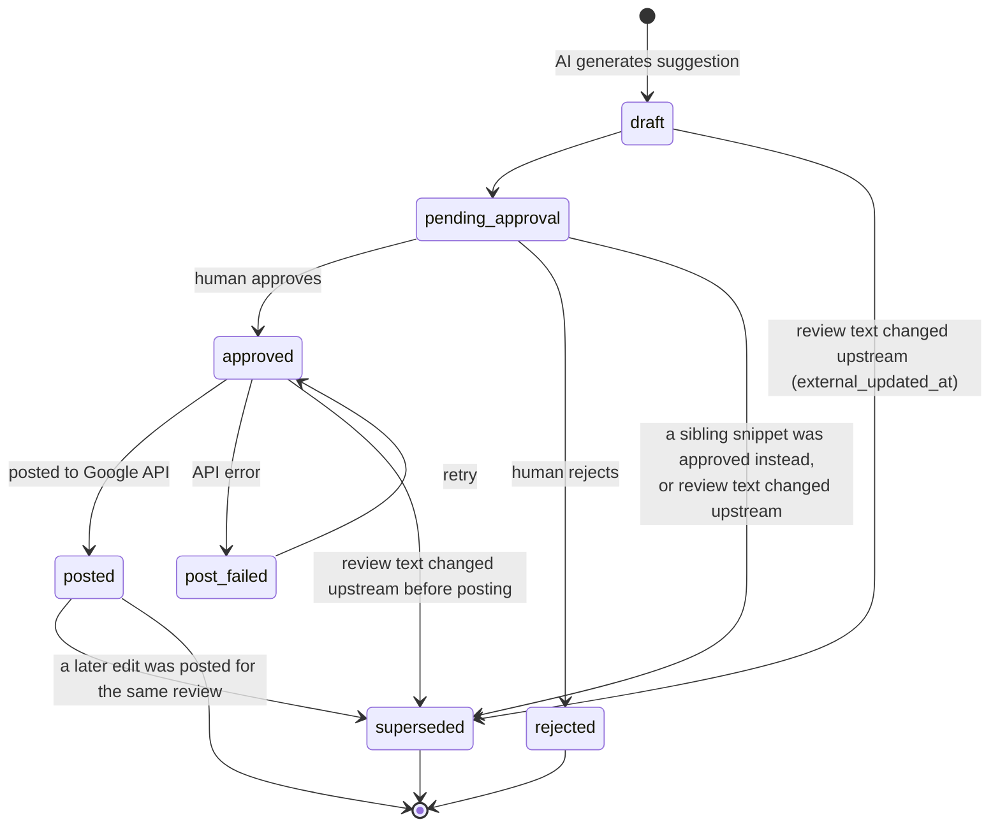

# Reviews Module

## Overview

The reviews module is the **human approval gate** of this product. Everything upstream of it —
the 15-minute Google Business Profile poller, the classification rule, the Azure OpenAI
generation step — runs unattended and produces *candidates*. Nothing those pipelines produce
reaches a customer-visible surface until a person opens the review queue, reads a drafted reply,
and clicks approve. This module owns that gate: the queue listing, the single-review detail view,
and the approve / edit / reject / dismiss actions that move a `review_responses` row through its
state machine. It does **not** own ingestion, classification, or generation — it only reads the
rows those steps wrote and lets a human act on them.

Two tables back it, both defined in
`apps/backend/src/db/drizzle/migrations/0004_reviews.sql`, with three analytics columns added to
the second by `0006_prompts.sql`: **`reviews`** (one row per external review, upserted by the
poller) and **`review_responses`** (one row per reply candidate — AI-drafted, human-written, or
imported from a pre-existing Google reply). The third table in `0004_reviews.sql`, `sync_runs`,
belongs to the poller/ingestion module, not this one, and is only referenced here where a sync
run's outcome explains something a queue user can see.

The consumers are the tenant's own staff — `users` rows with `role = 'owner'` or `'member'`,
scoped by `tenant_id` on both tables. The frontend surfaces are
`apps/web/src/app/(dashboard)/review-queue/` (list, responsive table/card split, three filters)
and `apps/web/src/app/(dashboard)/review-queue/[reviewId]/` (detail view with per-draft
approve / edit / reject). Both currently run against `ReviewService`, a mock in
`apps/web/src/app/_libs/services/review.service.ts` that returns
`apps/web/src/app/_libs/mock-data/reviews.ts` — there is no backend behind them yet. A second
consumer exists in the prompt-performance analytics
(`apps/web/src/app/_libs/utils/prompt-analytics.ts`), which aggregates approval outcomes per
prompt version off `review_responses` rows; see
[Prompt-analytics linkage](#prompt-analytics-linkage).

The single most important invariant in this module is that **a review can only ever have one
posted reply**. Google Business Profile has no reply *collection* — a reply is a
`reviewReply { comment, updateTime }` sub-field on the review resource itself, so posting is an
unconditional overwrite, not an append (`PLAN.md` §2, `review_responses`). That is enforced in
the database, not in code, and it is what makes the sibling-supersede behaviour described below
a correctness requirement rather than a UI nicety.

This document covers the data model, the lifecycle, and the module's scope boundaries. For the
endpoint-by-endpoint HTTP contract — request/response shapes, the guarded compare-and-swap each
mutating action needs, and the error codes — see
[Reviews Module — API Reference](./api-reference.md).

## Data model

| Table | Purpose |
|---|---|
| `reviews` | One row per external review, upserted by the poller on `(location_id, external_review_id)`. Carries the reviewer-facing content (`rating`, `review_text`, `reviewer_name`, `reviewed_at`), the pipeline's routing decision (`classification`, `escalation_reason`, `matched_keywords`, `sentiment`), the queue-level lifecycle (`status`), and two lifecycle flags this module must respect but never sets: `anonymized_at` (GDPR purge, `PLAN.md` §6) and `removed_upstream_at` (reviewer deleted the review on Google). `rating` is a raw integer constrained by `reviews_rating_check` to `BETWEEN 1 AND 5`. |
| `review_responses` | One row per reply candidate for a review. `content` is the live text, `source` records who authored it, `status` is its position in the state machine, `generation_group_id` ties sibling snippets generated in one AI call together, `posted_at` / `error_message` record the post-back outcome, `created_by_user_id` / `approved_by_user_id` are the accountability trail, and `generation_metadata` (jsonb) holds loose model/token debugging fields. `0006_prompts.sql` adds `prompt_version_id`, `original_content`, and `decided_at`. |

`sync_runs` also lives in `0004_reviews.sql` but is the poller's operability table
(`trigger`: `scheduled` \| `backfill`; `status`: `running` \| `ok` \| `error`), not part of this
module's surface.

### Enums that matter

Verified against `0000_foundation.sql`, where all seven are declared:

| Enum | Values | On |
|---|---|---|
| `review_sentiment` | `positive`, `neutral`, `negative` | `reviews.sentiment` (nullable) |
| `review_classification` | `auto_reply_candidate`, `escalated`, `pending_classification` | `reviews.classification`, `NOT NULL DEFAULT 'pending_classification'` |
| `escalation_reason` | `low_rating`, `blocklist_match` | `reviews.escalation_reason` (nullable) |
| `review_status` | `new`, `in_review`, `responded`, `dismissed` | `reviews.status`, `NOT NULL DEFAULT 'new'` |
| `response_type` | `auto_reply_suggestion`, `escalation_snippet` | `review_responses.response_type`, `NOT NULL` |
| `response_source` | `ai_generated`, `human_edited`, `human_manual`, `imported` | `review_responses.source`, `NOT NULL` |
| `response_status` | `draft`, `pending_approval`, `approved`, `rejected`, `posted`, `post_failed`, `superseded` | `review_responses.status`, `NOT NULL DEFAULT 'draft'` |

Note the column/type naming asymmetry on `review_responses`: the column is **`source`**, its type
is **`response_source`**. Every other enum column here shares its type's name.

Two pairs are easy to confuse, and confusing either one produces a bug that looks like a UI
inconsistency rather than a data error.

**`review_status` vs. `response_status`** — the more dangerous pair. `review_status` describes the
*review's* queue-level lifecycle only (`new` → `in_review` → `responded` \| `dismissed`);
`response_status` describes one *response row's* approval/post lifecycle. They deliberately do
not mirror each other. An earlier pass of the plan had `reviews.status` carry values like
`approved`/`posted`, and it was explicitly rejected: a review can have several
`review_responses` rows, and mirroring their granular states onto the parent creates a second
place the same state lives and can drift — `reviews.status = 'approved'` while zero responses
are actually approved (`PLAN.md` §2, `reviews`). The rule that follows from this is
load-bearing for the API: **the dashboard's status badge is a computed combination of
`classification` + `status` + the latest `review_responses` row, never a single column read.**

**`review_classification` vs. `review_sentiment`** — `classification` is the *routing* decision
and is the only one of the two that changes behaviour: it decides whether a review gets one
auto-reply suggestion or 2–3 escalation snippets plus a notification. `sentiment` is
informational only; it is computed and stored, it is shown as an indicator in the escalation
view, and it drives nothing in MVP (`PLAN.md` §3, closing note). Do not filter, route, or
threshold on `sentiment`.

Also worth keeping straight: `response_type` (`auto_reply_suggestion` vs.
`escalation_snippet`) records *why* a response was generated and follows directly from
`classification`; `source` (`ai_generated` / `human_edited` / `human_manual` / `imported`)
records *who authored the text*. A single row's `response_type` never changes after creation; its
`source` flips from `ai_generated` to `human_edited` exactly once, at approval time, if the
approver changed the text — see
[the approve endpoint](./api-reference.md#post-v1reviewsreviewidresponsesresponseidapprove).

### Indexes and constraints this module relies on

On `reviews`: `idx_reviews_tenant_id`, `idx_reviews_location_id`, `idx_reviews_status`,
`idx_reviews_classification`, `idx_reviews_reviewed_at`, `idx_reviews_external_reviewer_id`, and
the unique `idx_reviews_location_id_external_review_id` — the poller's upsert key, not something
this module writes through.

On `review_responses`, two partial unique indexes carry design weight:

```sql
CREATE UNIQUE INDEX idx_review_responses_review_id_live_reply
    ON review_responses(review_id)
    WHERE status IN ('approved', 'posted');

CREATE UNIQUE INDEX idx_review_responses_review_id_imported
    ON review_responses(review_id)
    WHERE source = 'imported';
```

The first is the one-reply-per-review invariant, and covering `approved` as well as `posted` is
what actually closes the race: if it only covered `posted`, two staff members could each approve
a different sibling snippet at nearly the same moment — both reads landing before either write —
and both would go on to call Google's API. Widening it means the *second* approve fails at the
database level, before any API call is made (`PLAN.md` §2 `review_responses`, §8.5). The second
makes the historical backfill job idempotent and safely re-runnable (`PLAN.md` §7).

Both tables carry an `AFTER INSERT OR UPDATE OR DELETE` audit trigger
(`log_db_changes()`, `0000_foundation.sql`) that snapshots every row change into `audit_logs`
with the extracted `tenant_id`. That is where the full history of who changed what lives — which
matters here because several actions this module performs have no dedicated attribution column of
their own; see [Gap](#gap-between-current-code-and-target-design). It also means the GDPR
redaction gap in `PLAN.md` §6.1 applies to every write this module makes to a `reviews` row.

There is **no `set_updated_at` trigger anywhere in the migrations** — `updated_at` on both tables
defaults to `NOW()` on insert and is not maintained afterwards by the database. Every `UPDATE`
this module issues must set `updated_at = now()` explicitly.

## Review lifecycle

### Classification — owned by the pipeline, read-only here

Classification runs once per ingested (or re-ingested) review, before this module ever sees it,
and writes `classification`, `escalation_reason`, and `matched_keywords`. The rule
(`PLAN.md` §3) is ordered, and the ordering matters:

1. Does the review text match an active `blocklist_terms` row for the tenant? →
   `classification = 'escalated'`, `escalation_reason = 'blocklist_match'`, and the matching
   term(s) stored in `matched_keywords` (jsonb) so the UI can say *"escalated because it contains
   'lawsuit'"* and the blocklist can be tuned later.
2. Otherwise, is `rating < tenant_settings.escalation_rating_threshold`? →
   `classification = 'escalated'`, `escalation_reason = 'low_rating'`.
3. Otherwise → `classification = 'auto_reply_candidate'`, `escalation_reason` stays `NULL`.

Because the blocklist check runs first and `escalation_reason` is a single-valued enum, a review
that is *both* low-rated and blocklist-matched only ever records `blocklist_match`; the
low-rating signal is not stored separately, though `rating` is of course still on the row. This
is an accepted simplification, not a bug — see `PLAN.md` §8.17. The API must therefore never
present `escalation_reason` as an exhaustive account of why a review escalated.

`classification` is `NOT NULL DEFAULT 'pending_classification'`, so a freshly ingested review
that has not been classified yet reads as `pending_classification`, never `NULL`. Generation
then follows classification: `auto_reply_candidate` produces one row
(`response_type = 'auto_reply_suggestion'`), `escalated` produces 2–3 rows sharing one
`generation_group_id` (`response_type = 'escalation_snippet'`), all at
`status = 'pending_approval'` (`PLAN.md` §5).

Two flows write `reviews` rows that bypass this module's queue entirely and should not appear in
it as actionable work:

- **Backfill** (`PLAN.md` §7) — the one-time historical import inserts each pre-existing Google
  reply as `source = 'imported'`, `status = 'posted'`, sets `reviews.status = 'responded'`
  directly, and leaves `classification` at its default. These rows exist to feed few-shot
  generation, not to be approved.
- **An externally-answered review** (`PLAN.md` §8.12) — someone replies directly on Google while
  our draft is still pending. The next poll imports that reply the same way and supersedes every
  non-terminal response for the review.

### Queue lifecycle on `reviews.status`

`reviews.status` is not only a display field — `PLAN.md` §8.3 makes `new` a **claimable job
queue**: the classify-and-generate step claims a review with
`UPDATE reviews SET status = 'in_review' WHERE id = ? AND status = 'new'`, and a concurrent
worker that loses the compare-and-swap (zero rows affected) skips the review rather than
generating a second, competing batch. This module must not blindly write `status` for cosmetic
reasons; the transitions it legitimately owns are:

- `in_review` → `responded`, when a response for that review reaches `posted`.
- `new` \| `in_review` → `dismissed`, when a human dismisses the review — the one terminal
  outcome that involves no reply at all.

Nothing in this module moves a review *back* to `new`; re-classification after an upstream edit
is the poller's job (`PLAN.md` §8.6).

### `review_responses` state machine

Reproduced from `PLAN.md` §4.2, using the real `response_status` values. This is the heart of the
module — every mutating endpoint in the [API reference](./api-reference.md) is one arrow on this
diagram.



Three separate causes drive `superseded`, and conflating them is a common misreading:

1. **A sibling was approved instead.** Only one row per `review_id` may sit at `approved` or
   `posted`, so approving one escalation snippet decides the fate of every other row in its
   `generation_group_id`. See [One reply per review](#one-reply-per-review) below.
2. **A later edit was posted for the same review.** Google's `PUT` overwrites the single reply,
   so the previously `posted` row flips to `superseded` and the new row becomes `posted`.
3. **The review text changed upstream.** If the reviewer edits their review after a draft was
   generated but before it is posted, that draft is now answering content that no longer exists.
   Any non-terminal response (`draft`, `pending_approval`, or `approved`-but-not-yet-`posted`)
   gets superseded and re-classification/re-generation re-triggers when a re-poll detects
   `external_updated_at` has moved (`PLAN.md` §8.6). This one is triggered by the **poller**, not
   by any endpoint in this module — but this module's endpoints are what encounter its
   consequences, as a row that was `pending_approval` when the page loaded and is `superseded`
   by the time approve is clicked.

`draft` exists in the enum but the generation flow inserts directly at `pending_approval`
(`PLAN.md` §5, steps 3–4), so in practice `draft` is reserved for a future
save-without-submitting path. Treat it as a valid state to read and never as one this module's
endpoints produce.

### One reply per review

The frontend already implements this contract client-side. `use-review-detail.ts`'s
`approveDraft` marks the approved draft `approved` and, in the same pass, marks **every** sibling
still at `pending_approval` as `superseded` with the same `decidedAt` timestamp; the UI copy
states it outright — *"Approving one automatically supersedes the other — only one reply can ever
be posted per review."* The server-side contract must match, and must be stricter, because the
frontend's version is a single-client optimistic update while the server has to survive two
clients acting at once:

- Approving response `R` on review `V` **must** transition every other `review_responses` row for
  `V` that is at `draft` or `pending_approval` to `superseded` in the **same transaction** as
  `R`'s own transition. Not a follow-up call, not a background job — a second client reading
  between the two writes would see two live candidates for a review that can only ever have one
  reply.
- The supersede sweep is scoped by `review_id`, not by `generation_group_id`. Grouping is what
  the UI uses to render "Snippet A / Snippet B" and what a future "regenerate all" action keys
  off (`PLAN.md` §2, `review_responses`), but the *invariant* is per review — a review with a
  stale draft from an earlier generation batch plus a fresh batch must end up with exactly one
  live row either way.
- The transition itself is a **guarded compare-and-swap**, not a blind write:
  `UPDATE review_responses SET status = 'approved', ... WHERE id = ? AND tenant_id = ? AND
  review_id = ? AND status = 'pending_approval'`. Zero rows affected means another user already
  actioned it, and that must be surfaced to the second user rather than silently overwriting
  (`PLAN.md` §8.4). The `tenant_id` and `review_id` terms are mandatory on this and every other
  statement in the transaction — see
  [the approve endpoint](./api-reference.md#post-v1reviewsreviewidresponsesresponseidapprove) for
  why dropping either turns a same-tenant conflict into a cross-tenant write.
- `idx_review_responses_review_id_live_reply` is the backstop under both of the above. Even if
  the application logic is wrong, the second concurrent approval fails on a unique-violation
  before any Google API call happens (`PLAN.md` §8.5). Handling that violation as a clean
  409-style conflict — rather than letting it surface as a 500 — is part of the endpoint
  contract.

### Posting, and the freshness check before it

`approved → posted` is the only transition in this module with an external side effect, and
`PLAN.md` §8.12 requires it to be gated by a **live, single-review freshness check immediately
before the write** — not on the last poll's cached state. Google's reply endpoint is an
unconditional upsert with no "already exists" check of its own, so without this gate, approving
our AI draft minutes after the owner personally replied on Google would silently overwrite the
owner's own words and report success. If the freshness check finds a reply already present, the
post is aborted: the `approved` response is superseded, the just-discovered manual reply is
imported (`source = 'imported'`, `status = 'posted'`), and the person who approved is told their
action did not go through. One extra lightweight API call per post buys that.

### Prompt-analytics linkage

`0006_prompts.sql` adds exactly three columns to `review_responses`:

| Column | Type | Purpose |
|---|---|---|
| `prompt_version_id` | `UUID REFERENCES prompt_versions(id) ON DELETE SET NULL` | Which exact prompt version generated this draft. Nullable — `human_manual` and `imported` rows never went through a prompt. Indexed by `idx_review_responses_prompt_version_id`. |
| `original_content` | `TEXT` | The AI's text as generated, before any human edit. Immutable after creation. |
| `decided_at` | `TIMESTAMPTZ` | When the row's status became terminal — approved, rejected, or superseded by a sibling's approval. |

Those three are what
`apps/web/src/app/_libs/utils/prompt-analytics.ts`'s `computePromptVersionStats` reads:
approval rate comes from counting rows per `prompt_version_id` by `status`;
approved-as-is vs. approved-after-editing comes from comparing trimmed `content` against trimmed
`original_content` on `approved` rows; average time-to-decision comes from
`decided_at - created_at` over rows with a non-null `decided_at`. The frontend already models
these as `promptId` + `promptVersion`, `originalContent`, and `decidedAt` on
`ReviewReplyDraft`; the backend resolves the first pair by joining `prompt_version_id` →
`prompt_versions` → `prompts`.

**`generation_metadata` (jsonb) is not the same thing and does not replace them.** It is the
original, loose per-generation debugging/compliance record — model name and version, region
(`westeurope`), token counts, and historically a prompt-version string with no normalized table
behind it (`PLAN.md` §2 `review_responses`, §5 step 5). `prompt_version_id` is the normalized FK
that exists specifically because analytics needs to index, join, and aggregate cheaply, which
jsonb querying is not suited for — the header comment in `0006_prompts.sql` says exactly this.
The division of responsibility to hold to: **`generation_metadata` is for a human debugging one
response; `prompt_version_id` is for a query aggregating thousands.** Never derive an analytics
figure by reading a key out of `generation_metadata`.

**`0006_prompts.sql` has not been applied to any database and has not been introspected.** Its
journal entry exists (`meta/_journal.json`, `idx: 6`, tag `0006_prompts`), so `pnpm db:migrate`
will pick it up — but nothing has run it, and `src/db/drizzle/schema.ts` is still the generic
boilerplate's introspected schema (`users`, `roles`, `refresh_tokens`, `media`, `webhooks`, …)
containing **none** of the InnoPeak tables, `reviews` and `review_responses` included. Any code
written against these three columns is writing against SQL that has not yet touched a live
database. The prompts side of this linkage — `prompts`, `prompt_versions`, and the
Settings → Prompts surface — is documented separately in
[../prompts/overview.md](../prompts/overview.md); this module documents only the
`review_responses` end of the join and does not restate the prompt tables' own design.

## API surface

All routes are versioned under `/v1/reviews`. Nothing below exists yet — this is the target
surface; see [Gap](#gap-between-current-code-and-target-design).

| Method | Path | Auth | Notes |
|---|---|---|---|
| `GET` | `/v1/reviews` | Bearer | Paginated queue listing. Filters: `status`, `classification`, `search`, `locationId`. Tenant-scoped. |
| `GET` | `/v1/reviews/:reviewId` | Bearer | One review with all its `review_responses` rows, ordered oldest-first within a generation group. |
| `POST` | `/v1/reviews/:reviewId/responses/:responseId/approve` | Bearer | Approves a response, optionally with edited `content`. Supersedes siblings; queues the post. Guarded CAS. |
| `POST` | `/v1/reviews/:reviewId/responses/:responseId/reject` | Bearer | `pending_approval` → `rejected`. Leaves siblings untouched. |
| `POST` | `/v1/reviews/:reviewId/responses` | Bearer | Posts a manual reply written from scratch (`source = 'human_manual'`). Supersedes non-terminal siblings. |
| `POST` | `/v1/reviews/:reviewId/dismiss` | Bearer | `reviews.status` → `dismissed`. No reply is posted. |
| `GET` | `/v1/reviews/:reviewId/responses/:responseId/post-status` | Bearer | Post-back outcome: `status`, `posted_at`, `error_message`. |
| `POST` | `/v1/reviews/:reviewId/responses/:responseId/retry-post` | Bearer | `post_failed` → `approved`, re-queueing the post (`PLAN.md` §4.2's retry arrow). |

This table is a summary, not the source of truth — see
[Reviews Module — API Reference](./api-reference.md) for every request/response contract, the
compare-and-swap each mutation needs, and the error codes.

## MVP scope

The frontend exposes a deliberate subset of the surface above. As with auth, that narrowing is a
**frontend decision, not a backend one**: the backend implements the full surface, and none of
its endpoints should be dropped or gated because MVP's UI does not call them today.

What the shipped UI does expose:

- **The queue list with three filters** — `status`, `classification`, and a free-text `search`.
  `review-filters-bar.tsx` offers all four `review_status` values but only two of the three
  `review_classification` values (`auto_reply_candidate`, `escalated`), deliberately omitting
  `pending_classification`. Search matches **reviewer name only**
  (`use-review-queue.ts` filters on `review.reviewerName`), not review text.
- **A responsive table/card split** — `review-results.tsx` renders both `ReviewTable` and
  `ReviewCardList` and toggles them with CSS visibility classes rather than a JS breakpoint
  check, to avoid a hydration mismatch. Both read the same `Review` objects, so this is purely
  presentational: **the API needs one list shape, not two.** The table's six columns —
  reviewer, rating, review, classification, status, date — are exactly the fields the list
  endpoint must return per row.
- **Detail view with per-draft approve / edit / reject** — `reply-draft-card.tsx` renders an
  editable `Textarea` seeded from `content`, an Approve button that submits the *current* textarea
  text, an Edit toggle, and a Reject button.

What the backend targets but the frontend does not surface today:

- **Server-side filtering and pagination.** `use-review-queue.ts` loads every review once and
  filters client-side; its own comment says to move filtering server-side once the real backend
  and page size make it necessary. The list endpoint is specified paginated and server-filtered
  from the start regardless — retrofitting pagination onto a client that assumed a complete list
  is a worse change than the frontend adopting `page`/`pageSize` later.
- **Dismiss.** `dismissed` appears as a filter *value* in the queue's status dropdown, but no UI
  action anywhere sets it — a review can be filtered by a status the shipped app cannot produce.
- **Manual replies.** There is no composer; `ReviewReplyDraft` models AI drafts only, and
  `source = 'human_manual'` has no frontend producer.
- **Post-back state.** `ReplyDraftStatus` is `pending_approval | approved | rejected |
  superseded` — it omits `draft`, `posted`, and `post_failed` entirely. The UI's approval
  confirmation reads *"Approved — will post to Google Business Profile,"* future tense: the
  frontend deliberately stops at `approved` and never shows whether the post actually landed.
  The backend still tracks `posted` / `post_failed` / `posted_at` / `error_message`, and
  `PLAN.md` §2 requires the retry path to exist, so the post-status and retry endpoints are
  specified even though nothing calls them yet.
- **Location filtering and sentiment.** `reviews.location_id` and `reviews.sentiment` are on
  every row and the API exposes both; the single-location MVP UI shows neither.

Two frontend/schema mismatches to resolve rather than paper over:

- `ReviewClassification` in `apps/web/src/types/domain.ts` includes **`"unclassified"`**, which
  is **not** a `review_classification` value. The schema's equivalent is
  `pending_classification` (also present in the union). `common.classification` in
  `apps/web/messages/en.json` has a label for `unclassified` and none for
  `pending_classification`, so this is a live inconsistency, not just a spare type member. The
  backend must emit only the three real enum values; the frontend union and its labels need
  collapsing onto them.
- `Review.classification` is typed `ReviewClassification | null` and `MOCK_REVIEWS` relies on
  that nullability, but the column is `NOT NULL DEFAULT 'pending_classification'` and can never
  be null. The API should return `pending_classification`, not `null`.

## Gap between current code and target design

**Nothing in this module exists in `apps/backend/src/` today.** Verified: `src/api/` contains
only `dev-tools`, `health`, `metrics`, and `tracing`; a repository-wide search for anything
review-related under `src/` matches only the two migration files
(`0003_review_provider_locations.sql`, `0004_reviews.sql`). There is no controller, service, DB
service, repository, DTO, or type for reviews anywhere, and no `reviews` slug in
`src/common/route-names.ts`. This is a from-scratch build, not an adaptation — which is the one
advantage this module has over auth: it can follow the current conventions from the first
commit instead of being migrated onto them.

To be built, in dependency order:

- **Apply and introspect the schema.** `src/db/drizzle/schema.ts` is still the boilerplate's
  introspected output and contains none of the InnoPeak tables. Run the documented SQL-first
  workflow (`pnpm db:migrate` → `pnpm db:introspect`) so `reviews` / `review_responses`
  — including `0006_prompts.sql`'s three added columns — exist as Drizzle tables before any
  repository code is written against them.
- **`src/db/repositories/reviews/reviews.repository.ts`** — Drizzle queries only: the filtered
  paginated list, the review-with-responses read, and each guarded compare-and-swap as a single
  statement returning its affected-row count. No composition, no business rules.
- **`src/db/repositories/reviews/reviews.db-service.ts`** — `ReviewsDbService`, the layer the
  business service actually depends on. Every multi-row transaction in this module belongs here:
  approve-plus-supersede-siblings, manual-reply-plus-supersede, and the
  `reviews.status → 'responded'` write that follows a successful post.
- **`src/api/reviews/`** — controller, service, module, plus the three subfolders the convention
  requires: `swagger/reviews.swagger.ts` (one file per controller, one composed decorator per
  route, never inline `@ApiOperation`/`@ApiResponse`), `constants/reviews.constants.ts`
  (module-local defaults such as the list page size — **not** user-facing strings), and
  `types/review.type.ts` (domain shapes; this convention's replacement for the older
  `interfaces/` folder).
- **`dto/`** — one query DTO for the list endpoint carrying `status`, `classification`,
  `locationId`, `search`, `page`, and `pageSize` as a single `@Query()` object rather than
  separate decorators, per `apps/backend/docs/conventions/api-patterns.md`; response DTOs with a
  static `from(...)` mapper; and an `example` on **every** `@ApiProperty`/`@ApiPropertyOptional`,
  no exceptions.
- **`src/common/constants/messages.constants.ts`** — does not exist yet. Every user-facing string
  this module produces (the conflict message when a compare-and-swap loses, the
  already-answered-externally message, success messages passed to `ResponseUtil.success`) comes
  from there, never an inline literal.
- **`RouteNames.REVIEWS = 'reviews'`** in `src/common/route-names.ts`, used as
  `@Controller({ path: RouteNames.REVIEWS, version: '1' })` — never a raw string.
- **A post-back worker.** `approved → posted` involves an external API call, a freshness check
  (`PLAN.md` §8.12), and a retry path; it belongs on the existing BullMQ/SQS queue transport,
  not inline in a request handler. The approve endpoint enqueues; the worker performs the
  freshness check, posts, and writes `posted` / `post_failed` with `posted_at` or
  `error_message`.

Conventions this module must follow, per
`apps/backend/docs/conventions/module-structure.md` and `apps/backend/CLAUDE.md`:

- **Four layers, not three**: Controller → Service → DB Service → Repository. The service never
  imports a repository and never runs a Drizzle query. No existing module in this codebase
  follows this yet, so there is no in-repo example to copy — follow the convention document, not
  the neighbours.
- **Minimal controllers**: bind params, call exactly one service method, wrap the result with
  `ResponseUtil`, return. No `Math.ceil`, no response shaping, no branching. `totalPages` is
  computed in the service or DB service.
- **Explicit return types on every method, every layer** — never inferred, never `any`. Under
  this project's TypeScript strictness (`noUncheckedIndexedAccess`,
  `exactOptionalPropertyTypes`) this is what keeps the layering compiler-enforceable rather than
  a convention someone can drift away from.
- **Documentation before implementation** — this file and
  [api-reference.md](./api-reference.md) are that documentation, and per the root `CLAUDE.md`'s
  module development workflow they need explicit confirmation before code is written.

Two things this module needs that the schema does not currently provide are called out as
required follow-up migrations in
[the API reference](./api-reference.md#schema-prerequisites-not-yet-in-the-migrations) rather
than silently assumed: there is no attribution column for a rejection or a dismissal, and
`PLAN.md` §2's recommended `review_responses.approved_at` was never added to
`0004_reviews.sql`.
