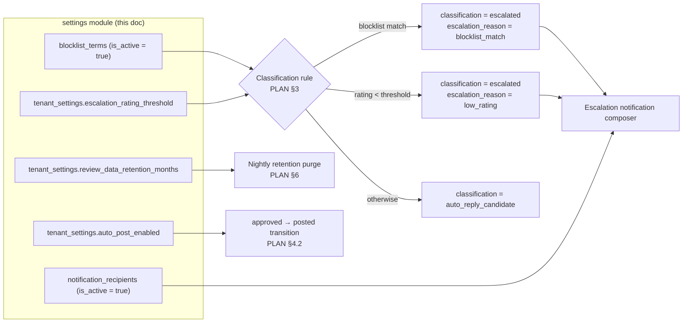

# Settings Module

## Overview

The settings module owns the tenant's own configuration of the review pipeline: the escalation
rating threshold, the keyword blocklist, who gets notified when a review escalates, and the
review-data retention window. Concretely it owns three tables in the InnoPeak schema
(`apps/backend/src/db/drizzle/migrations/` — `tenant_settings` and `blocklist_terms` in
`0002_tenant_auth.sql`, `notification_recipients` in `0003_review_provider_locations.sql`) plus
read/update access to the `tenants` row itself for the business-profile header.

These aren't cosmetic preferences. Two of them are **direct inputs to the classification rule**
(`PLAN.md` §3): a review escalates if it matches an active `blocklist_terms` row, or if its
`rating` is below `tenant_settings.escalation_rating_threshold`. A third —
`notification_recipients` — is what decides whether an escalation reaches a human at all, and on
which channel. If `tenant_settings` doesn't exist for a tenant, that tenant cannot classify a
single review: `escalation_rating_threshold` is `NOT NULL` **with no database default**, which is
exactly why `PLAN.md` §8.10 puts its `INSERT` inside the signup transaction alongside `tenants`
and `users`. This module reads and updates that row; it never creates it.

The consumer is the dashboard's Settings screen (`apps/web/src/app/(dashboard)/settings/`), which
is owner-only territory in the product — `PLAN.md` §2 defines `member` as "review workflow only
… no Settings access." The secondary consumer is the dashboard's business-profile card, which
reads the tenant profile this module exposes. Everything else that reads these tables reads them
*internally*, not over HTTP: the classifier, the escalation-notification composer, and the nightly
GDPR retention job (`PLAN.md` §6).

This document covers the module's data model, how each setting is consumed downstream, and what
has to be built. For the endpoint-by-endpoint contract — request/response shapes, validation
rules, role requirements, and error codes — see [Settings Module — API
Reference](./api-reference.md).

## Data model

| Table | Purpose |
|---|---|
| `tenant_settings` | **Owned.** One row per tenant (`idx_tenant_settings_tenant_id` is a UNIQUE index, not a plain one). `escalation_rating_threshold` (`INTEGER NOT NULL`, `CHECK (… BETWEEN 1 AND 5)`), `auto_post_enabled` (`BOOLEAN NOT NULL DEFAULT false`), `review_data_retention_months` (`INTEGER`, nullable — NULL means "fall back to the platform default", `PLAN.md` §6). |
| `blocklist_terms` | **Owned.** Zero-to-many per tenant. `term` (`VARCHAR(255) NOT NULL`), `is_active` (`BOOLEAN NOT NULL DEFAULT true`). Unique on `(tenant_id, lower(term))` via `idx_blocklist_terms_tenant_id_lower_term` — an expression index, so uniqueness is case-insensitive and **covers inactive rows too**. |
| `notification_recipients` | **Owned.** Which `users` row wants to hear about which `notification_type`, and on which channel. `user_id` is `NOT NULL` — a recipient is always an app user, never a free-text email address. `channel` is `notification_channel_pref`; `is_active` gates delivery. Indexed on `tenant_id` and `user_id`; **no unique constraint** — see [Gap](#gap-between-current-code-and-target-design). |
| `tenants` | **Read + update only.** `name` is the one column this module writes. Tenant *creation* belongs to the auth module's signup transaction — see [Auth Module — Overview](../auth/overview.md#auth-flows). `status` (`tenant_status`) is read-only here; only a platform admin changes it. |
| `locations` | **Read-only, foreign.** Owned by the connections module (`../connections/overview.md`) and populated by the GBP sync. Supplies the provider-derived half of the tenant profile — see [MVP scope](#mvp-scope). |
| `users` | **Read-only, foreign.** Joined for a recipient's `name`/`email`, and its `role` column is what gates every route in this module. Owned by auth. |

Two enums with near-identical names sit on either side of this module's boundary, and confusing
them is the easiest mistake available here:

- **`notification_channel_pref`** (`email`, `teams`, `both`) — a **preference**, on
  `notification_recipients.channel`. This module. It answers "where does this person want to be
  told?"
- **`notification_channel`** (`email`, `teams`) — a **delivery record**, on
  `notifications.channel`. The notifications module (`0005_notifications.sql`). It answers "where
  did this specific message actually go?"

The value list differs on purpose, not by oversight: `notification_channel` has no `both`, because
a `both` *preference* fans out into two `notifications` rows — one email, one Teams — and a value
meaning "two channels at once" would be meaningless on a row that records one actual send. This is
the distinction `PLAN.md` §2 (`notification_recipients` / `notifications`) was added to make;
before it, nothing in the schema recorded where a recipient *wanted* to be notified at all.

Two more enums matter here without being owned:

- `notification_type` (`escalation`) — genuinely shared, which is why it lives in
  `0000_foundation.sql` rather than either module's own file: `notification_recipients` (0003) and
  `notifications` (0005) both reference it. One value today; `PLAN.md` §2 confirms no digest or
  summary type is planned.
- `user_role` (`owner`, `member`) — the authorization gate for every route in this module. See
  [Role requirements](./api-reference.md#role-requirements).

## Settings flows

Each setting has exactly one downstream consumer, and none of them is this module's own HTTP
surface:

- **Threshold and blocklist → classification.** `PLAN.md` §3 runs the blocklist check *first*, so
  a review that is both low-rated and blocklist-matched records `escalation_reason =
  'blocklist_match'` and never `low_rating` — accepted, not fixed, per `PLAN.md` §8.17. Only
  `is_active = true` blocklist rows participate; that is the entire reason the column exists.
  When a term matches, the matched text is copied onto `reviews.matched_keywords` (`PLAN.md` §2,
  `reviews`), so a past escalation stays explainable even after the term row is gone.
- **Recipients → escalation delivery.** Every active `notification_recipients` row for
  `notification_type = 'escalation'` becomes one or two `notifications` rows per escalation event,
  depending on `channel`. `PLAN.md` §2 notes recipients are "typically owners, but
  `notification_recipients` already lets any user be added regardless of role" — so a `member` can
  be a recipient even though a `member` cannot open the screen that configures recipients.
- **Retention months → the nightly GDPR purge.** `PLAN.md` §6 anonymizes reviews older than
  `COALESCE(reviewed_at, created_at) - review_data_retention_months`; NULL falls back to a platform
  default rather than meaning "keep forever."
- **`auto_post_enabled` → the `approved → posted` transition.** `PLAN.md` §2 states MVP keeps this
  false "via app logic" — the column is writable but the posting pipeline does not honour `true`
  yet. See [MVP scope](#mvp-scope) for the conflict this creates with the shipped UI.

**Settings changes are not retroactive, and this is a documented product behaviour rather than an
implementation shortcut.** Per `PLAN.md` §8.11, changing `escalation_rating_threshold` or adding a
blocklist term does **not** reclassify reviews that are already classified: a review classified one
second before a term is added keeps its original classification, forever, unless something else
(an upstream edit, §8.6) re-triggers classification for its own reasons. No backfill job is queued
on save; none exists to queue. The API contract states this explicitly on both write endpoints so
that nobody — frontend, support, or client — reads a successful `200` as "and the queue has been
re-evaluated." A new setting applies to the next review the pipeline classifies after the write
commits, and to nothing before it.

## API surface

Two base paths, because two different resources are involved: the singleton tenant profile and the
settings collections beneath it. Both are versioned (`version: '1'` in `@Controller()`), both
resolve their `tenant_id` from the authenticated principal's JWT and never from a path or body
parameter.

| Method | Path | Auth | Notes |
|---|---|---|---|
| `GET` | `/v1/tenant` | Bearer, `owner` or `member` | Tenant profile — `tenants.name` plus the GBP-derived fields off the tenant's location. Partly blocked on a follow-up migration. |
| `PATCH` | `/v1/tenant` | Bearer, `@Roles('owner')` | Updates `tenants.name` only. Every other profile field is provider-derived and read-only. |
| `GET` | `/v1/settings` | Bearer, `@Roles('owner')` | Reads the `tenant_settings` singleton. |
| `PUT` | `/v1/settings` | Bearer, `@Roles('owner')` | Full-resource replace on the singleton. Not retroactive (`PLAN.md` §8.11). |
| `GET` | `/v1/settings/blocklist-terms` | Bearer, `@Roles('owner')` | Lists terms, active and inactive. |
| `POST` | `/v1/settings/blocklist-terms` | Bearer, `@Roles('owner')` | Creates a term, or reactivates a matching inactive one. |
| `PATCH` | `/v1/settings/blocklist-terms/:id` | Bearer, `@Roles('owner')` | Renames a term and/or flips `is_active`. |
| `DELETE` | `/v1/settings/blocklist-terms/:id` | Bearer, `@Roles('owner')` | Hard delete. |
| `GET` | `/v1/settings/notification-recipients` | Bearer, `@Roles('owner')` | Lists recipients, joined to `users` for name/email. |
| `POST` | `/v1/settings/notification-recipients` | Bearer, `@Roles('owner')` | Adds a tenant user as a recipient. |
| `PATCH` | `/v1/settings/notification-recipients/:id` | Bearer, `@Roles('owner')` | Changes `channel` and/or `is_active`. |
| `DELETE` | `/v1/settings/notification-recipients/:id` | Bearer, `@Roles('owner')` | Hard delete. |

**Deliberately not in this module**, despite sharing the Settings screen: the **Connection** tab
(`review_provider_connections`, `locations`, disconnect/reconnect, sync status) belongs to the
connections module — see `../connections/overview.md`; and the **AI** tab's "Manage prompts" link
targets the prompts module — see `../prompts/overview.md`. Five tabs on one screen, three modules
behind them. Don't add a connection or prompt route to `/v1/settings` just because the UI puts
them next to each other.

This table is a summary, not the contract — see [Settings Module — API
Reference](./api-reference.md) for every request/response shape, field rule, and error code.

## MVP scope

The Settings screen renders five tabs; **three of them are this module** (General, Blocklist,
Notifications). What the shipped frontend actually exercises is narrower than the backend target
above, and the difference is a frontend decision, not a backend restriction — the same split the
auth module documents in its [Frontend / backend
boundary](../auth/overview.md#frontend--backend-boundary).

Exposed by the frontend today (`apps/web/src/app/(dashboard)/settings/_components/`,
`apps/web/src/hooks/settings/use-settings.ts`):

- **General** — escalation-threshold slider (1–5, matching the CHECK constraint exactly),
  auto-post switch, review-retention months input.
- **Blocklist** — add a term, remove a term. Chips only; no rename, no mute.
- **Notifications** — per-recipient channel toggle-group (`email` / `teams` / `both`) and an
  active/inactive switch, over a fixed recipient list.

Backend target but **not** exposed by the frontend today:

- **Adding or deleting a notification recipient.** The UI iterates a list it never grows or
  shrinks; the seeded mock has exactly one recipient. `POST`/`DELETE` are documented because the
  schema and the product concept ("responsible employee", `PLAN.md` §3) fully support more than
  one, and because a tenant with zero active recipients silently escalates into the void — which
  is a state the UI currently cannot get out of.
- **Renaming a blocklist term, or muting one via `is_active`.** The chip's X maps to a hard
  `DELETE`; `is_active` is never written by the UI. `PATCH` is documented because `is_active` is
  what `PLAN.md` §3 actually filters on, so a way to write it belongs in the contract even if no
  screen calls it yet.
- **Editing the business name** (`PATCH /v1/tenant`). The dashboard's business-profile card is
  read-only; the name is captured once at signup (`businessName` → `tenants.name`, see
  [`POST /v1/auth/signup`](../auth/api-reference.md#post-v1authsignup)) and never edited
  afterwards. A tenant that typo'd its own name at signup currently has no way to fix it.

Three mismatches worth naming rather than smoothing over:

- **The frontend persists one composite object; the backend cannot.**
  `SettingsService.updateSettings(settings: SettingsData)` is a mock full-resource `PUT` over a
  single blob containing `general`, `blocklistTerms`, `notificationRecipients`, **and**
  `connection`. Against the real API that blob spans two tables of this module, one collection
  each with its own per-item routes, and a fourth field owned by the connections module. Every
  discrete mutation in `use-settings.ts` (add term, remove term, channel change, active toggle,
  disconnect) is already a distinct call in disguise — wiring the real API means splitting
  `persist()` into `PUT /v1/settings` plus the per-item routes, not swapping one mock call for one
  real one.
- **`aiReplyCount` lives in the frontend's `GeneralSettings` type and has no column anywhere.**
  The AI tab's 1–3 reply-count select writes it through `updateGeneral`, so today it round-trips
  into a `tenant_settings`-shaped object with no `tenant_settings` column to land in. See
  [Gap](#gap-between-current-code-and-target-design) — it needs a home, and this module is the
  likelier owner than prompts, since it is a generation-*count* knob rather than prompt text.
- **`auto_post_enabled` has a live switch but a pipeline that ignores it.** `PLAN.md` §2 keeps
  auto-post false for MVP "via app logic," while the General tab renders a real switch that toasts
  success on toggle. This document's resolution: **persist what the owner set** (a switch that
  silently discards its value is worse than one whose effect is deferred) and have the posting
  pipeline continue to require human approval regardless. That makes the UI copy the thing that
  needs fixing, not the endpoint — flagged for product rather than silently resolved either way.

One accepted limitation applies to this module's whole surface: **`tenant_settings` and
`blocklist_terms` are keyed on `tenant_id` only, never `location_id`** (`PLAN.md` §8.16). A
multi-location tenant would share one escalation threshold and one blocklist across every location,
with no per-location override — even though `user_locations` was reinstated specifically in
anticipation of multi-location (`PLAN.md` §2). This is accepted, not fixed: adding `location_id`
before a second location exists would be solving a problem with no requirement behind it. It does
mean the API takes no `locationId` parameter anywhere, and adding one later is a schema change plus
a breaking contract change, not a query-parameter addition.

## Gap between current code and target design

**None of this module exists in `apps/backend/src/` today.** Verified: `src/api/` contains only
`dev-tools/`, `health/`, `metrics/`, and `tracing/`; `src/db/repositories/` contains `ai/`,
`auth/`, `common/`, `media/`, `notifications/`, `users/`, and `webhooks/` — no `settings/`;
`src/common/route-names.ts` has no settings or tenant slug; and `src/common/constants/` does not
exist at all, so the shared messages file every user-facing string must come from has to be created
here or by whichever module gets there first. The three tables exist and are migrated; nothing
reads or writes them.

What has to be built, following
`apps/backend/docs/conventions/module-structure.md` + `apps/backend/CLAUDE.md`:

- **`src/api/settings/`** with the required `swagger/`, `constants/`, and `types/` subfolders
  (`types/`, not `interfaces/`). Four controllers means the `controllers/` + `services/` subfolder
  layout, not flat files at the module root:
  - `controllers/tenant-profile.controller.ts` (`/v1/tenant`),
    `controllers/tenant-settings.controller.ts` (`/v1/settings`),
    `controllers/blocklist-terms.controller.ts`,
    `controllers/notification-recipients.controller.ts`.
  - **One swagger file per controller**, same base name — `swagger/tenant-profile.swagger.ts`,
    `swagger/tenant-settings.swagger.ts`, `swagger/blocklist-terms.swagger.ts`,
    `swagger/notification-recipients.swagger.ts` — each exporting one decorator-composing function
    per route. Never an inline `@ApiOperation`/`@ApiResponse` on a controller method.
  - Controllers stay **minimal**: bind params, call exactly one service method, wrap with
    `ResponseUtil`, return. The tenant-profile response is a join across two tables; that
    composition belongs in the DB service, not the controller.
- **`src/db/repositories/settings/`** with both layers: `tenant-settings.repository.ts`,
  `blocklist-terms.repository.ts`, `notification-recipients.repository.ts`, and a
  `settings.db-service.ts` above them. The services depend on `SettingsDbService` only and never
  import a repository directly. The `tenants` row is reached through a **shared**
  `TenantsRepository` under `src/db/repositories/tenants/` rather than a settings-local copy — auth
  writes that table at signup and settings reads/updates it, which is precisely the coupling the
  centralized-repository convention exists to allow without a circular module import.
- **`RouteNames` entries** for `settings`, `tenant`, `blocklist-terms`, and
  `notification-recipients` in `src/common/route-names.ts` — controller paths are never raw
  strings.
- **`src/common/constants/messages.constants.ts`** — every success `message` and every exception
  message in this module comes from there. It does not exist yet.
- **DTOs with an `example` on every `@ApiProperty`**, and an **explicit return type on every
  method** across all four layers.

Two dependencies outside this module block it:

- **`RolesGuard` cannot enforce `owner` yet.** It reads `user.roles: string[]`, a shape inherited
  from the boilerplate's `roles`/`permissions` tables, which this schema does not have — see
  [Auth Module — Overview](../auth/overview.md#gap-between-current-code-and-target-design).
  Settings is the first module whose entire contract depends on that being replaced with the single
  `user_role` enum. Until it is, `@Roles('owner')` on these routes is decoration, not enforcement.
- **`tenant_id` must be on the JWT.** Every query here is tenant-scoped and takes its scope from
  the authenticated principal. The current `JwtPayload` has no `tenantId`; the auth module's gap
  list already covers adding it.

Required follow-up migrations, called out explicitly rather than assumed:

- **The GBP-derived tenant-profile fields have no columns.** The frontend's `Tenant` type
  (`apps/web/src/types/domain.ts`) carries `businessType`, `phone`, `googleRating`, and
  `googleReviewCount` alongside `name` and `address`. Of those, only `name` (`tenants.name`) and
  `address` (`locations.address`, `TEXT`, nullable) exist. `tenants` has exactly four non-timestamp
  columns — `id`, `name`, `created_by_platform_admin_id`, `status` — and `locations` has no phone,
  no category, and no rating aggregate. See
  [`GET /v1/tenant`](./api-reference.md#get-v1tenant) for the per-field breakdown and the proposed
  columns; the fields belong on `locations` (they are per-location GBP facts, not per-tenant ones)
  and the migration is the connections module's to write, since it owns that table and the sync
  that would populate them.
- **`notification_recipients` has no uniqueness.** Nothing stops two rows with the same
  `(tenant_id, user_id, notification_type)`, which is a double-notify bug waiting to happen —
  `CREATE UNIQUE INDEX idx_notification_recipients_tenant_user_type ON
  notification_recipients(tenant_id, user_id, notification_type);` is needed before `POST` can rely
  on the database instead of a racy read-then-write. See
  [`POST /v1/settings/notification-recipients`](./api-reference.md#post-v1settingsnotification-recipients).
- **`tenant_settings` has no home for `aiReplyCount`.** If the AI tab's reply-count select is real
  product behaviour rather than mock scaffolding, it needs a column — `ai_reply_count INTEGER NOT
  NULL DEFAULT 1 CHECK (ai_reply_count BETWEEN 1 AND 3)` mirrors `PLAN.md` §5's "generate 2–3 rows"
  for escalations and one for auto-reply candidates. Not added speculatively; flagged so it is a
  decision rather than an omission.

Not a gap, worth recording so nobody goes looking: `blocklist_terms` has no `match_type` enum
(`exact` / `contains` / `regex`) — `PLAN.md` §2 lists it as a possible fast-follow, explicitly not
required for MVP, so matching semantics are the classifier's to define, not a stored per-term
setting. And `notification_recipients` has no `initials` column: the frontend's
`NotificationRecipient.initials` is consumed as *data* by `notifications-settings-section.tsx:35`
(the `getInitials` util is imported only by `review-summary-card.tsx`), so the API must return it
derived server-side — the same way `AttentionReview.initials` already is. The API returns `name` and
nothing is missing.
